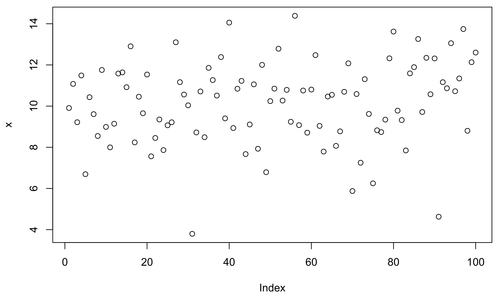

# A (brief) introduction to R  {#Intro_to_R}

## Overview

### What is R?

R was originally focused on statistical data analysis, but has evolved into a general-purpose high level programming language. High level languages are typically less complicated and more user friendly than low level languages (e.g. C, C++, Java), but this comes at the expense of being slightly slower to execute. 

Importantly, R is free and open-source and its core functionality can be extended using **packages**. These are available through the **C**omprehensive **R** **A**rchive **N**etwork ([CRAN](https://cran.r-project.org/web/packages/)) and allow the user to perform a range of both simple and complex tasks (e.g. reading and writing files, rendering images), without the requirement to delve into the underlying source code. 

While there are a myriad of free online resources available to help you learn R, including [R for Data Science](http://r4ds.had.co.nz/) and [YaRrr! The Pirate’s Guide to R](https://bookdown.org/ndphillips/YaRrr/), as well as paid options from [Data Camp](https://www.datacamp.com/courses/free-introduction-to-r), this chapter and the subsequent practicals will equip you with all the skills required to complete the course. 

### Why code? {#why_code}

For those of you familiar with desktop GIS (e.g. ArcGIS, QGIS) or other statistical programs (e.g. Excel, SPSS), the transition to using code can be a frightening experience! However, there are a several reasons why it is worth persevering with. 

First, and with **career progression** in mind, the ability to code is becoming increasingly important, particularly for those of you who want to progress down GIS or environmental career paths. Getting to grips with R and understanding the fundamentals of coding will equip you to learn new skills and new coding languages which may be required by a future employer (e.g. [Python](https://www.python.org/), [MATLAB](https://uk.mathworks.com/products/matlab.html), [Julia](https://julialang.org/), [Ruby](https://www.ruby-lang.org/en/), ...).

Second, performing your analysis using code ensures that your outputs are **reproducible**. If you provide someone else with the original data files and the corresponding code i.e. a list of operations carried out by the computer (e.g. read data, modify, plot, perform statistical test, save), they should be able to reproduce your outputs exactly. 

Third, code is **repeatable**. In standard GIS software (for example), most functions allow you to perform a single task on a single data file e.g. [clipping](https://pro.arcgis.com/en/pro-app/latest/tool-reference/data-management/clip.htm) a digital elevation model to the geometry of a shapefile. By comparison, if that same functionality can be implemented in [code](https://www.rdocumentation.org/packages/raster/versions/3.4-13/topics/crop), it can applied as easily to 10 data files, or 1000, or 10,000.

Finally, code is easily **modifiable**. Code can be tweaked, adapted, or completely rewritten to produce the desired outputs. In R, a wide range of functions are already available in [**packages**](https://cran.r-project.org/web/packages/), but you can write your own functions or combine existing functions to suit your analysis. This functionality is often not the case in other software, which are more complicated to modify and typically provide [Black Box](https://en.wikipedia.org/wiki/Black_box) solutions, where we can inspect the inputs and outputs, but typically have limited understanding of the steps in between. 

](figures/Using-R/Blackbox.png)

### A quick note on the practicals

As we progress through this course, make sure to read the content carefully. However, you do **not** have to run every bit of code in this document, although have a go where you feel it would help your understanding. If I explicitly want you to do something, I will write an instruction that looks like this:

> This is an instruction that tells you something to either think about, or do.


### Dealing with errors

Before we load R and take our first steps towards coding excellence, it is worth noting that errors are an **inevitable** aspect of coding. Irrespective of how good you are, you will spend more time fixing your code (i.e. debugging) than writing it! 

Luckily, when R encounters an error, it will try and help you out. For example, shown below is some simple R code. Here, we are tying to create a new variable called **a**, which is the product (+) of variable **b** and the number **1**:

```{r, error=TRUE}
a <- b + 1
```

In this example, the code fails and prints the error message `object 'b' not found` because the variable **b** does not exist! We could solve this by defining **b** beforehand as follows:

```{r, error=TRUE}
b <- 3
a <- b + 1
a
```

These error messages are **important** and contain helpful information - do not ignore them! If you've struggled to resolve the problem, you should then Google it (normally by just typing “R” followed by the error message into Google), e.g. `R Error in eval(expr, envir, enclos): object 'b' not found`. 

Another useful source of information is [StackOverflow](https://stackoverflow.com/) which is a public collection of coding questions and answers. If you've come across a challenging error, there's a high probability that someone else has also encountered the same error, and there may be a solution already available. 

Understanding, interpreting and fixing error messages is a key programming skill, so read the error messages carefully and use the above resources (Google, StackOverflow). If you need any additional help, staff and TAs will be happy to help during the practicals.

## Loading R

Now that we understand what R is, why it's useful and what to do when something goes wrong, let's begin. 

> Open RStudio. 

The RStudio user-interface should resemble the following:


This contains the following primary windows, which are described below:

{#workspace}

In the **console window**, commands can be typed and results returned. For example, typing the following command into the console:

```{r, eval = FALSE}
1 + 2
```

produces:

```{r, echo = FALSE}
1 + 2
```

> Copy and paste the above code into the console and press **Enter** to run. Does it produce the correct result? 

In the **Workspace window**, you can see all the objects that you have created in the current R session (**Environment tab**; currently empty!) as well as a record of the commands you've used (**History tab**; 1 + 2). 

At it's most basic, R can operate as a powerful calculator. We can add `+`, subtract `-`, multiply `*` and divide `/`, take the exponent `^`, calculate the square root `sqrt()` or the logarithm of a number `log10()`, or melt our computers by using the `factorial()` function. 

We can also combine operators to produce more complicated commands. For example, the following code takes the `sqrt()` of 25 and then takes its factorial ($5!$), which is equal to $5 * 4 * 3 * 3 * 1$. 

```{r}
factorial(sqrt(25))
```

## Variables

One of the most important things to know about in R is the **variable** or **object**. In this set of practicals, we use the term "variable", which is more common across different programming languages. Variables are containers that you can store values in, and then refer to again later. 
R creates variables for you automatically, so all that is required is to name it and then use the **assignment operator** `<-` to assign a value to it. 

As a general rule (and because of complicated reasons), use `<-` for assignment, as shown below, and **don't** use `=`:

```{r}
b <- 3
```

> Run the above code. This assigns the value of "3" to a variable named "b": 

You should now see that under the [**Workspace window**](#workspace), the variable **b** has been added to the Environment tab: 

{width=50%}

The variable **b** can now be called again by the user. 

> Run the following in the console. Does it work as expected? 

```{r, eval = FALSE}
b + 5
```

There are number of benefits to using variables. For example, take the following:

```{r}

a <- 5
b <- 10

result <- (sqrt(a) + log(b))^a + 2*b
result

```

This is a relatively complicated mathematical formula! It uses a square root `sqrt()` and logarithm `log()` function, as well as multiplication `*` and powers `^`. We could replicate this result by substituting each value of **a** for 5 and each value of **b** for 10, but this would be time consuming and prone to error, and would be very frustrating if we wanted to re-calculate the result for `a = 6` and `b = 11`! Using variables allows us to use and modify values multiple times within the code. 

In addition, using variables is important for [**repeatability**](#why_code).

Let's say we want to calculate the sum of the squares from 1 to 5 i.e. $1^2 + 2^2 + 3^2 + 4^2 +5^2$. We could write this numerically in R as follows:

```{r, eval = FALSE}

1^2 + 2^2 + 3^2 + 4^2 + 5^2

```

This produces the current result:

```{r, echo = FALSE}

1^2 + 2^2 + 3^2 + 4^2 + 5^2

```

However, what if wanted to perform this calculation for all the numbers from 1 - 50 i.e. $1^2 + 2^2 + 3^2 + ... + 50^2$?

What if we wanted to cube each value (i.e. $n^3$), rather than squaring? Either change would require a great deal of manual editing, with lots of potential for error.  

By comparison, using variables allows us to **loop** through a series of calculations. The code below creates a variable called `result` and loops through a sequence of numbers using `seq()` to perform the above calculation, where the variable `i` is updated each iteration. 

```{r}

# Initialises a variable called result, with a value of 0
result <- 0

# Loops through a sequence from 1 to 5 in increments of 1 (i.e. 1, 2, 3, 4, 5)
for(i in seq(from = 1, to = 5, by = 1)){
  # Squares each number (i) and adds to result
  result <- result + i^2
}

result


```

> Run the above code in the console. Try to modify the code to perform the calculation for 1 - 50; this should equal $42925$

At this stage, **don't worry** about understanding the syntax of the code above. The important thing to remember is that using variables allows to us to perform more complex and more robust analyses. 

### Variable names

When defining a variable name, you can't use spaces or characters that are not a-z, A-Z or 0-9. As a general rule, variables in R should be written in “snake case” (as opposed to “upper case” or “lower case”) where all words are in lower case and are separated by underscores (_). All of these are valid variable names in snake case:

- snake_case
- a_really_long_snake_case_name
- snake
- s

Other popular naming conventions include camelCase, UPPER_CASE or hyphen-case (among many others). Pick one and use it consistently. 

### Variable types

Each variable will have a particular **type**, which specifies what kind of a value it can hold. Whilst this is handled automatically for you by R, it is important that you understand what the different types are. Here are some common examples:

```{r}

# Character i.e. a string of letters, numbers and/or characters
a <- "Bill"

# Numeric i.e. a number with decimals
b <- 3.567

# Integer
c <- 3

# Logical i.e. TRUE or FALSE
d <- TRUE

```

> Run the above code. If successful, your workspace should now include the variables `a, b, c, d`. 

Some data types are compatible e.g. 

```{r}

# Numeric + integer
b + c

```

But others are not! 

```{r, error = TRUE}

# Numeric + character
b + a

```

## Scripts

So far we've been typing commands into the **console**. This works as expected; we can print results, store variables in the **workspace** and create plots in the **plots** window. 

However, it is often more convenient to store our code in a **script**, which is simply a file containing a set of commands and comments. For example, a single R script could contain commands to load data, perform statistical analysis, and output the results to a new file. This can be run in a single keystroke, which is much simpler than typing or copying and pasting each command in one after another.

To create a new R script: 

> Navigate to **File**, **New File** and **R Script**. 

This should open a new window, with a new untitled R script:

{width=50%}

To save the script:

> Navigate to **File** and **Save As**, and save it in the GEOG70581 folder with an appropriate name (e.g. `learning_R`)

Scripts work identically to the console...


## Comments


### Packages

## Whitebox Tools

To Install WBT:


## Using R packages

Here's the packages we'll be using:

- Raster
- Sp
- ggplot2
- ...


### Plots, files and packages 

This window provides access to plots created by the user, packages loaded to the environment, or files that are accessible in the working directory. 

To demonstrate this, we'll generate some random data using the following code, which uses the [**rnorm** function](https://stat.ethz.ch/R-manual/R-devel/library/stats/html/Normal.html). This generates 100 values, normally distributed at 10 ± 2 (mean ± standard deviation).  

```{r, eval = FALSE}
x <- rnorm(100, mean =  10, sd = 2)
plot(x)
```

> **Run** the above code. A new variable **x** should be stored in the environment, and a plot should have been generated in the plots window, resembling the following. **Note**: your output will differ from that shown below as the underlying data have been generated randomly. 




## Vectors

```{r}

# Creating a list of numbers
ls <- c(1, 2, 3, 4, 5)
ls

# Creating a sequence
sq <- seq(1,5,1)
sq

# Creating a repetitive list
rp <- rep(10, 5)
rp

# Multiplying together
ls * rp

```

## Loading data

```{r}

# Load data
df <- read.csv("C:/Users/44797/Desktop/Repo/GEOG-70581/data/flow_data.csv")
head(df)

# What columns do we have
colnames(df)

# What data do they store?
str(df)

# We can access columns by using the $ operator

# df$Date
# df$Flow


```

This is a dataframe, containing two columns, in a similar format to something you may be familiar with in Excel. It has a column of dates and a column of river flow (measured in m^3 per second).

We may want to index using `df[row.index, column.index]`

```{r}

# We can extract certain rows

# Extract rows 1 to 4, all columns
df[1:4,] 

# Extract rows 1 to 4, just the second column
df[1:4, 2]


```


