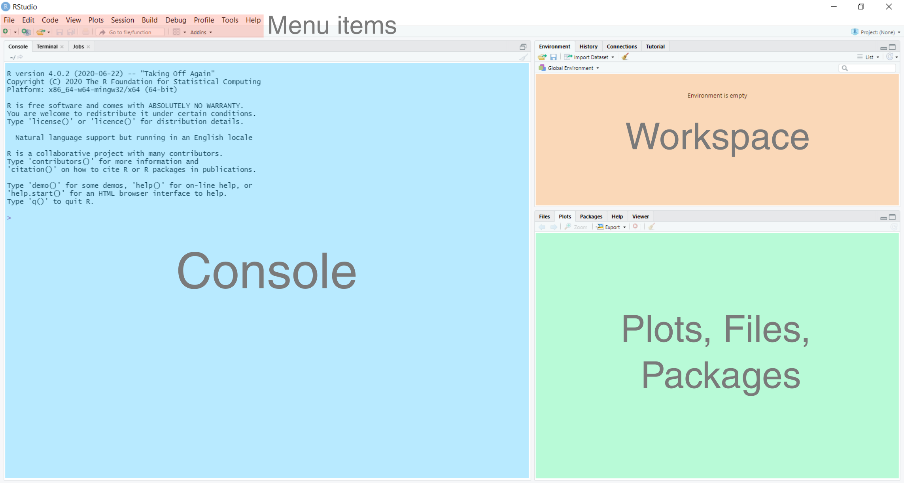
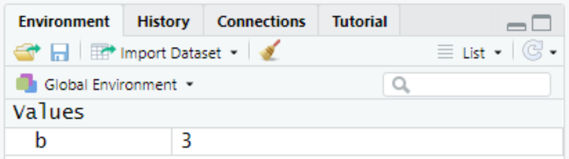
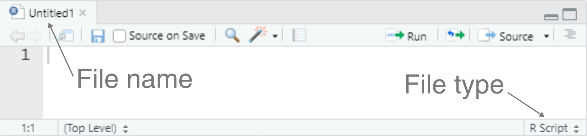
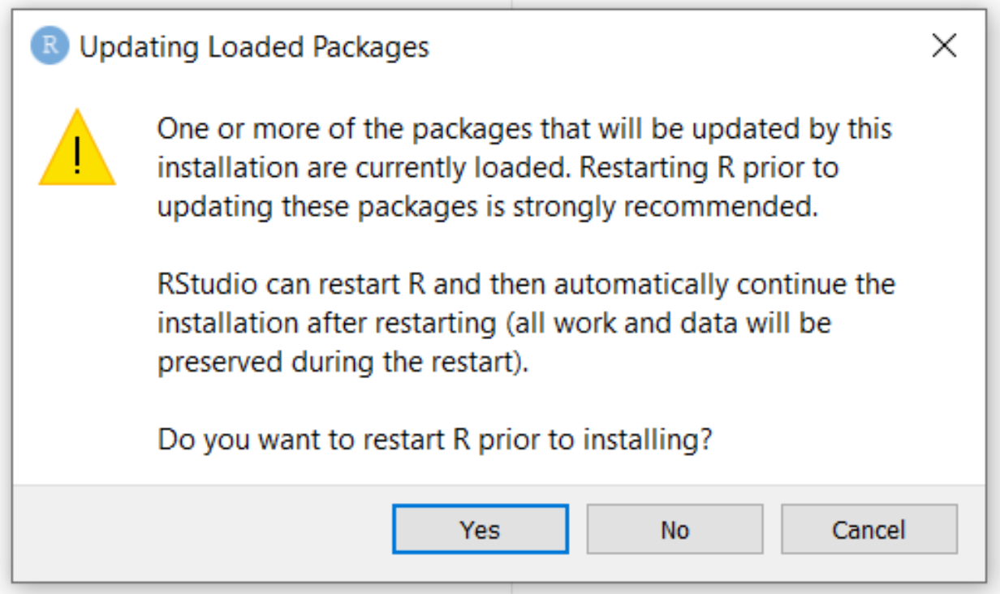
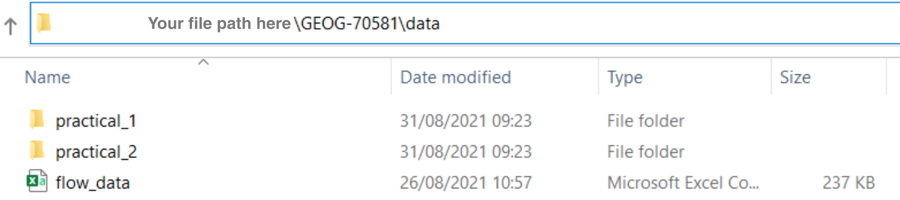
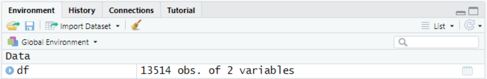

# A (brief) introduction to R  {#Intro_to_R}

```{r, eval = TRUE, echo = FALSE, warning= FALSE, message = FALSE, results='hide'}
# Function to check and install packages
check.packages <- function(pkg){
  new.pkg <- pkg[!(pkg %in% installed.packages()[, "Package"])]
  if (length(new.pkg)) 
    install.packages(new.pkg, dependencies = TRUE)
  sapply(pkg, require, character.only = TRUE)
}

# Checks and installs packages
packages <- c("ggplot2", "ggspatial", "here", "raster", "sf", "whitebox", # Practical-1
              "data.table", "dplyr", "forcats", "MASS", "units", "patchwork", "leaflet", "gridExtra", "rgdal") # Practical-2 
check.packages(packages)
```


## Overview

The following chapter provides a basic introduction to coding in R. If you already have experience with coding, perhaps from [Spatial Ecology](https://www.manchester.ac.uk/study/masters/courses/list/07053/msc-geographical-information-science/course-details/GEOG71921#course-unit-details) or [Understanding GIS](https://www.manchester.ac.uk/study/undergraduate/courses/2022/00575/bsc-geography/all-content/GEOG30552#course-unit-details), then the following content should be familiar to you. For those of you with little or no experience with code, the content builds from the simple (using R as a calculator) to the complex (loading packages and data, plotting) and will equip you with the skills needed to complete Practicals 1 (Eskdale) and 2 (Mersey)

You should aim to work through this Chapter by the end of Week 8, making sure you understand the concepts and code before moving on to the next sub-section. 

To test your understanding, there is a short **formative task** (non-assessed) at the end of this chapter [here](#formative_task). This covers many of the techniques covered here, as well as unfamiliar ones, so you may have to do some independent research to complete it. I'll post the solution on the Monday after the class (22/11/2021) so you can check your working.   

### What is R?

R was originally focused on statistical data analysis, but has evolved into a general-purpose high level programming language. High level languages are typically less complicated and more user friendly than low level languages (e.g. C, C++, Java), but this comes at the expense of being slightly slower to execute. 

Importantly, R is free and open-source and its core functionality can be extended using **packages**. These are available through the **C**omprehensive **R** **A**rchive **N**etwork ([CRAN](https://cran.r-project.org/web/packages/)) and allow the user to perform a range of tasks (e.g. reading and writing files, rendering images), without the requirement to delve into the underlying source code. 

While there are a myriad of free online resources available to help you learn R, including [R for Data Science](http://r4ds.had.co.nz/) and [YaRrr! The Pirate’s Guide to R](https://bookdown.org/ndphillips/YaRrr/), as well as paid options from [Data Camp](https://www.datacamp.com/courses/free-introduction-to-r), this chapter and the subsequent practicals will equip you with all the skills required to complete the course. 

### Why code? {#why_code}

For those of you familiar with desktop GIS (e.g. ArcGIS, QGIS) or other statistical programs (e.g. Excel, SPSS), the transition to using code can be a frightening experience! However, there are a several reasons why it is worth persevering with. 

First, and with **career progression** in mind, the ability to code is becoming increasingly important, particularly for those of you who want to progress down GIS or environmental career paths. Getting to grips with R and understanding the fundamentals of coding will equip you to learn new skills and new coding languages which may be required by a future employer (e.g. [Python](https://www.python.org/), [MATLAB](https://uk.mathworks.com/products/matlab.html), [Julia](https://julialang.org/), [Ruby](https://www.ruby-lang.org/en/), ...).

Second, performing your analysis using code ensures that your outputs are **reproducible**. If you provide someone else with the original data files and the corresponding code i.e. a list of operations carried out by the computer (e.g. read data, modify, plot, perform statistical test, save), they should be able to reproduce your outputs exactly. 

Third, code is **repeatable**. In standard GIS software (for example), most functions allow you to perform a single task on a single data file e.g. [clipping](https://pro.arcgis.com/en/pro-app/latest/tool-reference/data-management/clip.htm) a digital elevation model to the geometry of a shapefile. By comparison, if that same functionality can be implemented in [code](https://www.rdocumentation.org/packages/raster/versions/3.4-13/topics/crop), it can be applied as easily to 10 data files, or 1000, or 10,000.

Finally, code is easily **modifiable**. Code can be tweaked, adapted, or completely rewritten to produce the desired outputs. In R, a wide range of functions are already available in [**packages**](https://cran.r-project.org/web/packages/), but you can write your own functions or combine existing functions to suit your analysis. This functionality is often not the case in other software, which are generally more complicated to modify and typically provide [Black Box](https://en.wikipedia.org/wiki/Black_box) solutions, where we can inspect the inputs and outputs, but typically have limited understanding of the steps in between. 

](figures/Using-R/Blackbox.png)

### A quick note on the practicals

As we progress through this course, make sure to read the content carefully. However, you do **not** have to run every bit of code in this document, although have a go where you feel it would help your understanding. If I explicitly want you to do something, I will write an instruction that looks like this:

> This is an instruction that tells you something to either think about, or do.


### Dealing with errors

Before we load R and take our first steps towards coding excellence, it is worth noting that errors are an **inevitable** aspect of coding. Irrespective of how good you are, you will spend more time fixing your code (i.e. debugging) than writing it! 

Luckily, when R encounters an error, it will try and help you out. For example, shown below is some simple R code. Here, we are tying to create a new variable called **a**, which is the product (+) of variable **b** and the number **1**:

```{r, error=TRUE}
a <- b + 1
```

In this example, the code fails and prints the error message `object 'b' not found` because the variable **b** does not exist! We could solve this by defining **b** beforehand as follows:

```{r, error=TRUE}
b <- 3
a <- b + 1
a
```

These error messages are **important** and contain helpful information - do not ignore them! If you've struggled to resolve the problem, you should then Google it (normally by just typing “R” followed by the error message into Google), e.g. `R Error in eval(expr, envir, enclos): object 'b' not found`. 

Another useful source of information is [StackOverflow](https://stackoverflow.com/) which is a public collection of coding questions and answers. If you've come across a challenging error, there's a high probability that someone else has also encountered the same error, and there may be a solution already available. 

Understanding, interpreting and fixing error messages is a key programming skill, so read the error messages carefully and use the above resources (Google, StackOverflow). If you need any additional help, staff and TAs will be happy to help during the practicals.

## Loading R

Now that we understand what R is, why it's useful and what to do when something goes wrong, let's begin. 

> Open RStudio. 

The RStudio user-interface should resemble the following, although the exact arrangement of the windows may differ from that below:

<p align="center">

</p>

This contains the following primary windows, which are described below:

<p align="center">
{#workspace}
</p>

In the **console window**, commands can be typed and results returned. For example, typing the following command into the console:

```{r, eval = FALSE}
1 + 2
```

produces:

```{r, echo = FALSE}
1 + 2
```

> Copy and paste the above code into the console and press **Enter** to run. Does it produce the correct result? 

In the **Workspace window**, you can see all the objects that you have created in the current R session (**Environment tab**; currently empty) as well as a record of the commands you've used (**History tab**; 1 + 2). 

At it's most basic, R can operate as a powerful calculator. We can add `+`, subtract `-`, multiply `*` and divide `/`, take the exponent `^`, calculate the square root `sqrt()` or the logarithm of a number `log10()`, or melt our computers by using the `factorial()` function. Operators can also be combined to produce more complicated mathematical functions. 

## Variables {#variables-looping}

One of the most important things to know about in R is the **variable** or **object**. In this set of practicals, we use the term "variable", which is more common across different programming languages. Variables are containers that you can store values in, and then refer to again later. 
R creates variables for you automatically, so all that is required is to name it and then use the **assignment operator** `<-` to assign a value to it. 

As a general rule (and because of complicated reasons), use `<-` for assignment, as shown below, and **don't** use `=`:

```{r}
b <- 3
```

> Run the above code. This assigns the value of "3" to a variable named "b": 

You should now see that under the [**Workspace window**](#workspace), the variable **b** has been added to the Environment tab: 

<p align="center">
{width=50%}
</p>

The variable **b** can now be called again by the user. 

> Run the following in the console. Does it work as expected? 

```{r, eval = FALSE}
b + 5
```

There are number of benefits to using variables. For example, take the following:

```{r}

a <- 5
b <- 10

result <- (sqrt(a) + log(b))^a + 2*b
result # Typing the name of a variable ('result') prints it in the Console Window

```

This is a relatively complicated mathematical formula! It uses a square root `sqrt()` and logarithm `log()` function, as well as multiplication `*` and powers `^`. We could replicate this result by substituting each value of **a** for 5 and each value of **b** for 10, but this would be time consuming and prone to error, and would be very frustrating if we wanted to re-calculate the result for `a = 6` and `b = 11`! Using variables allows us to use and modify values multiple times within the code. 

> Modify the code above to test for `a = 6` and `b = 11`. Compare your answer with a colleague in class or on Zoom. Did you get the same result?

```{r, echo = FALSE, eval = FALSE}

a <- 6
b <- 11

result <- (sqrt(a) + log(b))^a + 2*b
result

```

Using variables is also important for [**repeatability**](#why_code).

Let's say we want to calculate the sum of the squares from 1 to 5 i.e. $1^2 + 2^2 + 3^2 + 4^2 +5^2$. We could write this numerically in R as follows:

```{r, eval = FALSE}

1^2 + 2^2 + 3^2 + 4^2 + 5^2

```

This produces the correct result:

```{r, echo = FALSE}

1^2 + 2^2 + 3^2 + 4^2 + 5^2

```

However, what if wanted to perform this calculation for all the numbers from 1 to 50 i.e. $1^2 + 2^2 + 3^2 + ... + 50^2$?

What if we wanted to cube each value (i.e. $n^3$), rather than squaring? Either change would require a great deal of manual editing, with lots of potential for error.  

By comparison, using variables allows us to **loop** (or iterate) through a series of calculations. The code below creates a variable called `result` and loops through a sequence of numbers using `seq()` to perform the above calculation, where the variable `i` is updated each iteration. 

```{r}

# Initialises a variable called result, with a value of 0
result <- 0

# Loops through a sequence from 1 to 5 in increments of 1 (i.e. 1, 2, 3, 4, 5)
for(i in seq(from = 1, to = 5, by = 1)){
  # Squares each number (i) and adds to result
  result <- result + i^2
}

# Prints variable 'result' to the Console Window
result


```

> Run the above code in the console. Try to modify the code to perform the calculation for 1 - 50; this should equal $42925$

At this stage, **don't worry** about understanding the syntax of the code above. The important thing to remember is that using variables allows to us to perform more complex and repeatable analyses.

### Variable names

When defining a variable name, you can't use spaces or characters that are not a-z, A-Z or 0-9. As a general rule, variables in R should be written in “snake case” (as opposed to “upper case” or “lower case”) where all words are in lower case and are separated by underscores (_). All of these are valid variable names in snake case:

- snake_case
- a_really_long_snake_case_name
- snake
- s

Other popular naming conventions include camelCase, UPPER_CASE or hyphen-case (among many others). Pick one and use it consistently. 

### Variable types {#variables_types}

Each variable will have a particular **type**, which specifies what kind of a value it can hold. Whilst this is handled automatically for you by R, it is important that you understand what the different types are. Here are some common examples:

```{r}

# Character i.e. a string of letters, numbers and/or characters
a <- "Bill"

# Numeric i.e. a number with decimals
b <- 3.567

# Integer
c <- 3

# Logical i.e. TRUE or FALSE
d <- TRUE

```

> Run the above code. If successful, your workspace should now include the variables `a, b, c, d`. 

Some data types are compatible e.g. 

```{r}

# Numeric + integer
b + c

```

But others are not! 

```{r, error = TRUE}

# Numeric + character
b + a

```

> Can you understand the error message above? Why does b + a produces an error?

## Data structures

In the previous examples, each variable has consisted of a **single** element. This could be a  name (`bill`), a decimal number (`3.567`), an integer (`3`), and so on. 

However, R can store data in a range of different structures, some of which you will encounter as we progress through the course. 

### Vectors {#vectors}

One of the simplest structures is the **vector**, which contains multiple elements of the same type. These are typically created using the command `c()`:
```{r}

# Creating a vector (v) of the numbers 1 - 5
v <- c(1, 2, 3, 4, 5)
v

```
As a vector **must** have elements of the same type, R will try and coerce elements to the same type:

```{r}

# Creating a mixed vector (m) containing numeric (1,2), character ("Bill", "Ben") and logical elements (TRUE)
m <- c(1, 2, "Bill", "Ben", TRUE)
m

```
In the above example, the numeric and logical elements have been coerced to characters, as signified by these elements being enclosed by quotation marks `" "`. 

We can also create vectors programmatically, rather than manually defining each element. For example, we can generate sequences using `seq()` or repetitive sequences using `rep()`:

```{r}

# Creating a sequence from 1 to 5, in increments of 1
s <- seq(from = 1, to = 5, by = 1)
s

# Creating a vector of length 5, consisting of the value 10
r <- rep(10, times = 5)
r

```

### Data frames {#data_frames}

Other common R data structures include **matrices**, **lists** and **data frames**. The data frame is the most commonly used structure for tabular data and will be familiar to those of you with experience in Microsoft Excel. Here is an example data frame, which is created by combining four existing vectors of the same length (`name`, `height`, `nationality`, [`bereft_of_life`](https://en.wikipedia.org/wiki/Dead_Parrot_sketch)):

```{r}

# Create numeric, character and logical vectors
name <- c("John", "Eric", "Michael", "Graham", "Terry", "Terry")
height <- c(1.96, 1.85, 1.78, 1.88, 1.75, 1.73)
nationality <- c("British", "British", "British", "British", "American", "British")
bereft_of_life <- c(FALSE, FALSE, FALSE, TRUE, FALSE, TRUE)

# Combines into a data frame
df <- data.frame(name, height, nationality, bereft_of_life)
df

```

> Run the above code in your R console

We'll be working with data frames throughout the practicals, so it will be useful to know that we can access data frame elements in a variety of different ways. We can access individual columns of a data frame using the `$` operator, for example:

```{r}

# Extract the "name" column
df$name

```

We can also extract using **indexing**, which requires us to provide the row and columns indexes in the following format: `df[row.index, column.index]`

```{r}
# Extract the element at row 3, column 4
df[3,4]

# Extract rows 1 to 4, all columns
df[1:4,] 

# Extracts all rows, the second and third columns
df[,2:3]

```

We can also extract rows and columns based on the values within the data frame, for example using the `subset()` function. This can be used to select and exclude variables and observations as follows:

```{r}
# Extract data frame rows where height is more than or equal to (>=) 1.8 m. 
subset(df, height >= 1.8) 

# Extract data frames rows where nationality is not equal to (!=) American
subset(df, nationality != "American")

# Extract data frames rows where bereft_of_life is equal to (==) FALSE
subset(df, bereft_of_life == FALSE)

```

> Using the above code as an example, extract all the rows where `name` is equal to Terry. Assign the result to a new variable. You can calculate the number of rows using the function `nrow()`. Did you get the following answer? 

```{r, echo = FALSE}
# Subsets based on the name Terry, counts the number of rows
nrow(subset(df, name == "Terry"))


```

The sections above have given you a crash course in some of the fundamentals of R. Learning to code (or learning a new code syntax for those of your familiar with Python, MATLAB, Java, ...) is similar to learning a new language. **Don't worry** if it seems complicated! You can always refer back to these instructions if you get stuck, or ask for guidance.

To finish this Chapter, we'll provide a brief overview of some other key skills, including writing [R scripts](#scripts), [loading data](#data_loading) and [packages](#packages), and [plotting](#data_plotting). This should prepare you for the [formative task](#formative_task). 
This is **not** an exhaustive list of R functions, and we'll cover other functionality in Practicals 1 and 2 (e.g. loading GIS raster and vector data, creating maps and figures, performing statistical tests). 

However, the R functionality outlined here will cover all the steps required for the [assessment](#Assessment) and should equip you with the core skills required to progress further with R in the future e.g. as the basis for your dissertation. 

## Scripts {#scripts}

So far we've been typing commands into the **console**. This works as expected; we can print results, store variables in the **workspace** and create plots in the **plots** window. 

However, it is often more convenient to store our code in a **script**, which is simply a file containing a set of commands and comments. For example, a single R script could contain commands to load data, perform statistical analysis, and output the results to a new file. This can be run in a single keystroke, which is much simpler than typing each command in one after another. 

To create a new R script: 

> Navigate to **File**, **New File** and **R Script**. 

This should open a new window, which is an untitled R script:

<p align="center">
{width=50%}
</p>

To save the script:

> Navigate to **File** and **Save As**, and save it in the GEOG70581 folder with an appropriate name (e.g. `learning_R`)

One of the easiest ways to run an **entire** script is to use `Ctrl + Shift + Enter`. However, you can also run aspects of a script by clicking on the individual line you want to run and using `Ctrl + Enter`. The same command applies if you highlight (select) multiple lines of code. 

### Comments

When writing code, it is good practice to include **comments** which describe what the code does. As your code becomes more complex and as time passes, it is very easy to forget what your code does! Commenting your code is especially important if your code is being used by other people or even by yourself weeks/months/years in the future; save yourself time and effort by describing your code fully as you write it. 

Comments can be written in R using the `#` symbol. Any line of code which begins with `#` is ignored by R when the script is run and are used solely to improve the readability of the code. 

To add a comment, insert the `#` symbol and write some text. 

> Below is some uncommented code. Copy and paste into your script and add some comments to describe what is taking place. 

```{r, eval = FALSE}

a <- seq(10, 100, 10)
b <- a/10
c <- b*a
plot(c, a)


```
 
> The above code is our first encounter with `plot()` which (as you may have guessed), is used to plot variables in base R [^1]. The new plot you've created should now appear in the **plots window** and should resemble the following figure. There are lots of more exciting ways to plot data in R, some of which are described [below](#data_plotting).

[^1]: **Base R** is used to refer to the functions that are part of the core packages deployed with R, such as `plot()`, `sqrt()` or `seq()`. As we install and utilise user-created [packages](#packages), we are moving away from base R. 

```{r, echo = FALSE}

a <- seq(10, 100, 10)
b <- a/10
c <- b*a
plot(c, a)


```

As a general rule, well-presented code would typically comprise: 

- 1/3 code;
- 1/3 empty space;
- 1/3 comments.

This is known as the **Rule of Thirds**. 

## Loading packages {#packages}

Now that we have our script set up, we need to understand is how to install and load packages in the R environment. 

> To begin, remove all the previous code from your script `learning_R.R` and save.

For the remainder of this chapter, we are going to use just one package as an example, but more will be required for Practicals 1 and 2, as detailed [here](Eskdale_set_up). 

The package we are going to use is [ggplot2](https://ggplot2.tidyverse.org/), which is a widely used visualization package for R. If there's a figure, map or graphic you want to make, it's likely that **ggplot2** can do it for you. It's now even used by the [BBC](https://bbc.github.io/rcookbook/)!

<p align="center">
<a name="Figure_BBC"></a>{width=100%}
</p>

**BBC graphics created using ggplot2**. See [here](https://bbc.github.io/rcookbook/) for details. 

We can install the package using the helpfully named function `install.packages()` as follows:

```{r, eval = FALSE}

# Function to install packages. Name of package enclosed by quotation marks. 
install.packages("ggplot2")

```

This function installs the package to your computer, but before we can use it, it needs to be activated within your current R session. This can be achieved by adding it to the `library()` as follows: 

```{r, warning= FALSE, message = FALSE}

# Function to add package to the library (no quotation marks)
library(ggplot2)

```

> Copy and paste the two code snippets above into your script and run to install and load ggplot2. 

This is the standard approach to installing and loading packages in R. However, one of the weaknesses of this approach is that R will try and install and load each package **every** time the script is run. This is unnecessary; the package is already loaded!  

> Try to re-install ggplot2 using the code above. The following pop-up should appear:

<p align="center">
{width=50%}
</p>
> Press **No**. The following message will appear in the console: `Warning in install.packages : package ‘ggplot2’ is in use and will not be installed`

We can address this issue by using a user-defined **function** (called `check.packages`) to check whether a package is already installed. If it **is** installed, R will skip the installation. If it is **not** installed, R will install as normal. This function is similar to the functions we've been using before, such as `sqrt()` or `seq()`, which are available by default in base R; the difference is it's been written from scratch! 

```{r, eval = FALSE, warning= FALSE, message = FALSE}

# Function to check and install packages
check.packages <- function(pkg){
  new.pkg <- pkg[!(pkg %in% installed.packages()[, "Package"])]
  if (length(new.pkg)) 
    install.packages(new.pkg, dependencies = TRUE)
  sapply(pkg, require, character.only = TRUE)
}

# Checks and installs packages
packages <- c("ggplot2")
check.packages(packages)

```

> Copy and paste the above code at the **start** of your R run script, removing the previous `install.packages()` and `library()` commands. Re-run the code. 

In future, you can add new packages by simply adding the package name to the `packages` **vector**. This works in exactly the same way as described [previously](#vectors), with the vector created using the `c()` command. For example, we could install packages as follows: `packages <- c("ggplot2", "dyplr", "raster", "sf")`. A full list of the available packages is [here](https://cran.r-project.org/) (>18,000 and counting...).

Finally, packages should typically be installed and loaded at the **start** of any R script. If your code requires a package to run and it has not yet been installed, the code will fail. Installing and loading all the required packages at the start of the script avoids this problem. 

## Loading data {#data_loading}

In the final two sections of this chapter, we will load some data from a external file and plot using ggplot2. 

In the previous examples, we've been creating variables, vectors and data frames from scratch, but most data you will work with will be saved in another file format. This could be a comma-separated file (`.csv`), tab-delimited (`.txt`) or in an Excel format (`.xls`), or could be a spatial data type, such as a raster (`.tif`, `.asc`, `.img`) or vector (`.shp`). Being able to load and manipulate different data types is a key programming skill. 

We'll use one of the most well-used formats as an example; the comma-separated file (.csv). This consists of rows and columns of data, where columns are delineated by commas. For example, here is an example of some comma-separated data:

```{r, eval = FALSE, warning= FALSE, message = FALSE}

name,age,height,year_of_birth,instrument
stewart,70,1.87,1952,drums
andy,79,1.70,1942,guitar
gordon,70,1.81,1951,vocals


```

When read by R, it is interpreted as follows, splitting columns based on the occurrence of commas, and using the first row as column names:

|   name  | age | height | year_of_birth | instrument |
|:-------:|:---:|:------:|:-------------:|:----------:|
| stewart | 70  | 1.87   | 1952          | drums      |
| andy    | 79  | 1.70   | 1942          | guitar     |
| gordon  | 70  | 1.81   | 1951          | vocals     |

To load a `.csv` file into R, we can use the command `read.csv()`. The most basic way to load a file is to write the **absolute** file path. This is the location on your computer where the file is saved. For example, a file saved on your `C drive`, within your `Documents` folder, and within a folder called `Manchester` would be formatted as: `C:\Documents\Manchester`

> To determine the absolute file path, navigate in your file explorer (e.g. Windows Explorer, finder on macOS) to the **data** sub-directory within GEOG70581:

<p align="center">

</p>

For the final two sections of this Chapter (and the [formative task](#formative_task)), we'll using a data file called `flow_data.csv` which contains the average daily river flow (m<sup>3</sup> per second) from the [National River Flow Archive](https://nrfa.ceh.ac.uk/) and the [UK Centre for Ecology & Hydrology](https://www.ceh.ac.uk/). The data are from monitoring station [90003](https://nrfa.ceh.ac.uk/data/station/meanflow/90003) on the River Nevis, which drains Ben Nevis, the highest mountain in the UK, and cover the period from the 1<sup>st</sup> October 1982 to the 30<sup>th</sup> September 2019.  

You can explore the Glen Nevis catchment below:

```{r, echo = FALSE, warning = FALSE, message = FALSE}

library(dplyr)
library(leaflet)
library(sf)

```

```{r, echo = FALSE, fig.align="center", warning = FALSE, message=FALSE}

# Labelling
content <- paste(sep = "<br/>",
                 "<b><a href='https://nrfa.ceh.ac.uk/data/station/info/90003'>Station 90003</a></b>",
                 "Glen Nevis",
                 "Scotland"
                 )

# Loads shapefiles
nevis_watershed_polygons <- readOGR(here("output", "introduction", "nevis_fill_watersheds.shp"), verbose = FALSE)

# Transform to WGS 84
nevis_watershed_polygons <- spTransform(nevis_watershed_polygons, CRS("+proj=longlat +datum=WGS84"))

m <- leaflet() %>%
  # Sets views
  setView(lat=56.803833472210535, lng = -5.059213728038961, zoom = 12) %>%
  # Adds default tiles
  #addTiles()  %>%
  addProviderTiles(providers$OpenTopoMap) %>%
  # Add polygon
  addPolygons(data=nevis_watershed_polygons, color = "#444444", fillColor = "#33b9ff", 
              weight = 1, smoothFactor = 0.5, opacity = 0.9, fillOpacity = 0.2) %>%
  # Add popops
  addPopups(-5.0899129843594855, 56.82164883574794, content,
    options = popupOptions(autoClose = FALSE, closeOnClick = FALSE)
  )
  # Adds marker for the monitoring station
  #addMarkers(lat=56.82164883574794, lng = -5.0899129843594855, popup = "Station 90003: Glen Nevis")
  # Adds marker for Ben Nevis
  #addAwesomeMarkers(lat=56.79664376010986, lng = -5.003456696914713, popup = "Ben Nevis (1345 m)")
  

m

```

<br/> 

The file path to your file might read as follows (if your name was Bill): `C:\Users\Bill\GEOG-70581\data\flow_data.csv`

To load this file into R:

> Copy and paste this file path into your script, enclosing the file path within quotation marks. **Importantly**, R uses forward slashes within file paths `/`, whereas the file path in your file explorer probably uses backslashes `\`, so these will need to be swapped.

```{r, eval = FALSE}

# Load data
df <- read.csv("C:/Users/Bill/Documents/GEOG-70581/data/flow_data.csv")

```

```{r, echo = FALSE}

# Load data (actual file path)
df <- read.csv("C:/Users/44797/Desktop/Repo/GEOG-70581/data/flow_data.csv")


```

If this has worked successfully, a new variable `df` will have been loaded into the **workspace**:

<p align="center">

</p>

As you may have noticed, this is not the most elegant way to load data, as it requires us to copy, paste _**and**_ edit the full file path each time. This would quickly become tiring if we wanted to load multiple data sets. In Practical 1, we'll guide you through a solution using R **projects** and the [**here** package](#R_Projects) but as ever, it is important to understand the basics before moving on to more sophisticated solutions. 

We can use a variety of commands to inspect this new data set, including:

```{r, eval = FALSE}

head(df)

colnames(df)

str(df)

```

> Run the above code. What do each of the commands do? `head()`, `colnames()`, `str()` What data **types** do we have in each column? See [here](#variables_types) for a reminder. What data **structure** are we working with? 

As outlined previously, we can access individual columns of a data frame using the `$` operator and could start to do some simple analysis using base R functions, such as:

```{r, eval = FALSE}

# What is the average daily flow?
mean(df$flow)

# What is the maximum daily flow?
max(df$flow)

# What is the minimum daily flow?
min(df$flow)

```

> Question: What is the **range** of daily flow measurements?

As outlined previously, we can also subset our data based on the values within the data frame, based on columns names (`$`) or using indexing. To simplify our subsequent analysis, we're just going to work with data collected in 2019, although we'll ask you to extract a different year for the [formative task](#formative_task).  

> The data frame rows which correspond to 2019 are from the 1<sup>st</sup> January [13242] to the 30<sup>th</sup> September [13514]. Extract these rows and all columns using indexing; see [here](#data_frames) for a reminder if you get stuck. 

```{r, echo = FALSE}
# Extracts rows corresponding to 2019 using indexing
df <- df[13242:13514,]
```
You may also have noticed from the `str()` command that our column of dates (day/month/year) were stored as **characters** e.g. `$ date: chr  "01/10/1982"`. Working with dates and times is a complicated task (see this [Tom Scott](https://www.youtube.com/watch?v=-5wpm-gesOY) video for a light introduction to the problem), so to simplify plotting, we'll convert these characters e.g. `"01/10/1982"` into a **date format**. This can be achieved using the following code, which overwrites the date column in the data frame: `df$date <-` and uses the function `as.Date()` to define a date format. In this case, our numbers are listed in day, month and then year, which is formatted in R as `"%d/%m/%Y"`:

```{r}
# Converts dates (in character format) to date format
df$date <- as.Date(df$date, format =  "%d/%m/%Y")
```

> Once you've extracted the flow data corresponding to 2019, run the above code. 

## Plotting {#data_plotting}

In the final task, we're going to plot these data using ggplot2. One of the challenges of ggplot2 is its steep learning curve, but we'll walk through this example to show how we can progress from the raw data to high quality figures. These approaches will be useful for your assessment. 

> To finish this chapter, copy and paste the following code elements into your R script in turn and run them. Make sure to *read* and *understand* what each step is doing.  

To begin, we're going to create an empty ggplot **canvas** i.e. the blank canvas upon which we can add ggplot elements, such as axes, legends, data, scale bars etc.   

```{r, fig.align="center"}
# Initialising an empty canvas
ggplot()
```

Next, we specify which data set we are going to plot. **Note**: ggplot2 works almost exclusively with **data frames**:

```{r, fig.align="center"}
# Which data frame do we want to use?
ggplot(data = df)
```

With the data frame defined, we now need to specify which columns of date we wish to plot. The code below uses the function `mapping=aes()`to do so, where the date variable is assigned to the x-axis `x=date` and the flow rate variable is assigned to the y-axis `y=flow` using their column names:

```{r, fig.align="center"}
# Which data frame columns do we want to plot?
ggplot(data = df, mapping=aes(x=date, y=flow))
```

However, our data are still not visible because we need to select a **geom** type, which is a complicated way of saying the type of geometric object we want to plot. We could plot our data as points, lines or polygons; we could choose a histogram, bar plot, or box and whiskers plot; there are [many](https://ggplot2.tidyverse.org/reference/) to choose from! 

In this example, we are going to plot our data as points, which is done using the `geom_point()` command. As you can see from the code below, the structure differs slightly from normal code, in that ggplot elements are separated by the `+` operator. This allows the user to add each ggplot element on a separate line of code, thereby improving readability. 

```{r, fig.align="center"}
# What type of geom do we want?
ggplot(data = df, mapping=aes(x=date, y=flow)) +
  geom_point()
```

In the same way, we could also plot the same data as a line, using `geom_line()`. In this example, both **geoms** are using the same data frame as inputs `x=date, y=flow`. This is because the data frame and columns have been specified in the initial call to ggplot here: `data = df, mapping=aes(x=date, y=flow)`. All subsequent geom objects (e.g. points, lines, bar plots...) will these inputs, unless an alternative is specified.

```{r, fig.align="center"}
# Adding a line geom
ggplot(data = df, mapping=aes(x=date, y=flow)) +
  geom_point() +
  geom_line()
```

The above code covers the basics of ggplot, but we can start to improve the design of our plots. For example, we can choose one of the available **themes**. We could re-order our geoms to show the data points above the line, while adding some colour using [HEX codes](https://htmlcolorcodes.com/). We could change the aspect ratio to produce a square plot and maybe add some axis labels:

```{r, fig.align="center"}
# Specifying data frame and columns
ggplot(data = df, mapping=aes(x=date, y=flow)) +
  # Specifying colours
  geom_line(colour = "#56ACFF") +
  geom_point(colour = "#767676") +
  # Adding a ggplot theme
  theme_classic() +
  # Setting the aspect ratio
  theme(aspect.ratio = 1) +
  # Updating axis labels (including superscript elements)
  labs(x = "Date (January - October 2019)", y = bquote('Average daily flow'~(m^3~'per second')))

```

Using the above plot, we could start to identify periods of above or below average flow. As a final step, we will probably want to export our figure so that it can be used elsewhere e.g. in the [assessment](#Assessment). To do so, we simply assign our ggplot object to a variable using the assignment operator: `<-` as normal:

```{r, eval = FALSE, fig.align="center"}
# Assign our ggplot object to the variable "g"
g <- ggplot(data = df, mapping=aes(x=date, y=flow)) + ...
```

Finally, we can save our ggplot object using the `ggsave()` function, as shown below. This takes in the name of the plot (`g`), as well as the intended name, extension and file path e.g. `"C:/Users/Bill/Documents/GEOG-70581/images/flow_data_2019.png"`. In this example, we are saving our output within the **images** sub-directory of GEOG-70581. We have also defined the name of the file `flow_data_2019` and specified its file type: `.png` (portable network graphics file). We can also modify other settings, such as the **dpi** which determines the plot resolution. A list of ggsave options can be found [here](https://ggplot2.tidyverse.org/reference/ggsave.html).

```{r, eval = FALSE, fig.align="center"}
# Saves to a png
ggsave(plot = g, "C:/Users/Bill/Documents/GEOG-70581/images/flow_data_2019.png", dpi = 150)
```

```{r, echo = FALSE, fig.align="center"}
# Assigning to a variable
g <- ggplot(data = df, mapping=aes(x=date, y=flow)) +
  geom_line(colour = "#56ACFF") +
  geom_point(colour = "#767676") +
  theme_classic() +
  theme(aspect.ratio = 1)

# Saves to a png using ggsave
ggsave(plot = g, "C:/Users/44797/Desktop/Repo/GEOG-70581/images/flow_data_2019.png", dpi = 150)
```

> Run the above code to assign your plot to the variable `g` and export it to your images folder, **making sure** to update the file path! 

We have now exported our plot and should be able to see it in the **images** sub-directory of GEOG-70581. **Importantly**, and for future plots, you don't need to run the commands in the sequence shown above e.g. first creating a canvas `ggplot()`, then defining a data frame `ggplot(data = df)`, and so on. This sequence was used to show you how we can add elements to the ggplot object, building from the blank canvas to exporting the final figure. 

## Formative task {#formative_task}

**Congratulations!** You have now completed the guided portion of Chapter 3: the (not-so) brief introduction to R. While this may have been challenging, we have covered most of the core skills which you will need. You should now have an appreciation of the the different data types and structures that are available in R, experience running code in the console and within scripts, and the ability to install packages, load data and create plots. We'll use many of these techniques in Practicals 1 and 2. 

To finish the practical, please complete the **formative task** outlined below. 

<br/> 

Create an R Script which does the following:

  > Installs the required packages.

  > Loads the flow data for Glen Nevis. 
  
  > Extracts all rows corresponding to the years 2000 to 2019, making sure to convert to date format. 
  
  > Finds the average daily river flow (m<sup>3</sup> per second) **for each month** and plots the result. 
  
  > **Questions**: on average, which month had the **highest** average daily flow and which had the **lowest**?
  
<br/> 
  
**Hints and Tips**: 

For general guidance on using ggplot2, see [here](https://ggplot2.tidyverse.org/reference/).

To extract the month from each record, you may want to use the `months()` function from base R, while `aggregate()` (described [here](https://r-coder.com/aggregate-r/)) can be used to compute summary statistics (i.e. the mean) based on groups. 

### Formative solution

A code solution to the formative task will be uploaded here on the Monday after the class.

```{r, eval = FALSE, echo = TRUE, warning = FALSE, message = FALSE}

# Solution to the Chapter 3 formative task
# Author: matt-tomkins
# Date of upload: xx-xx-xxxx

```

```{r, eval = FALSE, echo = FALSE, warning = FALSE, message = FALSE}

# Solution to the Chapter 3 formative task
# Author: matt-tomkins
# Date of upload: 21-11-2023

# Function to check and install packages
check.packages <- function(pkg){
  new.pkg <- pkg[!(pkg %in% installed.packages()[, "Package"])]
  if (length(new.pkg))
    install.packages(new.pkg, dependencies = TRUE)
  sapply(pkg, require, character.only = TRUE)
}

# Checks and installs packages
packages <- c("ggplot2")
check.packages(packages)

# Load data from csv (personal file path - update to your own)
df <- read.csv("C:/Users/44797/Desktop/Repo/GEOG-70581/data/flow_data.csv")

# Convert dates (in character format) to date format
df$date <- as.Date(df$date, format =  "%d/%m/%Y")

# Extracts post-2000 river flow
df_post2000 <- subset(df, date >= as.Date("2000-01-01"))

# Create a new column, corresponding to the month of measurement, using the months() function
df_post2000$month <- months(df_post2000$date)

# Summarise by month, using the aggregate() function and 'mean'
summary <- aggregate(flow ~ month, df_post2000, mean)

# Determines plotting order by converting the month column to a 'factor'
# The factor levels are determined by the base R month.name function
summary$month <- factor(summary$month, levels = month.name)

# Plotting using ggplot2
g <- ggplot(data = summary, mapping=aes(x=month, y=flow)) +
  # Stat = "identity" is used when the values of x and y are known
  geom_bar(fill = "#3EBBFB", stat="identity") +
  # Sets the theme
  theme_classic() +
  # Add x and y-axis labels
  labs(x = "Month (2000 - 2019)", y = bquote('Average daily flow'~(m^3~'per second'))) +
  # Tight fitting y-axis
  scale_y_continuous(expand = c(0,0)) +
  # Adjusts angle of x-axis labels
  theme(axis.text.x = element_text(angle = 45, vjust = 1, hjust=1))

# Displays figure
g

# Prints highest and lowest average daily flows
print(paste0("The month with the highest average daily flow is ", summary$month[summary$flow == max(summary$flow)]))
print(paste0("The month with the lowest average daily flow is ", summary$month[summary$flow == min(summary$flow)]))


```
