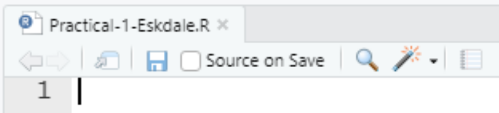

# Eskdale II - Set-up {#Eskdale_set_up}

## Install programs

If you haven't installed R and RStudio, please refer to the instructions [here](#Installation) before continuing. 

## Download data {#download_data}

If you've not already done so, the data for this practical can be downloaded [here](https://online.manchester.ac.uk/webapps/blackboard/content/listContentEditable.jsp?content_id=_13304460_1&course_id=_68533_1). The directory structure is outlined in [Chapter 2](#materials). 

## Open RStudio

> To begin, open RStudio. 

## Initialise an R project {#R_Projects}

In the previous chapter, we typed commands into the **console** and used **R scripts** to store commands and comments.

For both Practicals 1 (Eskdale) and 2 (Mersey), we are going to expand on these by also utilising **R projects**. Projects make life simpler by allowing us to access file locations (e.g. for loading and writing data) using **relative** file paths, rather than using the clunky and prone-to-breaking **absolute** file paths.  

Relative file paths work by setting the **working directory**, which is simply the the default location where R will look for files you want to load and where it will put any files you save. We can do this manually by using the `setwd()` function, but a simpler approach is to use an R **project**, which sets the working directory for your automatically. 

Rather than the complicated absolute file paths:
```{r, eval = FALSE}
"C:/Users/Bill/Documents/GEOG-70581/data/flow_data.csv"
```

which indicates that the file is located in `data`, which is within `GEOG-70581`, which is within `Documents`, which is within `Bill`, which is within `Users`, which is on the `C drive`, we can set the working directory to `GEOG-70581` (for example) and then access the file using the **here** package:

```{r, eval = FALSE}
here("data", "flow_data.csv")
```

This approach not only makes it easier to access files, but also improves **reproducibility**. Using projects ensures that our work is **self-contained** (the project directory contains all the data, scripts and outputs) and **portable**. Transferring the project directory to another user, to a different sub-folder on your computer, or a different drive, would not cause any code to fail. By comparison, scripts featuring absolute file paths or a manually defined working directory would likely fail in any of the above scenarios. 

To initialise a new R project:

> Go to **File**, **New Project**, and select **Existing Directory**.
> Using the Browse icon, set the project working directory to the folder **GEOG70581**, which you downloaded and unzipped [here](#download_data).
> Select **Create new project**

If this has been successful, your console should have been updated to include the path to your project working directory as follows:

<p align="center">
{width=50%}
</p>

## Creating an R script

Now that we have created our project for GEOG70581, we are going to use scripts to store the code for each practical. We'll create a script for Practical 1 and a separate script for Practical 2. 

For Practical 1:

> Navigate to **File**, **New File** and **R Script**. 

To save the script:

> Navigate to **File** and **Save As**, and save it in the GEOG70581 folder with an appropriate name (e.g. `Practical-1-Eskdale`)

This should now resemble the following:

<p align="center">
{width=50%}
</p>

## Install WhiteboxTools

For Practical 1, we are going to use the following packages:

- [`ggplot2`](https://ggplot2.tidyverse.org/) 
    - for data visualisation;
- [`here`](https://here.r-lib.org/)
    - to construct paths to your project files;
- [`raster`](https://rspatial.org/raster/pkg/index.html)
    - for reading, analysing and writing of raster and vector data;
- [`sf`](https://r-spatial.github.io/sf/) 
    - for simple storage of vector data;
- [`ggspatial`](https://paleolimbot.github.io/ggspatial/articles/ggspatial.html)
    - for simple plotting of raster data in ggplot2;
- [`whitebox`](https://giswqs.github.io/whiteboxR/)
    - for geospatial analysis (a front-end for [WhiteboxTools](https://www.whiteboxgeo.com/manual/wbt_book/preface.html));

Most of these packages can be installed as normal using the `install.packages()` and `library()` functions. The **exception** to this is whitebox, because (for complicated reasons) it is not currently available on the **C**omprehensive **R** **A**rchive **N**etwork ([CRAN](https://cran.r-project.org/web/packages/)). 

However, it is available on [R-Forge](https://r-forge.r-project.org/projects/whitebox/). While **CRAN** is the official package repository for R and generally features "release" versions of packages, **R-Forge** provides candidate, beta or "work-in-progress" packages or packages which don't meet the criteria for inclusion on CRAN. 

We can install R-forge packages as normal using the `install.packages()` function, but have to specify the repository (web location) where it is stored, in this case: `http://R-Forge.R-project.org`. 

> Paste the following code into your R script and run to install whitebox

```{r, eval = FALSE, warning= FALSE, message = FALSE}

# Installs whitebox from R-Forge
install.packages("whitebox", repos="http://R-Forge.R-project.org")
```

If successful, the console window should update as the installation progresses and should finish by printing the directory where the package is saved e.g. `The downloaded source packages are in ‘C:\file-path-here\downloaded_packages`. 

One additional step, which is different from "normal" R package installation, is to use the function `whitebox::wbt_init()`, which initialises WhiteboxTools:

```{r, eval = FALSE, warning= FALSE, message = FALSE}

# Initialise WBT 
whitebox::wbt_init()
```

```{r, eval = FALSE, warning= FALSE, message = FALSE}
Performing one-time download of WhiteboxTools binary from
     https://jblindsay.github.io/ghrg/WhiteboxTools/WhiteboxTools_win_amd64.zip 
(This could take a few minutes, please be patient...)
WhiteboxTools binary is located at:  C:/Users/44797/OneDrive/Documents/R/win-library/4.0/whitebox/WBT/whitebox_tools.exe 
You can now start using whitebox
    > library(whitebox)
    > wbt_version()
```

This code checks if a suitable WhiteboxTools **executable** is present (.exe) and installs if missing. The WhiteboxTools executable contains all the code used for geospatial analysis, which we then access using R via the whitebox R package. This is a slightly different configuration from normal R packages but enables WhiteboxTools to be used **cross-platform** i.e. WhiteboxTools functionality stored in the executable can be assessed through R, Python, ArcGIS or QGIS etc, depending on the user needs. 

> Run the above code to initialise WhiteboxTools, which should perform a one-time download of the WhiteboxTools binary (executable)

When complete, WhiteboxTools has now been successfully installed and initialised and is almost ready to be used. 

However, to avoid re-installing and re-initialisng WBT every time we run our script, we can either delete the code or **comment-out** `#` each line. Remember that R ignores any line of comment that begins with `#`:

```{r, warning= FALSE, message = FALSE}

# Code to install whitebox from R-forge and initialise
# install.packages("whitebox", repos="http://R-Forge.R-project.org")
# whitebox::wbt_init()

```

> Either delete or comment-out the previous commands (`install.packages()`, `wbt_init`). `Ctrl + Shift + C` is a useful shortcut for adding or removing comments from multiple lines of highlighted code. 

## Loading packages

To finish the set-up for Practical 1, we are going to install the remaining required R packages (described above) and load them into the R library. 

We've already practiced installing and loading the `ggplot2` package in [Chapter 2](#packages) so you are ready for the following: 

> Referring back to the instructions [here](#packages), install and load `ggplot2`, `here`, `raster`, `sf`, `ggspatial` and `whitebox`. **Hint 1** - we've already installed whitebox, so this can be excluded if you're using install.packages() and the library() commands. **Hint 2** - the user-defined function `check.packages` might be useful here.

```{r, echo = FALSE, warning= FALSE, message = FALSE, results='hide'}
# Function to check and install packages
check.packages <- function(pkg){
  new.pkg <- pkg[!(pkg %in% installed.packages()[, "Package"])]
  if (length(new.pkg)) 
    install.packages(new.pkg, dependencies = TRUE)
  sapply(pkg, require, character.only = TRUE)
}

# Checks and installs packages
packages <- c("ggplot2", "ggspatial", "here", "raster", "sf", "whitebox")
check.packages(packages)
```

If the package has been installed and loaded correctly, the console should print the following:

```{r, eval = FALSE, warning= FALSE, message = FALSE}
 ggplot2     here   raster       sf whitebox   ggspatial
    TRUE     TRUE     TRUE     TRUE     TRUE   TRUE
```

where the **logical** value `TRUE` equates to a successful installation (and vice versa for `FALSE`). 

