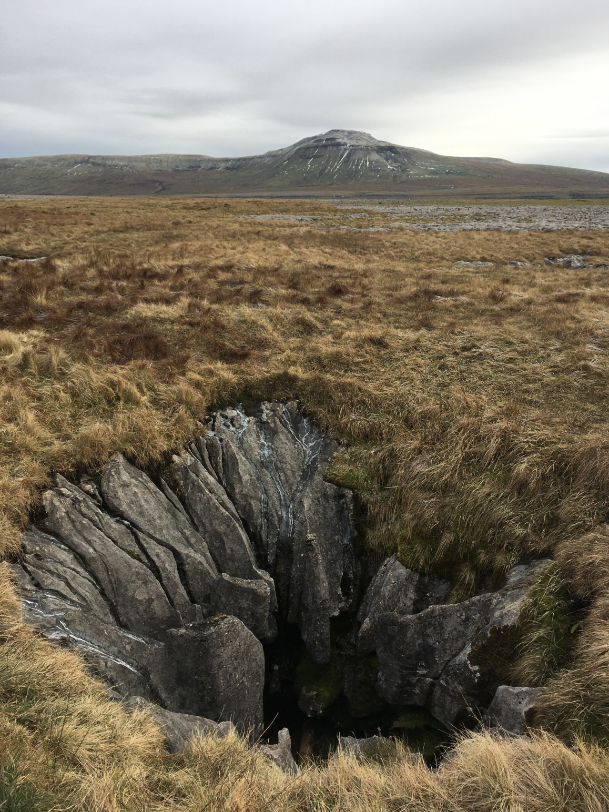
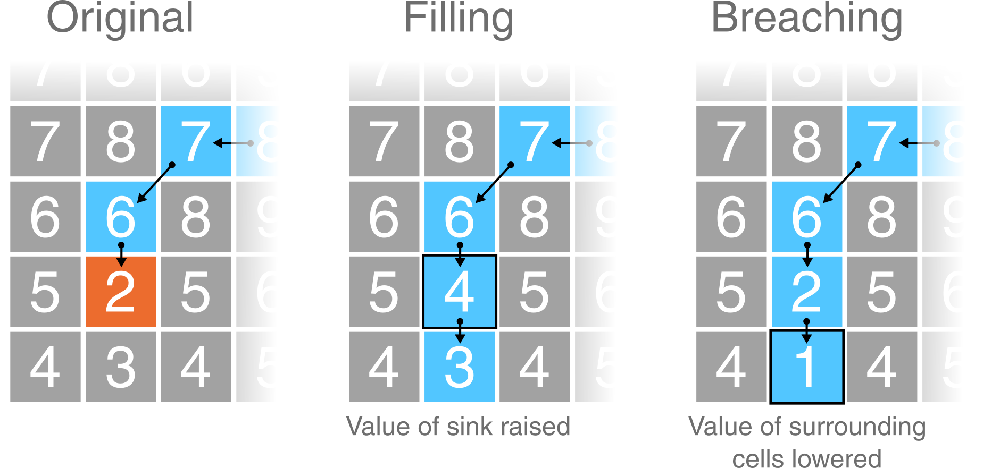
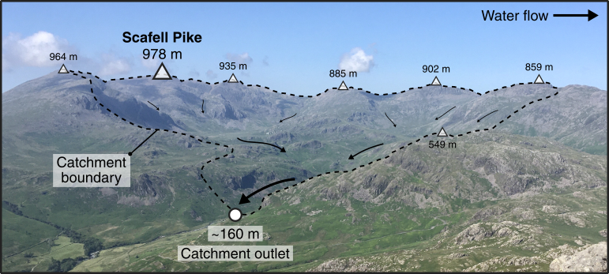
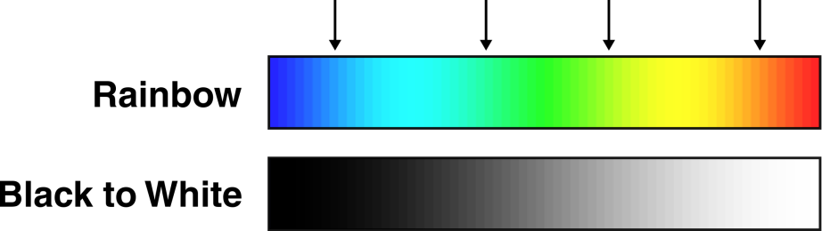
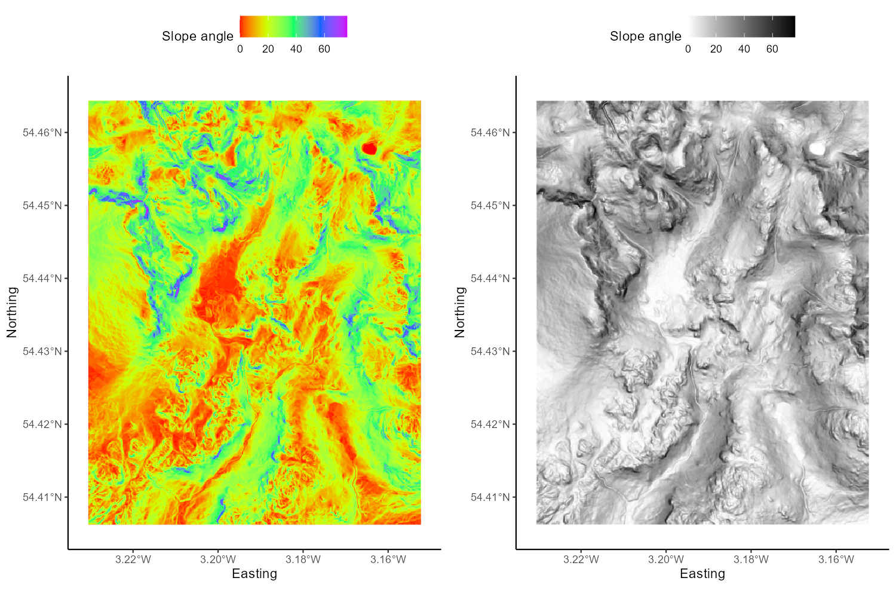
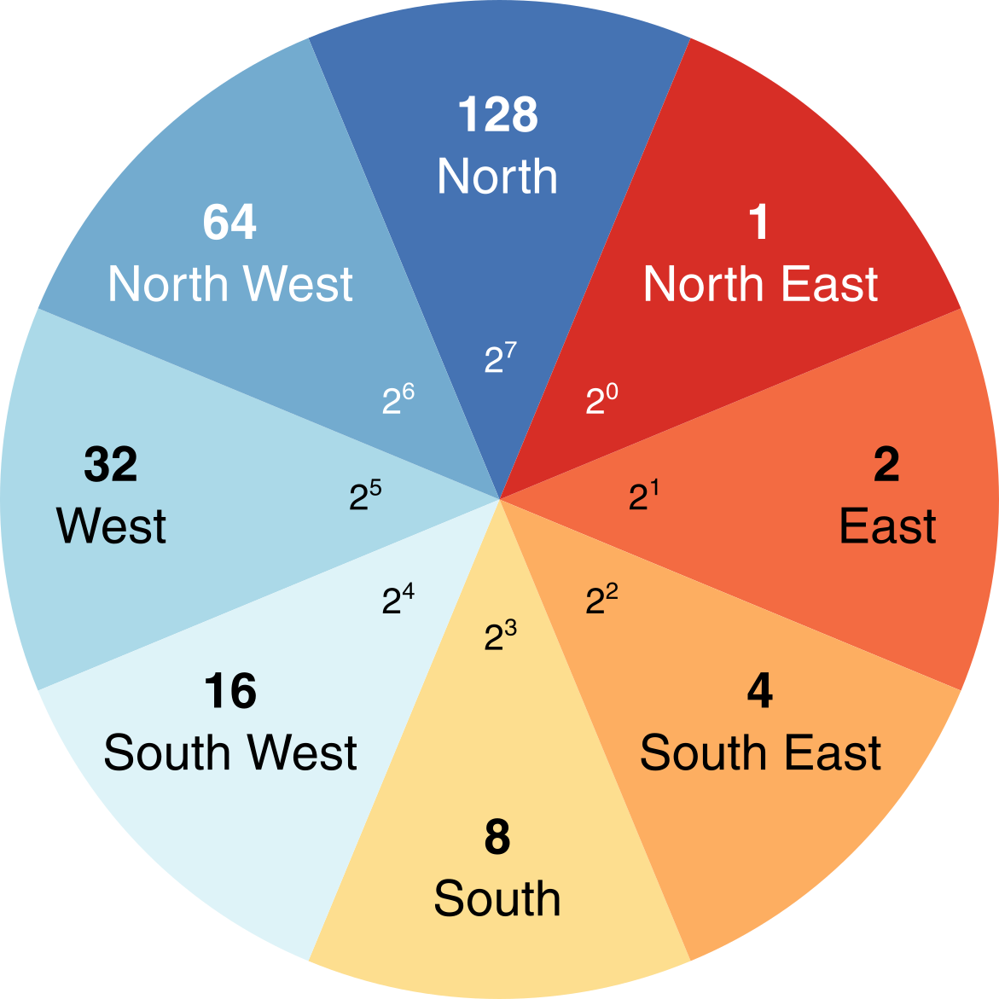
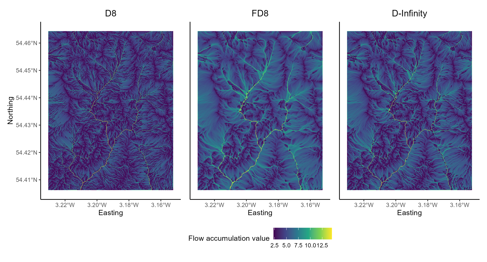

# Eskdale III - Flow routing {#Eskdale_flow_algorithms}

Overland and near-surface water flow can be modelled using DEMs if we assume that surface topography is the sole factor which influences the distribution of water. One very simple model routes all water from a particular grid cell in a DEM to a single neighbouring cell (i.e. water is not partitioned between multiple neighbours). This ‘D8’ (8 direction) method sets the flow direction toward the lowest of the eight neighbouring cells, in relation to the centre cell. 


<p align="center">
<a name="Figure_1"></a>{width=40%}
</p>

**Figure 1: Schematic of the D8 method**. The elevation value of the centre cell is 8 m (dark blue). Under atmospheric pressure, water flows to areas of lower elevation (< 8 m; light blue) and does not flow to areas of higher elevation (>8 m; grey). In this case, the D8 method would route all the water from the centre cell into the bottom left cell, as it has the lowest value (4 m).

Using this method, water flow is allowed in one of eight possible directions (↑ ↗ → ↘ ↓ ↙ ← ↖), assuming that water will travel along the steepest downslope path. In turn, the method is sometimes referred to as the steepest descent method. Based on the $3 * 3$ cell neighbourhood shown in **Figure 1**, flow would be directed from the centre cell (8 m elevation) to the southwest cell (4 m elevation).

> **Reminder**: you don't have to run every bit of code in this document. Indented text (such as this) is an instruction that tells you something to either think about, or do.

## DEM pre-processing: flow enforcement

One common issue encountered when performing hydrological analyses is the presence of sinks, which interrupt the drainage network. When sinks are encountered, flow direction is undefined when a grid cell, or group of grid cells, is lower than all neighbouring cells (see **Figure 2**). When sinks are encountered, and when there are no downslope neighbours, all water that enters a cell is unable to escape. These features are referred to as pits if they are a single cell in size, and depressions if they consist of groups of cells.

<p align="center">
<a name="Figure_2"></a>{width=50%}
</p>

**Figure 2: Schematic of a sink in a DEM**. In this $5 * 5$ matrix, water is routed into the top right cell (9 m) and then is routed to the lowest elevation cell at each step (9 m → 8 m → 7 m → 6 m → 2 m) using the D8 method (blue cells). However, the drainage network is interrupted by a sink at the 2 m cell (orange), as all neighbouring cells are of higher elevation.

Sinks can often be artefacts of the data and should be removed during DEM pre-processing. Pre-processing involves altering the elevations of the DEM in a way that enforces continuous flow-paths. However, it is important to realise that sometimes these ‘digital depressions’ reflect actual features in the landscape, and should be preserved during flow modelling. This is a particular issue for hydrological analysis of karst environments, where water can be routed into dolines and fractures (see **Figure 3**). However, for our work, we will assume that all depressions in DEMs are artefacts and are justified in being removed.

<p align="center">
<a name="Figure_3"></a>{width=50%}
</p>

**Figure 3: An example of a "true" DEM sink**. A sinkhole extending into the limestone karst of Twisleton Scar, Yorkshire Dales, with Ingleborough behind (723 m). How should we model water flow in environments with sinkholes, fractures, dolines and extensive sub-surface water flow? 

Several methods have been developed for removing depressions from DEMs. These methods vary greatly in terms of their sophistication and impact on the DEM. The two most common depression removal methods (**Figure 4**) are:

- depression **filling**, which raises cells within a depression to the elevation of the outlet cell;
- depression **breaching**, which digs a trench from a depression’s bottom to some point downslope.

<br/> 

<p align="center">
<a name="Figure_3"></a>{width=100%}
</p>

**Figure 4: Schematic of depression filling and breaching in a DEM**. Using the same values from Figure 2, original values are modified to allow water to escape the sink (orange). Depression filling has raised the value of the sink (2 m → 4 m), while depression breaching has lowered the value of a neighbouring cell (3 m → 1 m). In this simplified example, the outputs of these two distinct approaches are identical but care should be taken when working with real world data as they will often produce different results. 

Not all interruptions to flow routing are caused by depression cells. Often, DEMs contain extensive flat regions (areas of equal elevation). Flat areas interrupt flow routing in the same way as depressions. Cells within a flat region do not have downslope neighbours, and therefore, flow routing is impossible on flat sites without pre-processing. Correction of flow direction on flat sites typically involves finding an outlet cell, forcing flow from cells adjacent to the outlet to the outlet, and continuing backwards in an iterative manner (e.g., @jenson_extracting_1988).

### Data description

The DEM we are working with is centred on the Upper Eskdale catchment; an upland valley which drains the highest mountain in England (Scafell Pike; 978 m), as shown below:

<p align="center">
<a name="Figure_4"></a>{width=100%}
</p>

**Figure 5: Upper Eskdale panorama**, viewed from Harter Fell [Location: 54.386907, -3.205004, Elevation: 649 m]. The catchment ranges in elevation from 978 m (Scafell Pike) to ~160 m at the catchment outlet (white circle), and is ringed by numerous summits with elevations in excess of 800 m (white triangles). The catchment has an area of ~15.7 km<sup>2</sup> and all water which falls with the catchment ultimately drains to the Irish Sea via the River Esk. 

You can explore the catchment below: 

```{r, echo = FALSE, fig.align="center", warning = FALSE, message=FALSE}

# Labelling
content <- paste(sep = "<br/>",
                 "<b><a>Catchment Outlet (~160 m)</a></b>",
                 "Upper Eskdale",
                 "Western Lake District"
                 )

# Read using sf
eskdale_watershed_polygons <- st_read(here("output", "practical_1", "eskdale_watershed.shp"),
                                      quiet = TRUE)

# Transform using sf
eskdale_watershed_polygons <- st_transform(eskdale_watershed_polygons, 4326)

# Loads shapefiles and transform using rgdal (deprecated)
# eskdale_watershed_polygons <- readOGR(here("output", "practical_1", "eskdale_watershed.shp"), verbose = FALSE)
# eskdale_watershed_polygons <- spTransform(eskdale_watershed_polygons, CRS("+proj=longlat +datum=WGS84"))

m <- leaflet() %>%
  # Sets views
  setView(lat=54.436374897510255, lng = -3.1909687216299947, zoom = 12.1) %>%
  # Adds default tiles
  #addTiles()  %>%
  addProviderTiles(providers$OpenTopoMap) %>%
  # Add polygon
  addPolygons(data=eskdale_watershed_polygons, color = "#444444", fillColor = "#33b9ff", 
              weight = 1, smoothFactor = 0.5, opacity = 0.9, fillOpacity = 0.2) %>%
  # Add popops
  addPopups(-3.204500685, 54.412119851, content,
    options = popupOptions(autoClose = FALSE, closeOnClick = FALSE)
  )
  # Adds marker for the catchment outlet
  #addMarkers(lat=54.412119851, lng = -3.204500685, popup = "Catchment Outlet (~160 m)")
m

```

<br/> 

The DEM we are working with was downloaded from [EDINA Digimap](https://digimap.edina.ac.uk/), has a cell size of 10 m and uses the **British National Grid** (BNG), a **projected** coordinate Reference System [[EPSG:27700](https://epsg.io/27700)]. 

Unfortunately, we don't have time in this course to delve into the exciting world of map projections, although these are covered in great detail in [**Understanding GIS**](https://www.manchester.ac.uk/study/masters/courses/list/07053/msc-geographical-information-science/course-details/GEOG71552#course-unit-details). However, it is important to know that different map projections have different uses and work more/less effectively in different regions. As we are working within the UK, it makes sense to use a map projection which is tailored to the UK (e.g. BNG) as this minimises different types of map distortion (length, shape, area). 

When loaded into R using the `raster` package and plotted using `ggplot2` and `ggspatial`, our DEM can be visualised as follows, where the outlet point (white circle) and summits (black triangles) match those shown in Figure 5. 

```{r, echo = FALSE, warning= FALSE, message = FALSE, fig.align = 'center', results='hide'}
# Sets file path for DEM and hillshade
dem_file_path <- here("data", "practical_1", "dem_10m.tif")
hillshade_file_path <- here("data", "practical_1", "hillshade_10m.tif")
outlet_file_path <- here("data", "practical_1", "pour_point.shp")

# Loads datasets
dem <- raster(dem_file_path)
hillshade <- raster(hillshade_file_path)
outlet <- st_read(outlet_file_path)

# Create vectors for Eskdale summits
name <- c("Scafell", "Scafell Pike", "Broad Crag", "Esk Pike", "Bowfell", "Crinkle Crags", "Hard Knott")
elevation <- c(964, 978, 935, 885, 902, 859, 549)
lat <- c(54.447763, 54.454305, 54.455630, 54.457189, 54.447812, 54.433763, 54.411016)
lon <- c(-3.224725, -3.211583, -3.199687, -3.179151, -3.166392, -3.160426, -3.184869)

# Combines into a data frame
summits <- data.frame(name, elevation, lat, lon)

# Converts to simple features, setting the projection to WGS84
projcrs <- "+proj=longlat +datum=WGS84 +no_defs +ellps=WGS84 +towgs84=0,0,0"
summits_sf <- st_as_sf(x = summits,                         
           coords = c("lon", "lat"),
           crs = projcrs)

# Plots using ggplot
g <- ggplot() +
  layer_spatial(dem, aes(fill = stat(band1))) +
  layer_spatial(hillshade, aes(fill = after_stat(band1)), alpha = 2/10) +
  geom_sf(data = outlet, shape = 21, size = 3, fill = "white", colour = "black") +
  geom_sf(data = summits_sf, shape = 24, size = 2, fill = "black", colour = "black") +
  theme_classic() + 
  labs(fill = "Elevation (m)") +
  scale_fill_continuous(type = "viridis",  na.value = NA)
g
```

To accentuate areas of relief, the DEM has been combined with a semi-transparent **hillshade** layer, which is shown below:

```{r, echo = FALSE, warning= FALSE, message = FALSE, fig.align = 'center', results='hide'}

# Plots using ggplot
g <- ggplot() +
  layer_spatial(hillshade, aes(fill = after_stat(band1))) +
  theme_classic() +
  labs(fill = "Hillshade") +
  scale_fill_gradient(low = "black", high = "white",  na.value = NA)
g
```

### Breaching and filling

To evaluate the effects of depression **breaching** and **filling**, we're going to use the `whitebox` package and the `wbt_fill_depressions` and `wbt_breach_depressions` functions. One of the advantages of using `whitebox` is that functions can be applied to spatial data without having to load files into the R environment (and assign them to objects), which can be an issue when working with large files (e.g. high spatial resolution rasters) or when working on computers with limited available memory. 

We can **call** `whitebox` functions by simply naming the function, specifying the names of the input and output layers, and deciding on parameters (if required). For example, the code to fill depressions, might resemble the following:

```{r, eval = FALSE, warning= FALSE, message = FALSE}

# Fill depressions
wbt_fill_depressions("name of input file goes here", "name of output file goes here")

```

Given the structure of our file directory, this could be written as: 

```{r, eval = FALSE, warning= FALSE, message = FALSE}

# Fill depressions
wbt_fill_depressions("C:/Users/Bill/GEOG-70581/data/practical_1/dem_10m.tif", 
                     "C:/Users/Bill/GEOG-70581/output/practical_1/dem_10m_fill.tif")

```

Here, we've used absolute file paths to set the input DEM as `dem_10m.tif`, stored in data/practical_1. The function `wbt_fill_depressions` will fill depressions in the input DEM and save the new DEM as `dem_10m_fill.tif`, stored in output/practical_1. 
 
However, because we're using an R project we can simplify this further. As we'll be using the DEM (`dem_10m.tif`) on multiple occasions, we can store its file path using the **here** package in the variable `dem` as follows:

```{r, eval = FALSE, warning= FALSE, message = FALSE}
# Sets file path for DEM
dem <- here("data", "practical_1", "dem_10m.tif")

# Prints the file path to the console window
dem

```

> Copy and paste the above code into your Practical-1-Eskdale script and run. This should print the absolute file path to `dem_10m.tif`.

With this file path stored, we can run the fill depressions function as follows, using the **here** package to specify the name and intended location of the **output** file:

```{r, eval = FALSE, warning= FALSE, message = FALSE}

# Fills depressions
wbt_fill_depressions(dem, here("output", "practical_1", "dem_10m_fill.tif"))

```

> Run the above code, which should produce a new raster file in the output/practical_1 folder. 

> Repeat this process to also **breach** depressions, making sure to update the output file name. 

The difference between the original DEM and the processed DEM(s) may be very subtle and you probably won’t be able to observe the differences directly. As such, it may be useful to identify the specific areas of the raster which have been modified. This can be achieved by using the `subtract` function to work out the difference between the original DEM and the processed DEM, as follows:

```{r, eval = FALSE, warning= FALSE, message = FALSE}

# Subtract function; the difference between the processed DEM (filled) and the original DEM
wbt_subtract(here("output", "practical_1", "dem_10m_fill.tif"), # Input file 1
              dem, # Input file 2
              here("output", "practical_1", "dem_10m_fill_difference.tif")) # Output file

```

> Run the above code. 

To visualise this new raster file, we're going to load it into the R environment using the `raster` and `here` packages and plot with `ggplot2` and `ggspatial`. 

The raster can be loaded as follows: 

```{r, warning= FALSE, message = FALSE, fig.align = 'center', results='hide'}

# Loads raster using the raster and here packages
eskdale_dem <- raster(here("output", "practical_1", "dem_10m_fill_difference.tif"))

```

It can be plotted as follows: 

```{r, echo = TRUE, eval = TRUE, warning= FALSE, message = FALSE, fig.align = 'center'}

# Find minimum and maximum values
minimum_value <- min(values(eskdale_dem)[which(values(eskdale_dem) > 0)])
maximum_value <- max(values(eskdale_dem))

# Plots using ggplot
g <- ggplot() +
  layer_spatial(eskdale_dem, aes(fill = after_stat(band1))) +
  theme_classic() + 
  labs(fill = "Elevation difference (m)", x = "Easting", y = "Northing") +
  scale_fill_continuous(type = "viridis",  na.value = NA, 
                        limits = c(minimum_value, maximum_value))
g
```

Most of the above should be familiar to you, with a few exceptions:

- Under `scale_fill_continuous()`, we've set limits for the fill symbology. This now ranges between the maximum value, calculated using `max(values(dem))`, and the minimum value that is **greater than 0**, calculated using `minimum_value <- min(values(dem)[which(values(dem) > 0)])`. The latter is useful because most of the DEM was unmodified by `wbt_fill_depressions` so most raster cells contain a value of 0.
- The `layer spatial()` is a non-standard geom type and is available through the `ggspatial` package. This simplifies the process of plotting raster data in ggplot2, and this approach should be replicated for future plotting. 

> Run the above code elements to reproduce the plot above. You can remove `limits` from the `scale_fill_continuous()` argument to plot the actual distribution of DEM values. 

> Question: to what degree has the original DEM been modified by the `wbt_fill_depressions` function? Consider the **spatial extent** and **magnitude** of the observed differences.

**Note**: For this catchment, the difference between DEM breaching and filling is relatively minor. We'll use the latter (`dem_10m_fill.tif`) for all subsequent calculations. 

As outlined above, the areas which are most affected by the depression filling algorithm are partly determined by local relief i.e. relatives differences in elevation. To help visualise this, let’s create and plot a **slope** image for the area, where the values in the raster cells represent the gradient of the slope, rather than their raw elevation. This can be achieved using the `wbt_slope` function. 

> Using the examples above, run `wbt_slope`, using the original DEM as the input, saving the output file with a logical name (e.g. `dem_10m_slope.tif`) and to the correct sub-directory (output/practical_1). 

> Load the data into R and plot using ggplot2. Your figure should resemble the following:

```{r, echo = FALSE, eval = FALSE, warning= FALSE, message = FALSE, fig.align = 'center'}

# Sets file path for DEM
dem <- here("data", "practical_1", "dem_10m.tif")

# Create slope raster
wbt_slope(dem, here("output", "practical_1", "dem_10m_slope.tif"))

```

```{r, echo = FALSE, eval = TRUE, warning= FALSE, message = FALSE, fig.align = 'center'}

# Loads raster using the raster and here packages
eskdale_slope <- raster(here("output", "practical_1", "dem_10m_slope.tif"))

# Plots using ggplot
s <- ggplot() +
  layer_spatial(eskdale_slope, aes(fill = after_stat(band1))) +
  theme_classic() + 
  labs(fill = "Slope angle", x = "Easting", y = "Northing") +
  scale_fill_continuous(type = "viridis",  na.value = NA)
s

```

> Compare the ‘slope’ and ‘difference’ images. **Hint**: you can toggle between plots using the left and right arrows in the plot window. Based on your visual inspection the images, which parts of the landscape appear to have been affected by the depression filling algorithm? Why do you think that this is the case?

Before we move on to further analysis, it is worth thinking carefully about the **symbology** we are using for our raster layers. This is important, because not all colour ramps are created equal! Colour ramps differ in terms of their **perceptual uniformity** and their accessibility for **colour-blind** individuals. 

> Save your script before continuing. 

### Choosing a colour ramp

Perceptual uniformity refers to how well a colour ramp represents the underlying data. Some (e.g. [rainbow](https://www.climate-lab-book.ac.uk/2014/endof- the-rainbow/); @hawkins_scrap_2015) can introduce artificial boundaries (@alcalde_framing_2017) which influence how we assess and then use that data (see [here](https://blogs.egu.eu/divisions/gd/2017/08/23/the-rainbow-colour-map/)). In the schematic below, there are numerous artificial boundaries in the rainbow colour ramp (e.g. dark blue → light blue, light blue → green, green → yellow, yellow → orange), whereas the monochrome colour ramp smoothly transitions from black → white. 

<p align="center">
<a name="Figure_6"></a>{width=50%}
</p>


The **viridis** colour ramp we have been using so far **is** perceptually uniform, but others are not. 

> Inspect Figure 6 below. These show the same slope raster, but one is visualised using *rainbow*, while the other uses a monochrome (perceptually-uniform) colour ramp. Does this influence how you interpret the data?

<p align="center">
<a name="Figure_6"></a>{width=100%}
</p>

**Figure 6: Perceptual uniformity** with rainbow and monochrome colour ramps. 

In a similar fashion, not all colour ramps are suitable for individuals with various forms of colour-blindness (see @levine_using_2009 and  @geissbuehler_how_2013), who may have difficulty distinguishing reds from greens, or yellows from blues. Luckily, there are now a range of perceptually uniform and colour-blind friendly colour ramps (e.g. @crameri_geodynamic_2018), including [Scientific Colour Maps 6.0](http://www.fabiocrameri.ch/colourmaps.php). These can be downloaded and used across a range of GIS programs to suit a range of data types. For now, utilise the colour ramps available in R (i.e. viridis) but bear these issues in mind for future map creation. 

## Flow Parameters: Pointers

Now that we have a DEM that has had all interruptions to flow removed, we can continue to calculate the data needed to define the drainage network i.e. the topological network describing how each cell in a DEM is connected to all others.

One key input for drainage network calculations is a **pointer file**, which stores the flow direction of each cell in a raster grid, and thus, the topology of the drainage network. The exact nature of these data depends on the method used to derive the flow directions. Whitebox Tools stores D8 pointers as binary numbers in base-2, as follows:

<p align="center">
<a name="Figure_7"></a>{width=100%}
</p>

We'll explore the reason for this in Practical 2. In our earlier example of the D8 flow algorithm (see Figure 1), the flow direction was to the **SW**. This has a binary value of $2^4 = 16$. Therefore, in the pointer file, the highlighted dark blue cell would be assigned a value of 16. 

Several sub-programs in Whitebox Tools use pointer files to calculate other terrain data, including the algorithms used to calculate catchment area (see below). However, sub-programs rarely require a pointer file as an input, as WBT will automatically generate a pointer layer from the input DEM when required, before discarding the file afterwards. While this processing step is not readily apparent to the user, it is important to realise that it occurs, and it is often good practice to generate a pointer file manually. This can be achieved using the `wbt_d8_pointer` function. 

> Using the understanding gained above, run the `wbt_d8_pointer` function, using the correct input files and output file name and directory. Load the raster into R and plot. Your output should resemble the following, where each cell value has been reclassified according to the D8 flow. 

```{r, echo = FALSE, eval = FALSE, warning= FALSE, message = FALSE, fig.align = 'center'}

# Calculates D8 pointer
wbt_d8_pointer(here("output", "practical_1", "dem_10m_fill.tif"), 
               here("output", "practical_1", "dem_10m_D8_pointer.tif"))

```

```{r, echo = FALSE, eval = TRUE, warning= FALSE, message = FALSE, fig.align = 'center'}

# Loads raster using the raster and here packages
eskdale_pointer <- raster(here("output", "practical_1", "dem_10m_D8_pointer.tif"))

# Plots using ggplot
p <- ggplot() +
  layer_spatial(eskdale_pointer, aes(fill = after_stat(band1))) +
  theme_classic() + 
  labs(fill = "Pointer value", x = "Easting", y = "Northing") +
  scale_fill_continuous(type = "viridis",  na.value = NA)
p 
```

While this is an acceptable plot, it is actually slightly misleading, because the scale bar is *continuous*, despite the fact that our underlying data are *discrete* i.e. there are only eight possible values, which are listed below:

- $2^0 = 1$
- $2^1 = 2$
- $2^2 = 4$
- $2^3 = 8$
- $2^4 = 16$
- $2^5 = 32$
- $2^6 = 64$
- $2^7 = 128$

Here is the same data but using a discrete scale:

```{r, echo = TRUE, eval = TRUE, warning= FALSE, message = FALSE, fig.align = 'center'}

# Manually defined colours based on "RdYlBu" colour palette
colours <- c("1" = "#D73027",
             "2" = "#F46D43",
             "4" = "#FDAE61",
             "8" = "#FEE090",
             "16" = "#E0F3F8",
             "32" = "#ABD9E9",
             "64" = "#74ADD1",
             "128" = "#4575B4")

# Plotting
p <- ggplot() +
  layer_spatial(eskdale_pointer, aes(fill = factor(stat(band1)))) +
  theme_classic() + 
  labs(fill = "Pointer value", x = "Easting", y = "Northing") +
  scale_fill_manual(values = colours, na.value = NA)
p
```

which is described here:

<p align="center">
<a name="Figure_8"></a>{width=50%}
</p>

> Question: Can you think of any issues with symbolising pointer data? 

> Save your script before continuing. 


##  Flow Algorithms

Once you have determined how each grid cell in a DEM is connected to its neighbours, it is possible to use this pointer information to calculate the number of grid cells that are connected to each cell in an upslope (catchment area) and downslope (dispersal area) direction. These data describe the spatial pattern of upslope (or downslope) area draining to (or away from) each pixel in a DEM.

Measures of catchment area are often used for stream network extraction and other terrain indices. There are three primary measures of catchment area:

- Number of Upslope Elements (**NUE**): the number of cells draining to each grid cell;
- Upslope Contributing Area (**UCA**): the NUE multiplied by the cell area; 
- Specific Contributing Area (**SCA**): the UCA divided by the cell size or grid resolution.

The SCA characterises the amount of flow across a unit length of contour in the catchment. Unlike the NUE and UCA, SCA is not affected by the grid resolution of the DEM.

To calculate the upslope catchment area for each raster cell, we can use the `wbt_d8_flow_accumulation` function. 

> Run the above function, using the filled DEM as the input file and the output type (`out_type`) as 'specific contributing area' (in quotation marks). As SCA data typically have a very large range of values, we can also log-transform the flow accumulation values (`log = "TRUE"`) to improve plot readability. Save the output file with a logical name (e.g. `dem_10m_flow_accumulation.tif`) and to the correct sub-directory (output/practical_1). Load the raster to R and plot, and your output should resemble the following:

```{r, echo = FALSE, eval = FALSE, warning= FALSE, message = FALSE, fig.align = 'center'}

# Calculates accumulation file
wbt_d8_flow_accumulation(here("output", "practical_1", "dem_10m_fill.tif"), 
                         here("output", "practical_1", "dem_10m_flow_accumulation.tif"), 
                         out_type = "specific contributing area", 
                         log = "TRUE")
```

```{r, echo = FALSE, eval = TRUE, warning= FALSE, message = FALSE, fig.align = 'center'}

# Loads raster using the raster and here packages
eskdale_d8 <- raster(here("output", "practical_1", "dem_10m_flow_accumulation.tif"))

# Plots using ggplot
p <- ggplot() +
  layer_spatial(eskdale_d8, aes(fill = after_stat(band1))) +
  theme_classic() + 
  labs(fill = "Log-transformed flow accumulation value", x = "Easting", y = "Northing") +
  scale_fill_continuous(type = "viridis",  na.value = NA)
p 
```

> Inspect the map output. **Question**: Which parts of the landscape have low/high values of SCA, respectively?

### Comparing flow algorithms 

So far we have used the most simplistic flow algorithm (D8) to model specific catchment area (SCA). However, there are many flow algorithms available (e.g. @fairfield_drainage_1991, @seibert_new_2007, @grabs_calculating_2010) and each algorithm results in slightly different spatial patterns of water flow. As flow routing is fundamental to the modelling of surface water hydrology, it is important to familiarise yourself with several commonly used methods, although it can be difficult to decide when or where it is appropriate to use a particular routing algorithm. In this section of the practical, we will compare the output of three flow routing algorithms including:

- **D8**: see @ocallaghan_extraction_1984
- **FD8**: see @freeman_calculating_1991, @quinn_prediction_1991 and its modification by @quinn_tan_1995
- **D-infinity**: see @tarboton_new_1997; 

Flow algorithms differ in the way in which they:

- calculate flow direction; 
- model flow divergence, i.e., partition flow between neighbouring downslope cells; 
- handle streams.

The D8 algorithm is incapable of modelling flow divergence (or dispersion) because the flow from a particular grid cell is directed to a single downslope neighbour. FD8 (i.e. fractional D8; @freeman_calculating_1991, @quinn_prediction_1991) divides flow to each downslope neighbour using a partitioning scheme that is based on the slope angle to neighbouring cells, while a later modification by @quinn_tan_1995 increases the degree of flow convergence from the catchment divide to the channel head. Finally, D-infinity divide flows between a maximum of two downslope neighbours based on the direction of maximum downward slope. Of these, FD8-Quinn (@quinn_tan_1995) is the only algorithm of the three that explicitly recognises that flow on hillslopes should be divergent while flow along valley bottoms should be convergent. 

In the final part of the practical, we will assess the specific catchment areas (SCA) derived from each of the flow algorithms discussed above.

### FD8 catchment area 

To calculate the catchment area using the FD8 algorithm (@freeman_calculating_1991; @quinn_prediction_1991; @quinn_tan_1995), use the `wbt_fd8_flow_accumulation` function.

> Use the `wbt_fd8_flow_accumulation` function, making sure to select 'specific contributing area' and remembering to log-transform the values. The exponent parameter should be set to 1.1 (`exponent = 1.1`), as suggested by @freeman_calculating_1991. Save with an appropriate name (e.g. `dem_10m_flow_accumulation_fd8.tif`). Load the raster in R and plot. 

### D-infinity catchment area

To calculate the catchment area using the D-infinity algorithm of @tarboton_new_1997: 

> Use `wbt_d_inf_flow_accumulation`. Use the same input parameters as above (i.e. SCA, log-transformed values). Save with an appropriate name (e.g. `dem_10m_flow_accumulation_d_inf.tif`). Load the raster in R and plot. 

### Comparing the outputs

The output of the algorithms should resemble the following:

<p align="center">
<a name="Figure_7"></a>{width=100%}
</p>

**Figure 7: Flow algorithm comparison**. Results from the D8, FD8 and D-Infinity algorithms. Plot created using `ggplot2` and the `patchwork` package (useful for combining plots). 

When water flows over a hillslope, you would expect there to be some degree of divergence depending on the topography (i.e. some hillslopes are convergent and some are divergent). However, once water becomes channelised, you would no longer expect flow to be divergent. Once water is in a channel it stays there until it reaches a lake or ocean. Branching in channels is rather rare. So let’s assume that the pattern of SCA should display some degree of dispersion on hillslopes and no dispersion at all along valley bottoms (i.e. in streams). Flow divergence or dispersion is apparent in SCA images by a ‘fuzzy’ quality, almost like the SCA has been smudged. You can zoom into individual plots using the **Zoom** button in the Plot Window or edit the x- and y-axis limits of your plots by adding the following to your `ggplot2` call: 

```{r, echo = TRUE, eval = FALSE, warning= FALSE, message = FALSE}
# Sets x- and y-axis limits using coord_sf()
+ coord_sf(ylim=c(504063,506727), xlim = c(320705, 322255))

```

The above code uses British National Grid coordinates (m), rather than decimal degrees.  

<br/> 

**To finish Practical 1**, save your script and complete the following:

> Compare the D8, FD8 and D-Inf outputs. Either cycle between the plots using the plot window or combine them using the `patchwork` package. This would need to be installed and loaded to the library. 

> Which algorithms do a good job modelling the pattern of contributing area on hillslopes?

> Can you see signs of flow divergence along streams in any of the SCA images? Which algorithms perform best for modelling the pattern of SCA in fluvial (stream) environments?

> Do any of the algorithms do a good job for both hillslopes and streams?

<br/> 

**Congratulations!** You have now completed the Practical 1 (Eskdale; Chapters 4 - 6). You now have considerable experience running `whitebox`  functions as well as visualising spatial data using `ggplot2`. 

<br/> 

## Practical solution

As with the introduction to R (Chapter 2 - 3), I will provide a code solution to the Eskdale practical (Chapters 4 - 6), outlining the major analytical steps. 

This will be released prior to the Week 10 class. 

```{r, echo = FALSE, eval = FALSE, warning= FALSE, message = FALSE, fig.align = 'center'}

# Solution to Practical 1 (Eskdale)
# Author: matt-tomkins
# Date of upload: xx-xx-xxxx

```

```{r, echo = TRUE, eval = TRUE, warning= FALSE, message = FALSE, fig.align = 'center'}

# Solution to Practical 1 (Eskdale)
# Author: matt-tomkins
# Date of upload: 24/11/2023

# You may need to set your working directory here if working on a university-managed computer
# setwd(---- DIRECTORY PATH HERE ----)

# Function to check and install packages
check.packages <- function(pkg){
  new.pkg <- pkg[!(pkg %in% installed.packages()[, "Package"])]
  if (length(new.pkg)) 
    install.packages(new.pkg, dependencies = TRUE)
  sapply(pkg, require, character.only = TRUE)
}

# Checks and installs packages
packages <- c("ggplot2", "sf", "here", "raster", "whitebox", "ggspatial", "patchwork")
check.packages(packages)

# Initialise whitebox tools executable
# whitebox::install_whitebox()

# Check whitebox is in the library and the version
# library(whitebox)
# wbt_version()

# Sets file path for DEM
dem <- here("data", "practical_1", "dem_10m.tif")

# Breach and fills depressions
wbt_fill_depressions(dem, here("output", "practical_1", "dem_10m_fill.tif"))
wbt_breach_depressions(dem, here("output", "practical_1", "dem_10m_breach.tif"))

# Calculates D8 pointer
wbt_d8_pointer(here("output", "practical_1", "dem_10m_fill.tif"), 
               here("output", "practical_1", "dem_10m_D8_pointer.tif"))

# Calculates D8 accumulation file (SCA), with log-transformed values
wbt_d8_flow_accumulation(here("output", "practical_1", "dem_10m_fill.tif"), 
                         here("output", "practical_1", "dem_10m_flow_accumulation.tif"),
                         out_type = "specific contributing area", 
                         log = "TRUE")

# Calculates FD8 accumulation file (SCA), with log-transformed values and an exponent of 1.1
wbt_fd8_flow_accumulation(here("output", "practical_1", "dem_10m_fill.tif"), 
                         here("output", "practical_1", "dem_10m_flow_accumulation_fd8.tif"), 
                         out_type = "specific contributing area", 
                         log	= "TRUE", 
                         exponent = 1.1)

# Calculates D-Infinity accumulation file (SCA), with log-transformed values
wbt_d_inf_flow_accumulation(here("output", "practical_1", "dem_10m_fill.tif"), 
                          here("output", "practical_1", "dem_10m_flow_accumulation_d_inf.tif"), 
                          out_type = "specific contributing area", 
                          log	= "TRUE")

# Loads accumulation files using raster and here packages
eskdale_d8 <- raster(here("output", "practical_1", "dem_10m_flow_accumulation.tif"))
eskdale_fd8 <- raster(here("output", "practical_1", "dem_10m_flow_accumulation_fd8.tif"))
eskdale_d_inf <- raster(here("output", "practical_1", "dem_10m_flow_accumulation_d_inf.tif"))

# Plots D8 using ggplot2
p_d8 <- ggplot() +
  # Adds raster layer using layer_spatial
  layer_spatial(eskdale_d8, aes(fill = after_stat(band1))) +
  # Sets ggplot theme
  theme_classic() + 
  # Axis and legend labeling
  labs(fill = "Flow accumulation value", x = "Easting", y = "Northing", 
       title="D8") +
  # Sets fill symbology
  scale_fill_continuous(type = "viridis",  na.value = NA) +
  # Removes legend, sets title size
  theme(legend.position = "none", 
        plot.title = element_text(hjust = 0.5))

# Plots FD8 using ggplot2
p_fd8 <- ggplot() +
  # Adds raster layer using layer_spatial
  layer_spatial(eskdale_fd8, aes(fill = after_stat(band1))) +
  # Sets ggplot theme
  theme_classic() + 
  # Axis and legend labeling
  labs(fill = "Flow accumulation value", x = "Easting", y = "Northing", 
       title="FD8") +
  # Sets fill symbology
  scale_fill_continuous(type = "viridis",  na.value = NA) +
  # Sets legend location and axis labeling 
  theme(legend.position = "bottom") +
  theme(axis.title.y=element_blank(),
        axis.text.y=element_blank(),
        axis.ticks.y=element_blank(),
        plot.title = element_text(hjust = 0.5))

# Plots D-Infinity using ggplot2
p_dinf <- ggplot() +
  # Adds raster layer using layer_spatial
  layer_spatial(eskdale_d_inf, aes(fill = after_stat(band1))) +
  # Sets ggplot theme
  theme_classic() + 
  # Axis and legend labeling
  labs(fill = "Flow accumulation value", x = "Easting", y = "Northing",
       title="D-Infinity") +
  scale_fill_continuous(type = "viridis",  na.value = NA) +
  # Sets fill symbology
  theme(legend.position = "top") +
  # Removes legend and sets axis labeling 
  theme(axis.title.y=element_blank(),
        axis.text.y=element_blank(),
        axis.ticks.y=element_blank(), 
        legend.position = "none", 
        plot.title = element_text(hjust = 0.5))

# Combines using the patchwork library
combined_plot <- p_d8 + p_fd8 + p_dinf

# Displays figure
combined_plot

```
