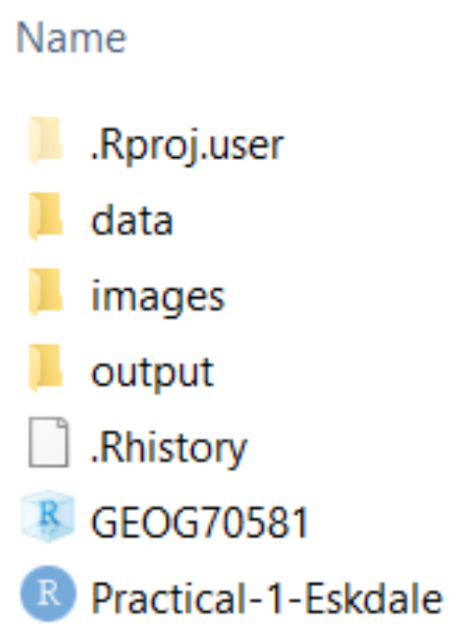
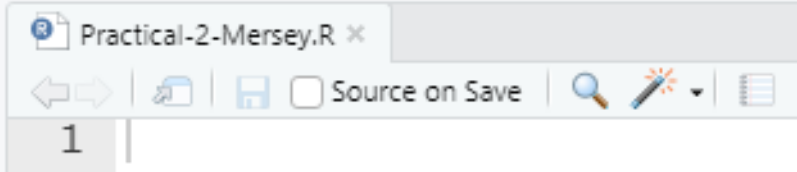

# Mersey II - Set-up {#Mersey_set_up}

## Practical overview

This practical is comprised of six primary tasks, with three weeks of class time available (Weeks 10 - 12). Each of the steps is described in more detail in the remainder of this document. An outline of the key tasks is as follows:

**Mersey III**: To complete in class in Week 10, and finish before the class in Week 11: 

- Task 1: Flow routing
- Task 2: Seed points 
- Task 3: Watershed delineation 

**Mersey IV**: To complete in class in Week 11:

- Task 4: Extracting catchment characteristics 

**Mersey V**: To begin in class in Week 11, and complete in Week 12 and via independent study: 

- Task 5: Model building
- Task 6: Model evaluation

It is anticipated that students should have made good progress through the above tasks in Weeks 10 and 11, giving time in Week 12 to complete any outstanding analysis, develop further skills and understanding (e.g., more ambitious model evaluation, with staff guidance), commence the practical report, and ask any questions you may have before submission.

The above structure was developed in direct response to student feedback from previous years, with requests for additional class time for statistical analysis and for assessment guidance. 

## Install programs

You should have already installed R and RStudio. If not, please refer to the instructions [here](#Installation) before continuing. 

## Download data {#download_data_v2}

The data for this practical have already been downloaded [here](https://online.manchester.ac.uk/webapps/blackboard/content/listContentEditable.jsp?content_id=_13304460_1&course_id=_68533_1) and can be found in `data/practical_2`. The directory structure is outlined in [Chapter 2](#materials). 

## Data description {#practical-2-data}

In Practical 1, we used a single raster file (`dem_10m.tif`) and visualised and assessed the outputs of a number of WBT functions (e.g. fill, breach, slope, pointer, flow accumulation). 

In Practical 2, we are going to use a much wider range of input data, all of which use the **British National Grid** (BNG), a **projected** coordinate Reference System [[EPSG:27700](https://epsg.io/27700)]. Alongside a few supplementary files (which you may wish to use for plotting), the key data are described here:

- **Raster** data (`.tif`):
  - `mersey_dem_fill` 
      - a filled digital elevation model of the Mersey Basin;
  - `mersey_rainfall` 
      - a raster of precipitation values; 
  - `mersey_bedrock` 
      - a categorical raster of bedrock geology types; 
  - `mersey_HOST` 
      - a categorical raster of soil types (**H**ydrology **o**f **S**oil **T**ypes);
  - `mersey_LC` 
      - a categorical raster of land cover classes, based on LCM2000 data;

- **Vector** data (`.shp`):
  - `mersey_EA_sites` 
      - a point vector representing the locations of water quality monitoring stations. The attribute table contains a unique Environment Agency ID for each (`EA_ID`):
      
- **Tables** (`.csv`):
  - `mersey_EA_chemisty` 
      - a comma-delimited table containing measurements for the following water quality indicators, as well as corresponding Environment Agency IDs:
        - pH: acidity/alkalinity;
        - SSC: suspended solids concentration (mg l<sup>−1</sup>);
        - Ca: calcium (mg l<sup>−1</sup>);
        - Mg: magnesium (mg l<sup>−1</sup>);
        - NH<sub>4</sub>: ammonium (mg-N l<sup>−1</sup>);
        - NO<sub>3</sub>: nitrate (mg-N l<sup>−1</sup>);
        - NO<sub>2</sub>: nitrite (mg-N l<sup>−1</sup>);
        - TON: total oxidised nitrogen (mg-N l<sup>−1</sup>);
        - PO<sub>4</sub>: phosphate (mg-P l<sup>−1</sup>);
        - Zn: zinc (μg l<sup>−1</sup>).
  - `mersey_EA_characteristics` 
      - a comma-delimited table containing *some* catchment characteristics, as well as corresponding Environment Agency IDs:
        - Percentage of the each of the five land cover classes present (derived from `mersey_LC`);
        - Percentage of the each of the four soil types present (derived from `mersey_HOST`);
        - Percentage of the each of the three bedrock geology types present (derived from `mersey_bedrock`).
      
> Read through the above descriptions carefully, making sure you understand the data we are using before moving on. We'll be combining the Environment Agency measurements of water quality (e.g. pH, SSC, ...) with spatial data representing the catchment (e.g. topography, rainfall, land cover, ...) to investigate the controls on water quality across the Mersey Basin. 

## Open RStudio

> To begin, open RStudio. 

## Projects and Scripts

### Using an existing R project {#Existing_R_Projects}

In Practical 2 (Eskdale), we utilised an **R Project** called GEOG70581. Your GEOG70581 directory should resemble the following:

<p align="center">
<a name="Figure_scripts"></a>{width=20%}
</p>

Here we have sub-directories for the original data (`data`) and any spatial data files or images we might create (`output` and `images`). We can also see the `GEOG70581` **project file** and the `Practical-1-Eskdale` **R script**. The former is used to improve file access and to ensure our code is reproducible, self-contained and portable (see [here](#R_Projects) for a refresher). The latter contains all our code and comments relating to Practical 1.

In this practical, we **don't** need to create a new R project. We will simply use the existing R project as follows:

> Go to **File**, **Open Project in New Session**, and select the **GEOG70581** project file. 

If this has been successful, your console should have been updated to include the path to your project working directory as follows:

<p align="center">
{width=50%}
</p>

### Creating an R script

As shown in the file directory image above, we already have an R script for the Eskdale practical (`Practical-1-Eskdale`). As we are now working on a separate practical, with different input data and analytical techniques, it makes sense to create a new script to store the code and comments. 

To create a new script for Practical 2:

> Navigate to **File**, **New File** and **R Script**. 

To save the script:

> Navigate to **File** and **Save As**, and save it in the GEOG70581 folder with an appropriate name (e.g. `Practical-2-Mersey`)

This should now resemble the following:

<p align="center">
{width=50%}
</p>

## Loading packages

As we're working in the same R project from Practical 1, we don't need to re-install already utilised packages (e.g. `whitebox`). 

However, we will need to install some new packages and ensure that all packages are loaded into the R environment. 

> Copy and paste the `check.packages` function into your new script, either from below or from `Practical-1-Eskdale.R`:

```{r, eval = FALSE, warning= FALSE, message = FALSE, results='hide'}
# Function to check and install packages
check.packages <- function(pkg){
  new.pkg <- pkg[!(pkg %in% installed.packages()[, "Package"])]
  if (length(new.pkg)) 
    install.packages(new.pkg, dependencies = TRUE)
  sapply(pkg, require, character.only = TRUE)
}
```
<br/> 

In **Practical 1**, we used the following packages:

- [`ggplot2`](https://ggplot2.tidyverse.org/) 
    - for data visualisation;
- [`here`](https://here.r-lib.org/)
    - to construct paths to your project files;
- [`raster`](https://rspatial.org/raster/pkg/index.html)
    - for reading, analysing and writing of raster and vector data;
- [`sf`](https://r-spatial.github.io/sf/) 
    - for simple storage of vector data;
- [`ggspatial`](https://paleolimbot.github.io/ggspatial/articles/ggspatial.html)
    - for simple plotting of raster data in ggplot2;
- [`whitebox`](https://giswqs.github.io/whiteboxR/)
    - for geospatial analysis (a front-end for [WhiteboxTools](https://www.whiteboxgeo.com/manual/wbt_book/preface.html));

<br/> 

In **Practical 2**, we are going to use a number of additional packages:

- [`dplyr`](https://cran.r-project.org/web/packages/dplyr/index.html) 
    - for easy manipulation of data frames;
- [`units`](https://cran.r-project.org/web/packages/units/index.html) 
    - for calculation of measurement units;
- [`glmnet`](https://glmnet.stanford.edu/articles/glmnet.html) for regression analysis (LASSO)
  
```{r, eval = FALSE, echo = FALSE}

- [`corrplot`](https://cran.r-project.org/web/packages/corrplot/vignettes/corrplot-intro.html) and [`olsrr`](https://cran.r-project.org/web/packages/olsrr/vignettes/intro.html)
    - for correlation and regression analysis.
- [`MASS`](https://rdrr.io/cran/MASS/) 
    - for statistical analysis, based upon Venables and Ripley (2002) "**M**odern **A**pplied **S**tatistics with **S**"; 
- [`forcats`](https://forcats.tidyverse.org/) 
    - for working with categorical variables (factors);
- [`data.table`](https://cran.r-project.org/web/packages/data.table/index.html)
    - for easy manipulation of tables;
```

<br/> 

To load new packages, you can either use the `install.packages()` and `library()` functions or more simply, add package names to the packages vector, as shown here:

```{r, eval = FALSE, warning= FALSE, message = FALSE, results='hide'}
# Checks and installs packages
packages <- c("ggplot2", "ggspatial", "here", "raster", "sf", "whitebox", # Practical-1
              "dplyr", "units", "glmnet") # Practical-2 
check.packages(packages)
```

> Use the above code to install and load the required packages. 


