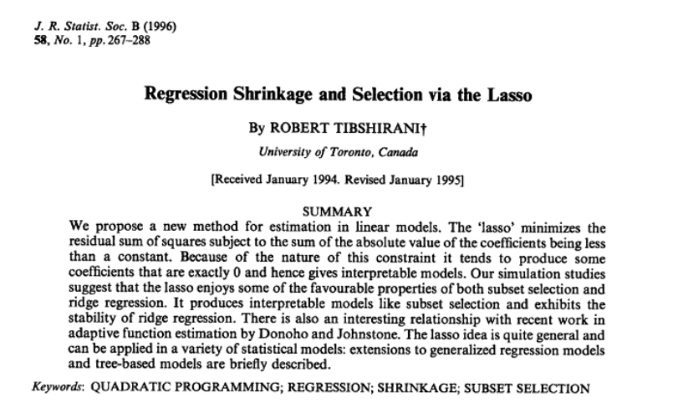
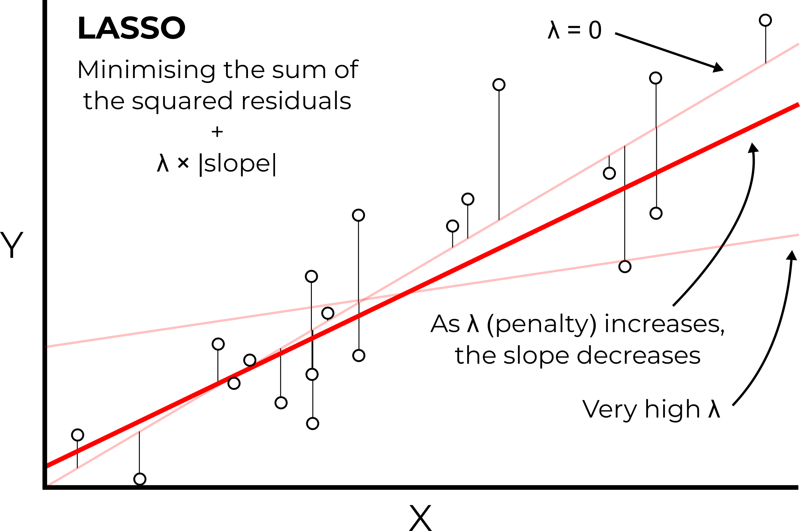

# Mersey IV - Statistical analysis {#mersey_four}

## Task 4: Extracting catchment characteristics

We know from the lecture that river hydrochemistry can be influenced by a range of catchment characteristics, including land cover, soil type, bedrock geology, topography, and rainfall. Before we undertake statistical analysis, our next step is to extract these characteristics for each of the 70 catchments in the `mersey_watersheds` file (`.shp`), so we can relate these to the Environment Agency water quality data collected at each of the 70 monitoring sites.

Information on these characteristics for the Mersey region can be obtained from the relevant files in the data pack, including:

-   `mersey_LC` [`categorical`], based on LCM2000 data;
-   `mersey_HOST` [`categorical`] i.e., Hydrology of Soil Types;
-   `mersey_bedrock` [`categorical`], sourced from the British Geological Survey;
-   `mersey_dem_fill` [`continuous`], a digital elevation model (50 m spatial resolution);
-   `mersey_rainfall` [`continuous`], annual average rainfall (mm a^-1^).

To simplify our analysis, I am going to walk you through the approach to calculate *some* of these variables, including the average of the continuous datasets (elevation, slope, aspect, rainfall).

For the categorical datasets (e.g., percentage of the each of the land cover / soil / bedrock classes present), I have provided you with the summary values, stored in `data/practical_2/mersey_EA_characteristics.csv`.

While extracting these values is an important part of the data cleaning-preparation process, it is *time-consuming*, requiring reclassification of each categorical raster (e.g., simplifying the number of classes and removing classes that are not present in the study area) and normalisation of the values based on catchment area. Given the focus of EMMC, this part has been removed to give you more time to focus on the **statistical analysis and interpretation** (as requested by previous student feedback), and to relate your results to key environmental **concepts**.

If you are interested in the reclassification approach, I have provided some guidance in the final chapter [here](#Hints).

### Calculating surface derivatives

Before we can extract characteristics for each watershed, we need to produce some additional layers. Here, we are interested in the effects of elevation (the data from `mersey_DEM_fill`) and rainfall (`mersey_rainfall`), as well as topographic **slope** and **aspect**, both of which likely influence the path of water through the landscape. These two attributes (*slope, aspect*) are known as **surface derivatives** as they are calculated (derived) from the DEM.

To produce **slope** and **aspect** rasters:

> use the `wbt_slope` and `wbt_aspect` functions, using the original filled DEM as the input data (`mersey_dem_fill.tif`) and using appropriate output names (e.g. `mersey_dem_slope` and `mersey_dem_aspect`).

Your outputs should resemble the following:

```{r, echo = FALSE, eval = TRUE, warning= FALSE, message = FALSE, fig.align = 'center', results='hide'}
# Sets file path for DEM
dem <- here("data", "practical_2", "mersey_dem_fill.tif")

# Slope and aspect
wbt_slope(dem, here("output", "practical_2", "mersey_dem_slope.tif")) 
wbt_aspect(dem, here("output", "practical_2", "mersey_dem_aspect.tif")) 

# Loads slope and aspect rasters
mersey_slope <- raster(here("output", "practical_2", "mersey_dem_slope.tif"))
mersey_aspect <- raster(here("output", "practical_2", "mersey_dem_aspect.tif"))

# Creates ggplot for slope
slope <- ggplot() +
  layer_spatial(mersey_slope, aes(fill = stat(band1))) + # Adds raster layer
  #annotation_spatial(data = snapped_seed_points, shape = 21, fill = "#FB5858", colour = "black", size = 3) + # Adds snapped seeds layer
  theme_classic() + 
  labs(fill = "Slope angle", x = "Easting", y = "Northing") +
  scale_fill_continuous(type = "viridis",  na.value = NA) +
  #scale_fill_distiller(palette = "RdYlBu", na.value = NA) +
  theme(legend.position = "top")

# Creates ggplot for aspect
aspect <- ggplot() +
  layer_spatial(mersey_aspect, aes(fill = stat(band1))) + # Adds raster layer
  #annotation_spatial(data = snapped_seed_points, shape = 21, fill = "#FB5858", colour = "black", size = 3) + # Adds snapped seeds layer
  theme_classic() + 
  labs(fill = "Aspect", x = "Easting", y = "Northing") +
  #scale_fill_continuous(type = "viridis",  na.value = NA) +
  scale_fill_distiller(palette = "RdYlBu", na.value = NA) +
  theme(legend.position = "top")


slope+aspect
```

### Extracting continuous characteristics

To begin:

> Load the `mersey_watersheds.shp` file into R (produced in Task 3) using the `st_read` function, storing in a variable called `watersheds`.

```{r, echo = FALSE, eval = TRUE, warning= FALSE, message = FALSE, fig.align = 'center', results='hide'}
# Load watersheds (vector, sf, VALUE column is important) and renames
watersheds <- st_read(here("output", "practical_2", "mersey_watersheds.shp"))
```

> Next, print out attribute names for the shapefile as follows:

```{r, echo = TRUE, eval = TRUE, warning= FALSE, message = FALSE, fig.align = 'center'}
colnames(watersheds)
```

For our analysis, the attribute of interest is `VALUE`, which contains the unique Environment Agency ID for each watershed. **Importantly**, this is also found in `mersey_EA_chemisty.csv` file. This will enable us to join the two datasets, populating the attribute table of the `watersheds` variable with the water quality measurements stored in the csv.

> To simplify this, use the following code to replace the column name `VALUE` with a new name `Seed_Point_ID`. The latter is used in the `mersey_EA_chemisty.csv`.

```{r, echo = TRUE, eval = TRUE, warning= FALSE, message = FALSE, fig.align = 'center', results='hide'}
# Replaces column name 'VALUE' with 'SEED_Point_ID'
names(watersheds)[names(watersheds) == 'VALUE'] <- 'Seed_Point_ID'
```

> You can re-use the `colnames` function to check it worked correctly:

```{r, echo = FALSE, eval = TRUE, warning= FALSE, message = FALSE, fig.align = 'center', results='hide'}
colnames(watersheds)
```

With this updated:

> We can now load the Environment Agency data using `read.csv()`, as shown in [Chapter 3](#Intro_to_R):

```{r, echo = TRUE, eval = TRUE, warning= FALSE, message = FALSE, fig.align = 'center', results='hide'}

# Loads csv using read.csv
ea_data <- read.csv(here("data", "practical_2", "mersey_EA_chemistry.csv"))
```

> and **merge** using the `merge` function:

```{r, echo = TRUE, eval = TRUE, warning= FALSE, message = FALSE, fig.align = 'center', results='hide'}
# Merge based upon matching Seed_Point_IDs
watersheds_ea <- merge(watersheds, ea_data, by = "Seed_Point_ID")
```

> Use the `head()` function to inspect the first few rows of our new data frame.

```{r, echo = FALSE, eval = TRUE, warning= FALSE, message = FALSE, fig.align = 'center'}
head(watersheds_ea)
```

> Save your script before continuing.

Before we move on to extract our continuous derivatives (average elevation, rainfall, slope and aspect), it is worth noting that R variables can be removed from the environment as follows:

```{r, echo = TRUE, eval = FALSE, warning= FALSE, message = FALSE, fig.align = 'center', results='hide'}
# Removes object(s) from memory
rm(mersey_dem)
```

This can be useful if R is running slowly.

To extract continuous derivatives, we are going to use the `extract` function from the **raster** package, which is described [here](https://www.rdocumentation.org/packages/raster/versions/3.5-2/topics/extract). We'll be using this function for each continuous dataset. It is also used for extracting categorical derivatives, as demonstrated [here](#Hints), so it's important that you understand what it's doing.

Broadly, the function extracts values from a raster object at the locations of spatial vector data, where the value of interest is user-defined. For example, this could be the mean (e.g. the average elevation of a DEM within a vector polygon), the count (e.g. the number of cells within a vector polygon), or a minimum or maximum (e.g. the maximum elevation within a vector polygon), as shown in the figure below:

<p align="center">

<a name="Figure_7"></a>{width="50%"}

</p>

**Figure 5: Visual example of the `extract` function**. In this example, our raster layer is the slope of the terrain in the Eskdale catchment, studied in [Week 9](#Eskdale_flow_algorithms), with values ranging from 0° (flat) to 76° (very steep). Our vector layer is a series of three $Polygons$, covering three upland locations (other valid vector types include $Points$ and $Lines$). Here, the `extract` function would return the average and minimum-maximum slope for $Polygons$ $A$ and $B$ respectively, and the count (number of raster cells) for $Polygon$ $C$.

<br/>

To use the `extract` function, the raster dataset needs to be loaded into R.

> Load the digital elevation model into R and store with a sensible variable name e.g. `mersey_dem`:

```{r, echo = FALSE, eval = TRUE, warning= FALSE, message = FALSE, fig.align = 'center', results='hide'}
# Load elevation raster
mersey_dem <- raster(here("data", "practical_2", "mersey_dem_fill.tif"))
```

> Now we can use the `extract` function as follows. This takes in both raster (`mersey_dem`) and vector input data (`watersheds_ea`), where the value of interest is determined by the `fun` parameter (i.e. a function). Here we are using an existing base R function (e.g. mean) but we can use user-defined functions as well. For example, `fun=function(x, ...) length(x)` would **count** the length (or number) of raster cells for each watershed, and `min` or `max` would return the minimum and maximum elevations, respectively. In our case, we just want to calculate the mean (average) elevation, so we can use the approach below:

```{r, echo = TRUE, eval = FALSE, warning= FALSE, message = FALSE, fig.align = 'center', results='hide'}
# Extracts raster values for each watershed, calculates mean (fun=mean), stores in attribute table ($average_elevation), with NA values removed (na.rm=TRUE)
watersheds_ea$average_elevation <- extract(mersey_dem, watersheds_ea, fun=mean, na.rm=TRUE)
```

> When you're happy you understand the process, load the other continuous rasters into R with sensible variable names (e.g. `mersey_rainfall`, `mersey_slope`, `mersey_aspect`) and use the `extract` function to calculate the relevant attributes e.g. `$average_rainfall`, `$average_slope`, `$average_aspect`.

```{r, echo = FALSE, eval = TRUE, warning= FALSE, message = FALSE, fig.align = 'center', results='hide'}
# Load raster data
mersey_dem <- raster(here("data", "practical_2", "mersey_dem_fill.tif"))
mersey_rainfall <- raster(here("data", "practical_2", "mersey_rainfall.tif"))
mersey_slope <- raster(here("output", "practical_2", "mersey_dem_slope.tif"))
mersey_aspect <- raster(here("output", "practical_2", "mersey_dem_aspect.tif"))
```

```{r, echo = FALSE, eval = TRUE, warning= FALSE, message = FALSE, fig.align = 'center', results='hide',  cache = FALSE}
# Extract derivatives, calculate mean, and store in attribute table
watersheds_ea$average_elevation <- extract(mersey_dem, watersheds_ea, fun=mean, na.rm=TRUE)
watersheds_ea$average_rainfall  <- extract(mersey_rainfall, watersheds_ea, fun=mean, na.rm=TRUE)
watersheds_ea$average_slope <- extract(mersey_slope, watersheds_ea, fun=mean, na.rm=TRUE)
watersheds_ea$average_aspect  <- extract(mersey_aspect, watersheds_ea, fun=mean, na.rm=TRUE)

# Removes object(s) from memory
#rm(dem, rainfall, slope, aspect)

```

> Use the `head()` function to inspect the output.

### Extracting categorical characteristics

As noted above, I have produced some catchments characteristics for you, derived from `mersey_LC`, `mersey_HOST` and `mersey_bedrock`. If you want to learn about the approach, it is detailed [here](#Hints). This information is stored in `mersey_EA_characteristics.csv` and includes:

-   Percentage of the each of the five land cover classes present:
    -   Arable %
    -   Heath %
    -   Grassland %
    -   Urban %
    -   Wetland %
-   Percentage of the each of the four soil types present:
    -   Permeable %
    -   Impermeable %
    -   Gleyed %
    -   Peats %
-   Percentage of the each of the three bedrock geology types present:
    -   Sands_and_Muds %
    -   Limestone %
    -   Coal %

> Load the above dataset using `read.csv()` and then **merge** this dataset with `watersheds_ea` (containing the continuous characteristics calculated above) using the `merge` function and `Seed_Point_ID` as the merge value.

```{r, echo = FALSE, eval = TRUE, warning= FALSE, message = FALSE, fig.align = 'center', results='hide',  cache = FALSE}

# Load characteristics using read.csv
watershed_char <- read.csv(here("data", "practical_2", "mersey_EA_characteristics.csv"))

# Merge based upon matching Seed_Point_IDs
watersheds_ea <- merge(watersheds_ea, watershed_char, by = "Seed_Point_ID")

```

> Again, use the `head()` function to check this worked as expected.

<br/>

**To finish Task 4:**

> Run the following code, which removes the geometry stored in the data frame (not required for subsequent analysis) and saves our dataframe as a comma-separated file.

```{r, echo = TRUE, eval = TRUE, warning= FALSE, message = FALSE, fig.align = 'center'}

# Drops geometry attribute from watersheds_ea
watersheds_ea <- st_drop_geometry(watersheds_ea)

# Writes data frame to comma-separated file
write.csv(x = watersheds_ea, here("output", "practical_2", "mersey_watersheds_ea.csv"), row.names=FALSE)

```

> If you wish, it might be good idea to clean / simplify our R environment before commencing the statistical analysis. To do so, best practice is to restart R (`Ctrl + Shift + F10` on Windows) *or* you can use the following code `rm(list = ls())` to remove all objects from the workspace. While the latter isn't a perfect solution (see [here](https://rstats.wtf/source-and-blank-slates#sec-rm-list-ls)), it can be of value if used prudently.

```{r, echo = TRUE, eval = FALSE, warning= FALSE, message = FALSE, fig.align = 'center'}

# Delete user-created objects from the global workspace
rm(list = ls())
```

## Task 5: Model building

In this next task, we will compare the information about catchment characteristics with the water quality data collected at each of the 70 monitoring stations. To begin:

> Load the csv file created at the end of Task 4 (`mersey_watersheds_ea.csv`), saving to a new variable called `watersheds_df`:

```{r, echo = TRUE, eval = TRUE, warning= FALSE, message = FALSE, fig.align = 'center'}
# Reads completed file from csv
watersheds_df <- read.csv(here("output", "practical_2", "mersey_watersheds_ea.csv"))

```

If you have any other variables in your R environment, these can be removed using `rm()`.

This data frame should contain the following 10 water quality indicators for each watershed:

-   pH: acidity/alkalinity;
-   SSC: suspended solids concentration (mg l<sup>−1</sup>);
-   Ca: calcium (mg l<sup>−1</sup>);
-   Mg: magnesium (mg l<sup>−1</sup>);
-   NH<sub>4</sub>: ammonium (mg-N l<sup>−1</sup>);
-   NO<sub>3</sub>: nitrate (mg-N l<sup>−1</sup>);
-   NO<sub>2</sub>: nitrite (mg-N l<sup>−1</sup>);
-   TON: total oxidised nitrogen (mg-N l<sup>−1</sup>);
-   PO<sub>4</sub>: phosphate (mg-P l<sup>−1</sup>);
-   Zn: zinc (μg l<sup>−1</sup>).

It should also contain the continuous derivatives (e.g. average elevation) and categorical derivatives (e.g. land cover percentage) for each watershed.

**Note**: some of the calculated percentages may not add up to 100%. During the reclassification of the categorical datasets (`land_cover`, `soils`, `bedrock`), we focused on the macro-classes which make up the majority of the catchment and are known to have the greatest impact of river hydrochemistry (e.g. urban areas, farmland). While other land cover categories are found within each watershed (hence $total$ $percent < 100$), these typically account for only a small percentage of the total area and have a limited effect on the river environment. These categories have been excluded to simplify the analysis.

### An introduction to linear models in R

It is now time to examine the relationships between river water quality and catchment metrics. The key model outputs that are ultimately required for the assessment are:

1.  **Regression equations** relating each water quality variable (dependent variable; n = 10) to the *important* catchment characteristics (independent variables; n = 16).

2.  An assessment of **model quality**. The exact metrics / plots / tests are up to you!

> Remember, you **don't** have to run every code block shown below, but you can do so if it would help your understanding. 

> In the following instructions, I will guide you through some of the keys steps for one water quality indicator (`Mg`). You can replicate this approach and add further analysis (e.g., model evaluation) for the other nine indicators.

The simplest way to run a linear regression in R is to use the `lm()` function (i.e., a linear model), an example of which is shown below, storing in an output called `model`:

```{r, echo = TRUE, eval = TRUE, warning= FALSE, message = FALSE, fig.align = 'center'}
# Fit a linear model (ordinary least squares regression)
model <- lm(formula = Mg ~ average_elevation, data = watersheds_df)
```

We have defined the data frame being used (`data = watersheds_df`) and the input variables from that data frame. This is achieved by including their column names, shown here:

```{r, echo = TRUE, eval = TRUE, warning= FALSE, message = FALSE, fig.align = 'center'}
colnames(watersheds_df)
```

Input variables in the **formula** are separated by `~`, where the variable to the left is the dependent variable (`Mg`) and the variable to the right is an independent variable (`average_elevation`). We can, however, include **multiple** independent variables to perform multiple linear regression. This is achieved as follows, where additional independent variables are separated by `+`:

```{r, echo = TRUE, eval = TRUE, warning= FALSE, message = FALSE, fig.align = 'center'}
# Fits a linear model
model <- lm(formula = Mg ~ average_elevation + Grassland_percent, data = watersheds_df)
```

We can then assess the model output using the `summary` function:

```{r, echo = TRUE, eval = TRUE, warning= FALSE, message = FALSE, fig.align = 'center'}
summary(model)
```

For this set of independent variables, we have an R<sup>2</sup> of 0.30 (`Multiple R-squared: 0.2964`) and a model *p* value of \< 0.01 (`p-value: 7.672e-06`).

> What is your opinion of the model performance? 

The model coefficients for the independent variables are described above, where `*` denotes *p* values \< 0.05 (95% probability) and `**` denotes *p* values \< 0.01 (99% probability). As the coefficients are very small, they are presented in scientific notation. These can be converted to numeric (non-scientific) format using the following code:

```{r, echo = TRUE, eval = TRUE, warning= FALSE, message = FALSE, fig.align = 'center'}
format(-2.096e-04, scientific = FALSE)
```

We can supply multiple values to the `format` function by creating a vector:

```{r, echo = TRUE, eval = FALSE, warning= FALSE, message = FALSE, fig.align = 'center'}
format(c(-2.096e-04, -8.358e-06, ...) , scientific = FALSE)
```

> When you're happy you understanding the formatting of the `lm` function, move on to the next section.

### Training vs. Testing {#train-test}

One **limitation** of the above approach is that our dataframe (`watersheds_df`) contains observations from all 70 EA monitoring stations.

When performing statistical analysis, it is common practice to split any dataset into:

-   a **training** subset, which is used to create the model(s).
-   a **testing** subset, which is used to evaluate the model(s).

Subsetting our data in this way allows models to be evaluated more rigorously. Many models perform well "in-sample" but poorly "out-of-sample" when evaluated against independent data (i.e. the testing subset). This is commonly referred to as **over-fitting**.

Training and testing subsets are usually defined randomly, with an approximate ratio of 70:30 (although this varies). However, and to ensure reproducibility, this step has been completed for you: the `watersheds_df` dataframe contains a `group` variable denoting which monitoring sites belong to the training and testing subsets.

> Run the code above to create `training` and `testing` dataframes:

```{r, echo = TRUE, eval = TRUE, warning= FALSE, message = FALSE, fig.align = 'center'}
# Extracts training dataset, comprising 50 observations (~70%)
training <- subset(watersheds_df, Group == "Training")

# Extracts training dataset, comprising 20 observations (~30%)
testing <- subset(watersheds_df, Group == "Testing") 

```

> Before you move on to the next section, can you think of any limitations of this approach?

> Hints: How important is the training-testing ratio? How are training-testing subsets created?

### The full model

An additional **limitation** of the above approach is that we have manually defined the independent variables of interest (`average_elevation + Grassland_percent`). For exploratory analysis, however, we may not know which are the most important variables. Perhaps there is a combination of independent variables which produces a better model fit (e.g. R<sup>2</sup> \> 0.30)?

As a first step, we could create a full model including **all** the *relevant* independent variables. This would include the normalised variables (e.g. `Arable_percent`, `Heath_percent`, ...), but we'd want to exclude the categorical counts (e.g. `Arable`, `Heath`, ... influenced by catchment size), as well as any IDs or geometry variables. In general, we are only interested in testing the continuous derivatives (column names starting with `average_`) and the normalised categorical derivatives (column names ending in `_percent`).

Rather than typing out the columns of interest manually, we are going to use the `select` function from the `dplyr` package to achieve this:

```{r, echo = TRUE, eval = TRUE, warning= FALSE, message = FALSE, fig.align = 'center'}
# Creates a vector of column names, including only those which contain "average" or "percent"
factors <- colnames(watersheds_df %>% dplyr::select(contains(c("average", "percent"))))

# Prints to console
factors
```

> Run the above code. **Note**, the formatting of `dplyr::select` may be slightly confusing but it is necessary because there is also a `select` function in the `MASS` package. Here, we are telling R to use `select` from `dplyr`.

Using this vector of column names, we are going to create new data frames (called `training_df` and `testing_df`) containing only the independent variables of interest for the `training` dataset:

```{r, echo = TRUE, eval = TRUE, warning= FALSE, message = FALSE, fig.align = 'center'}
training_df <- training[factors]
testing_df <- testing[factors]
```

> Run the above code and use `head()` to inspect the results.

To run a linear regression using these data, we need to ensure our dependent variable of interest is also present in the dataframe, which can be achieved using `cbind`. Note that we have specified `variable` as the name of the column containing the `Mg` values, but this can be changed if you desire:

```{r, echo = TRUE, eval = TRUE, warning= FALSE, message = FALSE, fig.align = 'center'}
# Column bind (cbind) the dependent (n=1) and independent variables (n=16)
model_df <- cbind(variable = training$Mg, training_df)
```

> Run the above code which creates a new dataframe (`model_df`) containing the dependent variable we want to model (`Mg`) and the full set of independent variables for our training set. 

> Next, run a new `lm()` model using all the independent variables, which can be acheived using the equation `variable ~ .`, and inspect the output.

```{r, echo = FALSE, eval = TRUE, warning= FALSE, message = FALSE, fig.align = 'center'}

# OLS, all independent variables
linear_model <- lm(formula = variable ~ ., data = model_df)
summary(linear_model)
```

> **Question**: How has model performance changed?

> Do you think adding all our independent variables to the model is a good approach?  

#### Problems with the full model

Including all the independent variables has improved our model performance on the `training` set.  *However*, there are some important issues we need to consider: 

-   While adding all the independent variables has increased the overall model fit (R^2^), we don't know which variables are actually **important**. Perhaps only one or two of these have a demonstrable and/or high magnitude effect on the dependent variable? In the example above, only one coefficient is marked as significant at $p < 0.05$ (`Arable_percent`). 

-   In general, we prefer models with the minimum number of parameters (independent variables). These models require fewer assumptions, less intensive data collection, can be applied more confidently to new data sets/locations, and are often easier to interpret. This principle of **model parsimony** is based upon [*Occam’s Razor*](https://www.britannica.com/topic/Occams-razor): "other things being equal, simpler explanations are generally better than more complex ones".

-   Another, and perhaps more important issue, is that we not yet assessed the performance of the model on the `testing` data set. Good performance on the training set is a promising sign, but we also need to evaluate how the model performs on unseen and independent data.

To achieve this, we can use the `predict()` function which predicts new values for `Mg` based on our model and using catchment characteristics from the `testing` set (`newdata = testing`):

```{r, echo = TRUE, eval = TRUE, warning= FALSE, message = FALSE, fig.align = 'center'}
# Predict Mg values based upon linear model, saving to testing dataframe
testing$predicted_Mg <- predict(linear_model, newdata = testing)
```

> Run the above code, which will create a new column in the `testing` dataframe called `predicted_Mg`, using our model as input (`linear_model`).

> To evaluate the model performance, create a scatter plot of measured `Mg` *vs.* predicted `Mg` values, using the skills developed in the [Introduction to R](@Intro_to_R). I would recommend adding a 1:1 line to the plot, as follows: `geom_abline(intercept = 0, slope = 1, lty = "dashed")`. You could also add a linear regression using the measured and modelled values, although see below for important disucssion. This can be acheived using the following: `geom_smooth(method = "lm", se = FALSE, colour="#FF953C")`.

```{r, echo = FALSE, eval = TRUE, warning= FALSE, message = FALSE, fig.align = 'center'}

# ggplot of measured vs. modelled (predicted) Mg values
mg_plot <- ggplot(data = testing, aes(x = Mg, y = predicted_Mg)) +
  # Adding a linear regression ("lm"), removing standard error bars (se = FALSE)
  geom_smooth(method = "lm", se = FALSE, colour="#FF953C") +
  # Adds a 1:1 line for comparison
  geom_abline(intercept = 0, slope = 1, lty = "dashed") +
  # Adds the point data, modifying the shape, size, colour and fill
  geom_point(shape = 21, colour = "white", fill = "#5695FF", size = 2.5) +
  # Setting the theme and aspect ratio
  theme_classic() +
  theme(aspect.ratio = 1) +
  # Axis limits
  scale_x_continuous(limits = c(-10,60)) +
  scale_y_continuous(limits = c(-10,60)) +
  # Add axis labels and a title
  labs(x = Measured~Mg, y = Modelled~Mg, 
       title = Plot~of~measured~vs.~modelled~Mg~values)

mg_plot

```

> Use this plot to assess the model performance on the `testing` set. Can you see evidence of systematic and/or random error?

While this plot allows for visual evaluation of the model, it is also useful to produce metrics for a quantitative evaluation, such as root-mean-square error (RMSE), normalised root-mean-square-error (nRMSE), or R^2^, which you've covered earlier in the unit.  

It is also *tempting* at this stage to produce a regression between the measured and modelled values, such as the following: 

```{r, echo = TRUE, eval = TRUE, warning= FALSE, message = FALSE, fig.align = 'center'}
# Regression (measured vs. modelled)
prediction_model <- lm(formula = Mg ~ predicted_Mg, data = testing)
summary(prediction_model)
```

While this looks like a sensible approach, this is actually **incorrect**  because this is evaluating the deviations from the modelled line-of-best-fit (shown in ${\color{#FF953C}{orange}}$ above), and <ins>not</ins> the 1:1 line. An easy mistake! 

To illustrate, below is a plot of some data from Alexander et al. ([2015](https://doi.org/10.1021/acs.jcim.5b00206)), a highly recommended paper on $R^2$. As you can see from the plot, there is a clear correspondence between the observed and predicted values. If we run a linear regression on these data (`lm(formula = observed ~ predicted...`), then $R^2=1$ i.e., a straight line can be drawn *through* the data points. 

This is misleading, however, because the data are far from the 1:1 line. The correct $R^2$ is actually $-1.26$, which is very different!  

```{r, echo = FALSE, eval = TRUE, warning= FALSE, message = FALSE, fig.align = 'center'}

# Data from Figure 2 of Alexander et al. (2015)
# Link: https://doi.org/10.1021/acs.jcim.5b00206
predicted <- c(7, 7.50190123, 8.003802731, 8.505703417, 9.001901094, 9.509505876, 10)
observed <- c(5.946969927, 6.371211597, 6.803030282, 7.227272675, 7.659090999, 8.075757822, 8.507575784)
df <- data.frame(predicted, observed)

# Regression (y ~ x)
prediction_model <- lm(formula = observed ~ predicted, data = df)
summary(prediction_model)

# 1 - RSS / TSS
sst <- sum((df$observed - mean(df$observed))^2)
sse <- sum((df$observed - df$predicted)^2)
r_squared <- 1 - (sse / sst)

# ggplot of observed-predicted
test_plot <- ggplot(data = df, aes(x = predicted, y = observed)) +
  # Adding a linear regression ("lm"), removing standard error bars (se = FALSE)
  geom_smooth(method = "lm", se = FALSE, colour="#FF953C") +
  # Adds a 1:1 line for comparison
  geom_abline(intercept = 0, slope = 1, lty = "dashed") +
  # Adds the point data, modifying the shape, size, colour and fill
  geom_point(shape = 21, colour = "white", fill = "#5695FF", size = 2.5) +
  # Setting the theme and aspect ratio
  theme_classic() +
  theme(aspect.ratio = 1) +
  # Axis limits
  scale_x_continuous(limits = c(6,10)) +
  scale_y_continuous(limits = c(6,10)) +
  # Add axis labels and a title
  labs(x = "Predicted", y = "Observed", 
       title = Alexander~et~al.~(2015))
test_plot

```

To produce the **correct** $R^2$, we need to do so manually using the following equation:

$$R^2=1-\frac{RSS}{TSS}$$
Here $RSS$ is the residual sum of squares i.e., deviations of predicted values (e.g., `predicted_Mg`) from actual empirical values (e.g., `Mg`), and can be calculated in R as follows:

```{r, echo = TRUE, eval = TRUE, warning= FALSE, message = FALSE, fig.align = 'center'}
# Residual sum of squares i.e., the size of the residuals from the model 
rss <- sum((testing$Mg - testing$predicted_Mg)^2)
```

$TSS$ refers to the total sum of squares i.e., the dispersion of the data points from the average value, or as Alexander et al. ([2015](https://doi.org/10.1021/acs.jcim.5b00206)) summarise: "*the size of the residuals for a null model where all predictions are the same, i.e. the mean value.*"

$TSS$ involves:

1. calculating the difference between each measured value and the mean of the measured values, for example using the `mean()` function,
2. squaring the differences, 
3. calculating the total sum of the squared values. 

For example, if these were the measured values and the mean:

$$[5.3, 4.6,6.5,8.5,10.1]$$
$$mean=7.0$$
the **differences** would be as follows:
$$[-1.7,-2.4,-0.5,1.5,3.1]$$
the **squared differences** would be: 

$$[2.89, 5.76, 0.25, 2.25, 9.61]$$
resulting in:

$$TSS = 20.76$$

```{r, echo = FALSE, eval = TRUE, warning= FALSE, message = FALSE, fig.align = 'center'}
# Sum of Squares Total
tss <- sum((testing$Mg - mean(testing$Mg))^2)
```

> Write code to calculate $TSS$ using the guidance above, and use the $RSS$ example for assistance. If you get stuck, ask for help! 

The ratio of $RSS$ to $TSS$ accounts for the *unexplained* variation in the dependent variable that is not accounted for by the model. In turn, using $1-\frac{RSS}{TSS}$ returns our *explained* variation ($R^2$), which for the measured-modelled `Mg` data, produces:

```{r, echo = FALSE, eval = TRUE, warning= FALSE, message = FALSE, fig.align = 'center'}
# Model performance for the testing set
# See: https://en.wikipedia.org/wiki/Coefficient_of_determination#cite_note-8
r_squared <- 1 - (rss / tss)
print(r_squared)
```

This has produced an unexpected **negative** value, similar to the example data from Alexander et al. ([2015](https://doi.org/10.1021/acs.jcim.5b00206)) above. How can we explain this?

Numerically, this has occurred because $RSS > TSS$ i.e., the error (residuals) in the model ($RSS$) are greater than the variation of the observations around their mean ($TSS$). But what does that actually mean? 

When $R^2<0$, this means that the model predictions are worse than simply using the mean of the dependent variable (`Mg`) as a predictor i.e., a horizontal line at the `Mg` mean would have lower residuals than our predictions. Not good! 

If `testing` R^2^ is lower than `training` R^2^, we would describe our models as **overfit** and/or **poorly generalised** i.e., the model performs well on the `training` set, but poorly on the `testing` set. In most cases, there may be some overfitting, but not extreme (e.g., `training` $R^2=0.7$, `testing` $R^2=0.4$). In our example above, we have extreme overfitting ($R^2<0$)

One solution to prevent overfitting is to reduce model complexity i.e., the number of independent variables. While this will generally reduce `training` performance, this can lead to improved performance on independent data (`testing`). Moreover, by reducing the number of independent variables, we can focus on the important processes (model parsimony), can make fewer assumptions, and can more easily apply our model to new situations.

> How can we acheive this?

### Variable selection strategies

Determining which variables to include/exclude from a model is a very difficult problem, which has resulted in many different variable selection strategies. Common approaches include expert opinion and/or theory, stepwise regression, implemented in `MASS`, partial least squares (PLS) regression, implemented in `PLS`, as well as elastic net methods and ridge regression, both implemented in `glmnet`. You may want to explore some of these approaches if you use regression analysis for your dissertation.

We are going to use a very popular and well-respected approach, known as Least Absolute Shrinkage and Selection Operator (**LASSO**), implemented in `glmnet`. Published by Robert Tibshirani in [1996](https://www.jstor.org/stable/2346178), the original work has >65,000 citations! There are lots of [online resources](https://www.youtube.com/watch?v=NGf0voTMlcs&t=196s&ab_channel=StatQuestwithJoshStarmer) available to learn more about LASSO, including the original paper. 

<p align="center">
  <a name="lasso_abstract"></a>
  
</p>

### LASSO in theory 

As explored in the lecture, LASSO is slightly different to ordinary least squares (OLS) regression, which produces a model which minimises the sum of the squared residuals, as shown [below](@fig:ols).

<br/> 

<p align="center">
  <a name="figure_ols"></a>
  
</p>

In **ordinary least square regression**, the line of best fit minimizes the sum of the squared (vertical) residuals between the data points and the line itself

<br/> 

While this approach produces the best fit to the `training` data, this can often result in overfitting, and poor performance on `testing` data, as demonstrated with our analysis of `Mg`.  

Instead, LASSO minimises the sum of the squared residuals, but also adds an additional **penalty** term known as **lambda** (λ), which is applied to the slope coefficient of the model ($λ×slope$). While OLS minimises the sum of the squared residuals, LASSO returns the model with the minimal overall error (sum of the squared residuals + $λ×slope$).

The aim of this approach is to add a small amount of **bias** to our model. While this generally results in a worse fit for the `training` data, this often leads to improved performance on the `testing` data. 

<br/> 

<p align="center">
  <a name="figure_ols"></a>
  
</p>

In **LASSO**, an additional penalty term (λ) is used to reduce overfitting

<br/> 

This approach is known as *regularisation*, which in effect is reducing the sensitivity of our model to the `training` data. A model that is highly tuned to the `training` data often won't perform well in other situations. In contrast, models containing fewer variables and/or additional bias ($λ×slope$) are often more **generalisable**. 

One key aspect we haven't discussed in depth is **lambda** (λ). This refers to the **size of the penalty** we apply to the slope coefficient i.e., how much should we penalise steeper slope coefficients in our model? Note that the shallower the slope of the model, the less sensitive it is to the `training` data.

- If λ = 0, then no penalty would be applied, and the results of LASSO would be identical to OLS.

- As we increase λ, the slope of the model will get closer and closer to 0 (i.e., the model is very insensitive to the `training` data)

**How then should we choose a suitable lambda for λ?**

### Cross-validation for λ

A common approach to choose λ (and other model parameters) is known as **cross-validation**. There are many different methods that can be used here, such as *k*-fold cross-validation or leave-*one*-out cross-validation (LOOCV), but the underlying approach is similar and is summarised in the figure below. 

<p align="center">
  <a name="figure_cross_validation"></a>
  
</p>

In *k*-fold **cross-validation**, the training set is split into *k*-folds, with one fold left out for each model run. The model performance on this fold is used to evaluate performance, as with the `testing` set.

<br/> 

We've already split our data into [training-testing subsets](@train-test). Cross-validation repeats the process, splitting the training data into different groups (or sets or folds). For example, **10-fold** cross-validation would split the training data into ten folds. The model would then be trained using a dataset comprising nine of the ten folds, with the final fold left out and used for model evaluation. This process would then be repeated, leaving a different fold out for each model run.  When all combinations have been tested, the final model might be the average of the *k* model runs or the best performing one. 

One disadvantage of cross-validation is that the training data will be split **randomly** into different folds. If you run your analysis again, the data within each fold will be different and your model output might also differ! 

One way to account for this is to repeat cross-validation many times (e.g., $×100$ or $×1000$), which generally produces more stable coefficients. This is the approach we'll use in the following sections.

> Before we move on the use LASSO in R, make sure you understand the approaches outlined above. If you can answer the following, move on!

> How does LASSO differ from OLS? 

> What is λ? 

> How does cross-validation work?

### LASSO in practice 

In R, we can run a LASSO regression via `glmnet`, which is described in full [here](https://glmnet.stanford.edu/articles/glmnet.html). The main function, which confusingly is also named `glmnet()`, takes in dependent and independent variables in a similar way to `lm()`, but as vectors or matrixes, rather than data frames, as shown below.

One key input of `glmnet()` is the `alpha` parameter. For our analysis, we are going to keep $alpha = 1$, which denotes that we are performing LASSO regression. The package `glmnet()` is designed to enable a more complex approach known as *elastic net regression*, published by Zou and Hastie ([2005](https://doi.org/10.1111/j.1467-9868.2005.00503.x)). This method incorporates both LASSO and a similar technique known as *ridge regression*. While elastic net is an excellent approach, combining the strengths of both LASSO and ridge, it is much more complex. 

```{r, echo = TRUE, eval = TRUE, warning= FALSE, message = FALSE, fig.align = 'center'}

# Independent variables (x)
x <- as.matrix(training_df)

# Dependent variable (y)
y <- training$Mg

# A vanilla Lasso regression (alpha = 1)
lasso <- glmnet(
  x = x,
  y = y,  
  alpha = 1
)

```

> Run the above the code and print the regression results using `print(lasso)`. This output shows a range of potential models, which vary in terms of the number of non-zero coefficients (Df) (i.e., the number of independent variables in the model), the percentage of deviance explained (%dev), and the value of λ i.e., the parameter that controls the strength of the penalty. 

```{r, echo = FALSE, eval = TRUE, warning= FALSE, message = FALSE, fig.align = 'center'}

# Print results of glmnet
print(lasso)

```

There are lots of models here, with differing values for λ, so how do we pick one? This is where **cross-validation** comes in, splitting the data into *k*-folds, and repeating the process until we find the best value for λ. 

> Run the code below to run LASSO with cross-validation, using 10-folds. 

```{r, echo = TRUE, eval = TRUE, warning= FALSE, message = FALSE, fig.align = 'center'}

# Lasso regression (alpha = 1), with 10-fold cross-validation
lasso_cv <- cv.glmnet(
  x = x,
  y = y,
  alpha = 1, 
  n_folds = 10
)

# Plot results
plot(lasso_cv)

```

You can use `plot()` to visualise the results of cross-validation, which shows how the model performance varies with the number of non-zero coefficients and the value for λ. **Note**, your plot might look different to the one above, but don't panic... Marked with dashed lines are two candidate models that the user might want to select as the final model:

- $λ_{min}$ (`lambda.min`) i.e., the model with the minimum mean cross-validated error (y-axis)
- $λ_{1se}$ (`lambda.1se`) i.e., the model with the largest λ within 1 standard error of $λ_{min}$. 

$λ_{min}$ is therefore the "best" model, based upon the mean cross-validated error. However, a user might prefer to select $λ_{1se}$. As this has a larger penalty value (λ), this will guard better against overfitting, while typically resulting in fewer independent variables. 

This is an improvement, because we now have just two candidate models to select from, either $λ_{min}$ (minimum error, but potential for overfitting), or $λ_{1se}$ (larger error, but more parsimonious). However, there is still an issue to be solved.

> Run `cv.glmnet()` again with the same settings and keep plotting the results. What do you notice? 

If this has worked as expected, your plots and final models should have changed each time. Sometimes this difference might be quite subtle, but occasionally you will obtain a very different result. As discussed above, this is due to the **random splitting** of the data during cross-validation. Our relatively small dataset is quite *sensitive* to this split, whereas we might expect to see less sensitive behaviour for datasets consisting of hundreds or thousands of measurements, or where there are high magnitude or unambigious links between the dependent and independent variables.

To stabilise our results, we will repeat cross-validation 100 times, as shown below. This uses a `for` loop to iterate the chosen number of times, perform cross-validation, and then store the $λ_{1se}$ value for each iteration. I am using $λ_{1se}$ for model parsimony here, but you can explore the effects of using $λ_{min}$ for the assessment. For example, if using $λ_{1se}$ returns no important predictors (except for the intercept), then the model is **underfit**, and $λ_{min}$ might be preferable.

```{r, echo = TRUE, eval = TRUE, warning= FALSE, message = FALSE, fig.align = 'center'}

# Number of iterations
n_repeats <- 100

# Empty numeric `variable` to store lambda values 
lambda_values <- numeric(n_repeats)

# Iterate n_repeat times
for (i in 1:n_repeats) {
  
  # Perform LASSO regression (alpha = 1), with 10-fold cross-validation
  lasso_cv <- cv.glmnet(
    x = x,
    y = y,
    alpha = 1, n_folds = 10
  )
  
  # Store lambda.1se
  lambda_values[i] <- lasso_cv$lambda.1se
}

```

> Run the code above and inspect the results. For example, you could plot of a histogram of the λ values using `hist()` and print out the `median()` λ. 

> Thinking back to earlier in the course, why would using the median λ be a better choice than mean?

The median λ based on my repeated (n=100) 10-fold cross validation is as follows:

```{r, echo = FALSE, eval = TRUE, warning= FALSE, message = FALSE, fig.align = 'center'}

# Print the median
print(median(lambda_values))

```

Your λ value should be identical or very similar. If so, it can be used to produce a final model for this dependent variable:

```{r, echo = TRUE, eval = FALSE, warning= FALSE, message = FALSE, fig.align = 'center'}

# Final LASSO model, without cross-validation
final_model <- glmnet(x, y, alpha = 1)

# Print model coefficients, using our selected value for λ
coef(final_model, s = median(lambda_values))

```

> Run the above code to run the LASSO regression and print out the model coefficients.

```{r, echo = FALSE, eval = TRUE, warning= FALSE, message = FALSE, fig.align = 'center'}

# Final LASSO model, without cross-validation
final_model <- glmnet(x, y, alpha = 1)

# Print model coefficients, using our selected value for λ
coef(final_model, s = median(lambda_values))

```

Our model coefficients are as follows:

- `intercept` = 9.62080435
- `Arable_percent` = 0.29694731
- `Gleyed_percent` = 0.05816263

Coefficients are important because they are used in **regression equations**, which can then be used for prediction. 

The general format for a regression equation is as follows:

$$
y = a + (b_1 \cdot x_1) + (b_2 \cdot x_2) + (b_n \cdot x_n)
$$
where `a` is the constant (intercept) value, and `b` is the coefficient of x. 

For our `Mg` model above, we can define our regression equation (presented using sensible data precision) as:

$$
Mg = 9.62 + 0.30 \cdot Arable \: percent + 0.06 \cdot Gleyed \: percent
$$
**Well done!** You have now calculated a regression which links the dependent variable (Mg) to the important independent variables, in this case the percentage of arable land cover and gleyed soils. 

> For your assessment, we would like you to **explain** the regression results, linking to hydrological processes and literature. For example, why are $Arable \: percent$  and $Gleyed \: percent$ present in the model?

> Think about specific sources of pollution, transport pathways, types of flow...

## Task 6: Model evaluation

Having created a statistical model, it is necessary to evaluate its performance. Comparison plots of **measured vs. modelled values** are one common way to assess model quality, alongside other metrics such as root-mean-square error (RMSE), normalised root-mean-square-error (nRMSE), Q-Q plots, or histograms of model residuals. You may want to explore some of these for the assessment. 

To predict values based on our LASSO model for the `testing` set, we can use the `predict()` function, taking the model variable (`final_model`) as the input, and using our selected λ value:

```{r, echo = TRUE, eval = TRUE, warning= FALSE, message = FALSE, fig.align = 'center', cache = TRUE}

# Predict Mg values based upon LASSO model and our selected λ, using 'testing' as input
testing$predicted_Mg <- predict(final_model, newx = as.matrix(testing_df), s = median(lambda_values))

```

> Run the above code block to predict Mg concentrations in the `testing` dataset, using the LASSO model produced from the `training` dataset. Note that you can also run this process for the `training set` as well e.g., `predict(final_model, newx = x, s = median(lambda_values))`. This allows you to calculate metrics (e.g., R^2^) for both the training and testing set. 

Other metrics include RMSE or nRMSE (plus others introduced earlier in the course) using your own code or additional packages (e.g. `Metrics`);

$$
 RMSE = \sqrt{mean(measured\:values - modelled\:values)^2}
$$

Plots of measured vs. modelled values (as well as Q-Q plots and histograms) can be created in ggplot2. Here is an example:

```{r, echo = FALSE, eval = TRUE, warning= FALSE, message = FALSE, fig.align = 'center'}

# ggplot of measured vs. modelled (predicted) Mg values
mg_plot <- ggplot(data = testing, aes(x = Mg, y = predicted_Mg)) +
  # Adding a linear regression ("lm"), removing standard error bars (se = FALSE)
  geom_smooth(method = "lm", se = FALSE, colour="#FF953C") +
  # Adds a 1:1 line for comparison
  geom_abline(intercept = 0, slope = 1, lty = "dashed") +
  # Adds the point data, modifying the shape, size, colour and fill
  geom_point(shape = 21, colour = "white", fill = "#5695FF", size = 2.5) +
  # Setting the theme and aspect ratio
  theme_classic() +
  theme(aspect.ratio = 1) +
  # Axis limits
  scale_x_continuous(limits = c(0,40)) +
  scale_y_continuous(limits = c(0,40)) +
  # Add axis labels and a title
  labs(x = Measured~Mg, y = Modelled~Mg, 
       title = Plot~of~measured~vs.~modelled~Mg~values)

mg_plot

```

> Does the regression line match the 1:1 line? Is there any evidence of under- or over-prediction? Are there any outliers? What **types** of errors can you identify?  

You could also assess this relationship statistically, but be careful to calculate $R^2$ correctly ($1-\frac{RSS}{TSS}$), rather than `lm(formula = Mg ~ predicted_Mg...`. 

> How well does our Mg model perform on the testing dataset, based on the above graphs/statistics? Is out-of-sample performance comparable to in-sample performance?

<br/> 

**To finish the practical** and to prepare for the assessment:

> Replicating the above approaches, calculate regression equations using LASSO for all 10 water quality indicators (NO<sub>2</sub>, pH, SSC, Ca, Mg, NH<sub>4</sub>, NO<sub>3</sub>, TON, PO<sub>4</sub>, Zn). 

> Evaluate the performance of the models. The exact approach is up to you, but I would encourage you to be **ambitious**. Some common approaches includes $R^2$ for the `training` and the `testing` sets, Q-Q plots, histograms of residuals, error metrics (e.g., $RMSE$, $NRMSE$). 

<br/> 

**Advice**:

- when constructing your models, think carefully about both over- and under-fitting. For example, in the `Mg` example above, I used $λ_{1se}$ to favour model parsimony. However, models can be underfit (e.g., no important predictors, except for the intercept), so in some cases $λ_{min}$ might be preferable.

- when evaluating model performance, don't worry if performance is not "good", however you define this. Predicting water quality is challenging and we don't always fully understand the links between catchment characteristics and river hydrochemistry. Moreover, if the models *were* all "good" (e.g., high $R^2$, low $RMSE$), you would have very little to discuss in your report! 

