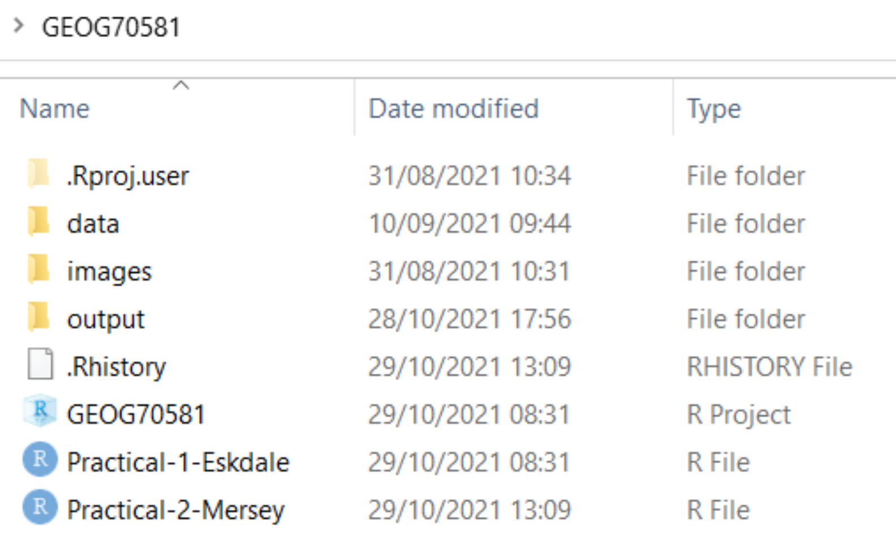

# (PART\*) Endmatter {-}

# Handy Hints {#Hints .unnumbered}

This chapter contains a few handy hints which may be useful if you're having any issues loading R packages or running `Whitebox` tools. 


### Dealing with errors {-}

Errors are an **inevitable** aspect of coding, irrespective of how experienced you are! As we gain programming experience, these errors increase in difficulty from initially simple problems, such as incorrect file paths or errors in code syntax, to the more complex.

Being able to deal with errors is therefore an essential programming skill. My top tips for fixing errors are:

1. **Read the error message** (red text in the R console). If this appears, it usually means that something has gone wrong! Error messages can vary in quality, but at the very least they should tell you:

    - **where** the error was encountered i.e. which line of code failed.
    - some indication as to **why** the error occurred e.g. `No such file or directory`
</p>

2. Use **help()**. If you're unsure of how a particular function works, then you can use the in-built function `help()`, with the name the of the function as the input, e.g.,

``` {r, echo = TRUE, eval = TRUE}

# Call help() for the 'st_read' function from sf package
help("st_read")

```

This will give you valuable information on the function, including a description, inputs, arguments, and examples. 

3. If the error message doesn't provide a simple solution to the problem, and help() hasn't helped, then the next step should be to work through your code step-by-step, testing each line or code block to ensure it is working correctly (usually using `print()` statements). 

To illustrate this, here is some code which has failed: 

```{r, echo = TRUE, eval = FALSE, warning= FALSE, message = FALSE, fig.align = 'center'}
# Function to check and install packages
check.packages <- function(pkg){
  new.pkg <- pkg[!(pkg %in% installed.packages()[, "Package"])]
  if (length(new.pkg)) 
    install.packages(new.pkg, dependencies = TRUE)
  sapply(pkg, require, character.only = TRUE)
}

# Checks and installs packages
packages <- c("ggplot2", "here", "raster", "whitebox")
check.packages(packages)

# Fill depressions in a DEM
wbt_fill_depressions(dem = here("data", "practical_2", "dem_10m.tif"),
                     output = here("output", "practical_2", "dem_10m_fill.tif"))

# Loads raster
filled_dem <- raster(here("data", "practical_2", "dem_10m_fill.tif"))

# Plots using ggplot
g <- ggplot() +
  # Adds raster layer using layer_spatial
  layer_spatial(filed_dem, aes(fill = after_stat(band1))) +
  # Sets ggplot theme
  theme_classic() + 
  # Axis and legend labeling
  labs(fill = "Elevation (m)", x = "Easting", y = "Northing" +
  theme(legend.position = "top") +
  # Sets fill symbology
  scale_fill_continuous(type = "viridis"  na.value = NA)

# Shows plot
g

```

I would first inspect the error message (`No such file or directory`) but if I didn't understand it, I would then troubleshoot by:

1. First running the `check.packages(packages)` function. Were all the packages installed correctly i.e. `TRUE`?

2. Then checking the `wbt_fill_depressions()` function. Does this produce an error? Does it correctly produce an output raster in the intended location? Does the output look sensible? Plotting the raster might be useful here to check.

3. Then running the `raster()` function to load the raster into R. Here the code would fail and I could then start to investigate further:

    - Are there any syntax errors? e.g. use of commas, correct number of brackets, spelling errors?
  
    - Are the inputs defined correctly? 
  
In the above example, the code fails because the `raster` package is trying to load `dem_10m_fill.tif` from `data/practical_1` when it was actually saved in `output/practical_1`. 

Running the code again might produce **another** error, in which case I would repeat the above process, checking the code step-by-step until the error can be located and fixed.

> Can you spot any errors in the code below? There are three to find... 

```{r, echo = TRUE, eval = FALSE, warning= FALSE, message = FALSE, fig.align = 'center'}

# Plots using ggplot
g <- ggplot() +
  # Adds raster layer using layer_spatial
  layer_spatial(filed_dem, aes(fill = after_stat(band1))) +
  # Sets ggplot theme
  theme_classic() + 
  # Axis and legend labeling
  labs(fill = "Elevation (m)", x = "Easting", y = "Northing" +
  theme(legend.position = "top") +
  # Sets fill symbology
  scale_fill_continuous(type = "viridis"  na.value = NA)
  
```

**TLDR**: the best way to fix errors is to be **systematic** in your approach.

Work your way through the code step-by-step, checking it is producing the **intended** outputs at each stage - just because the code doesn't produce an error, it doesn't mean it is producing the output that you want! 

### Whitebox functions vs. the `raster` package {-}

So far, there has been some confusion regarding the role of `whitebox` functions, the `raster` package and `ggplot2`. Each of these has a unique role, as visualised below, while analysis needs to be conducted in the correct order to avoid errors. 

<p align="center">
<a name="Analysis_order"></a>{width=100%}
</p>

**Analysis structure**. [1] Create output files using `whitebox` [2] Load outputs into R using `raster` [3] Plot them using `ggplot`

</p>

To illustrate this, below we have an example of the `wbt_d8_pointer` function, which creates a D8 pointer file based on an input digital elevation model (dem):

```{r, echo = TRUE, eval = FALSE, warning= FALSE, message = FALSE, fig.align = 'center'}

# Creates a D8 pointer file (.tif) at the output location, based on the input dem
wbt_d8_pointer(dem = here("data", "practical_2", "mersey_dem_fill.tif"),
               output = here("output", "practical_2", "mersey_dem_D8_pointer.tif"))
```

This uses the `here` package for locating the input file (`mersey_dem_fill.tif`), which is stored in `data/practical_2`, and for saving the output, which is stored as `mersey_dem_D8_pointer.tif` in `output/practical_2`. 

If this runs successfully (make sure to carefully check file paths, file names, use of commas), then an output raster will be created at the specified location.

**Crucially**, this does **not** load the raster into the R environment, so any attempt to plot the raster using `ggplot2` would fail. 

To achieve this, a raster must be first loaded into the R environment as follows: 

```{r, echo = TRUE, eval = TRUE, warning= FALSE, message = FALSE, fig.align = 'center'}

# Loads D8 pointer raster using the raster and here packages
mersey_pointer <- raster(here("output", "practical_2", "mersey_dem_D8_pointer.tif"))

```

Again, we have determined the input file location using `here` package (`output/practical_2/mersey_dem_D8_pointer.tif`) and stored the raster as an object in the R environment called `mersey_pointer`. 

With this stored, it can then be plotted using `ggplot`, setting  `layer_spatial` to the `mersey_pointer` object name:

```{r, echo = TRUE, eval = TRUE, warning= FALSE, message = FALSE, fig.align = 'center'}

# Plots using ggplot
p <- ggplot() +
  layer_spatial(mersey_pointer, aes(fill = stat(band1))) +
  theme_classic() + 
  labs(fill = "Pointer value", x = "Easting", y = "Northing") +
  scale_fill_continuous(type = "viridis",  na.value = NA)
p 
```

**TLDR**: for subsequent analysis, make sure to adhere to the following structure:

1. Create output files using `whitebox` functions.

2. Load those output files into R using the `raster` package (stored as objects)

3. Plot the R objects using `ggplot2`

Any deviation from this order (e.g. plotting without loading using `raster`, loading files that have not yet been created using `whitebox`) will cause errors!

### R Projects {-}

Make sure to initialise an R project for your work ([Section 5.4](#R_Projects)) and ensure this is created for your GEOG70581 directory. This should resemble the following, with the R **project file** and a separate **R script** for the Eskdale and Mersey Basin practicals:

<p align="center">
{width=65%}
</p>

### File paths {-}

Remove spaces in directories or file paths. As a rule, avoid using spaces when naming files or folders as this can cause issues, particularly when coding: 

- "P:/Environmental Monitoring Concepts/GEOG70581/..." *Bad*
- "P:/Environmental_Monitoring_Concepts/GEOG70581/..." *Good*
  
</p>

### Output files {-}

Make sure to inspect output files. When you run a command (e.g. a Whitebox function), check that it produces the intended output (e.g. a raster file (.tif) in the output directory). If there is an error or the output hasn't been created, subsequent code will fail. 

### Packages {-}

If you're having difficulty loading the `raster` or `sf` packages on a University managed computer, this is due to multiple package installs. Go to the packages window, identify the **older** version of each package, and tick the check box to load it into your R library. 

### Code structure {-}

While you will **not** be assessed on the quality of your code (you do **not** have to submit your code for the assessment), remember that well-formatted code (with comments and good structure) is easier to read and understand and will be less prone to error. 

> Inspect the code below:

```{r, echo = TRUE, eval = FALSE, warning= FALSE, message = FALSE, fig.align = 'center'}

# Function to check and install packages
check.packages <- function(pkg){
  new.pkg <- pkg[!(pkg %in% installed.packages()[, "Package"])]
  if (length(new.pkg))
    install.packages(new.pkg, dependencies = TRUE)
  sapply(pkg, require, character.only = TRUE)
}

# Checks and installs packages
packages <- c("ggplot2", "sf", "here", "raster", "whitebox", "ggspatial", "patchwork")
check.packages(packages)

# Sets file path for DEM
dem <- here("data", "practical_1", "dem_10m.tif")

# Breach and fills depressions
wbt_fill_depressions(dem, here("output", "practical_1", "dem_10m_fill.tif"))
wbt_breach_depressions(dem, here("output", "practical_1", "dem_10m_breach.tif"))

# Calculates D8 pointer
wbt_d8_pointer(here("output", "practical_1", "dem_10m_fill.tif"),
               here("output", "practical_1", "dem_10m_D8_pointer.tif"))

# Calculates D8 accumulation file (SCA), with log-transformed values
wbt_d8_flow_accumulation(here("output", "practical_1", "dem_10m_fill.tif"),
                         here("output", "practical_1", "dem_10m_flow_accumulation.tif"),
                         out_type = "specific contributing area",
                         log = "TRUE")
 
```

This code includes comments for each main code block, line spaces to distinguish different parts of the code, and is written in a logical order (e.g. first loading packages, then loading/selecting data, running tools). Any non-essential code has been removed e.g. additional calls to install.packages() or library(). 

### Errors with R projects and the `here` package {-#project_repair}

If you're working on a university-managed computer, you may have encountered errors while trying to use `whitebox` functions, such as `wbt_fill_depressions()`, or accessing files using relative file paths via the `here` package.

This problem actually originates with our use of R projects (described [here](#R_Projects)). R projects are designed to make accessing files simple and to ensure our analyses are **self-contained** and **portable**. They do this by automatically setting the **working directory** in RStudio. You can test this by using the `getwd()` function, which should print your working directory to the console. 

If the R project is working, this should set your working directory to the directory where your R project is saved e.g., an R project file stored in `C:/Users/Bob/Documents/GEOG70581` should have an identical working directory. 

Unfortunately, R projects **were not working** as intended on university-managed computers in **2023/24**: the working directory was *not* being automatically updated. In most cases, the working directory was stuck at `P:/`, even if the R project is saved elsewhere! This was a completely **new** problem for 2023/24, but it is possibly due to changes in the waycomputers are managed after the recent [cyber incident](https://www.manchester.ac.uk/cyber-incident/).

This can lead to difficulties accessing files using `here`, but also utilising `whitebox` functions, even when inelegant *absolute* file paths are used. In both cases, R is looking in the wrong place, either for the data files, or the WBT executable. 

This **issue should be solved for 2024/25**, but if it arises again, there are two options **to fix this**:  

> The simplest approach is to start from scratch, downloading the [course data]([Week 8 to 12](https://online.manchester.ac.uk/webapps/blackboard/content/listContentEditable.jsp?content_id=_15464511_1&course_id=_77840_1)), and creating a new R project in the same directory. If successful, it should resemble the following:

<p align="center">
{width=65%}
</p>

> The next step is to set the working directory **manually** using the `setwd()` function (**see below for an example**). This should update the working directory to the correct location, such as `C:/Users/Bob/Documents/GEOG70581` or `P:/GEOG70581` depending on where you data are saved, and should be done **before** installing packages. The practical steps can then be following as normal and the `whitebox` functions should work as intended. 

> Try running the code below, making sure to update the path to the correct working directory.

```{r, echo = TRUE, eval = FALSE, warning= FALSE, message = FALSE, fig.align = 'center'}

# FIRST, set your working directory manually
setwd(---YOUR PATH GOES HERE---) # e.g., "C:/Users/Bob/Documents/GEOG70581"

# Function to check and install packages
check.packages <- function(pkg){
  new.pkg <- pkg[!(pkg %in% installed.packages()[, "Package"])]
  if (length(new.pkg)) 
    install.packages(new.pkg, dependencies = TRUE)
  sapply(pkg, require, character.only = TRUE)
}

# Checks and installs packages
packages <- c("ggplot2", "here", "raster", "whitebox", "sf", "ggspatial")
check.packages(packages)

# Initialise whitebox tools executable
whitebox::install_whitebox()

# Check whitebox is in the library and the version
library(whitebox)
wbt_version()

# Sets file path for DEM
dem <- here("data", "practical_1", "dem_10m.tif")

# Prints the file path to the console window
dem

# Fills depressions
wbt_fill_depressions(dem, here("output", "practical_1", "dem_10m_fill.tif"))

# Subtract function; the difference between the processed DEM (filled) and the original DEM
wbt_subtract(here("output", "practical_1", "dem_10m_fill.tif"), # Input file 1
              dem, # Input file 2
              here("output", "practical_1", "dem_10m_fill_difference.tif")) # Output file

# Loads raster using the raster and here packages
eskdale_dem <- raster(here("output", "practical_1", "dem_10m_fill_difference.tif"))

# Find minimum and maximum values
minimum_value <- min(values(eskdale_dem)[which(values(eskdale_dem) > 0)])
maximum_value <- max(values(eskdale_dem))

# Plots using ggplot
g <- ggplot() +
  layer_spatial(eskdale_dem, aes(fill = after_stat(band1))) +
  theme_classic() + 
  labs(fill = "Elevation difference (m)", x = "Easting", y = "Northing") +
  scale_fill_continuous(type = "viridis",  na.value = NA, 
                        limits = c(minimum_value, maximum_value))
g

```

> **If you want to continue** with an existing directory/R Project, then you will need to set the working directory manually (`setwd()`) **and** set the origin for the `here` package, as shown below: 

```{r, echo = TRUE, eval = FALSE, warning= FALSE, message = FALSE, fig.align = 'center'}

# Set the working directory manually
setwd("C:/Users/Bob/Documents/GEOG70581") # UPDATE TO YOUR DIRECTORY

# Manually set the origin for the 'here' package
here::i_am("practical-1-eskdale.R") # UPDATE IF A DIFFERENT FILE NAME USED
```

The above solutions have been tested on a range of university-managed computers, working on both the `P:` and `C:` drive. 

For other installation issues, please contact me on my `@manchester` email. For other R issues, please post on the [forum](https://online.manchester.ac.uk/ultra/courses/_83595_1/cl/outline).


### Catchment characteristics from categorical data {-}

In Task 4, we calculated some important catchment characteristics from the continuous datasets (e.g., `average_elevation`, `average_rainfall`, `average_slope`, `average_aspect`). To simplify the analysis, and to give you more time to focus on **statistical analysis and interpretation**, I dealt with the categorical datasets (land cover, soil type, bedrock type) and provided the summary values in `mersey_EA_characteristics.csv`. The following instructions outline how this was completed. While you do **not** need to run this code as part of the practical, it is useful for you to understand the process, especially if you wanted to use this or similar techniques in future e.g., for your dissertations. 

#### Reclassification {-}

The categorical files `mersey_LC` (based on LCM2000 data), `mersey_HOST` (Hydrology of Soil Types) and `mersey_bedrock` contain many different detailed classes, some of which are not applicable to the study region. Therefore, the datasets need to be simplified by aggregating some classes and omitting unnecessary classes. 

For example, there are 26 classes in LCM2000 data, each with a unique numeric identifier. These were simplified into the following five macro-classes, alongside their numeric identifiers:

- **Arable** = 41, 42, 43;
- **Heath** = 91, 101, 102; 
- **Grassland** = 51, 52, 61, 71, 81;
- **Urban** = 171, 172;
- **Wetland** = 111, 121.

This was achieved using the `fct_collapse` function from the `forcats` package, using the following approach, which can you replicate:

> First, load the land cover raster into R as normal:

```{r, echo = TRUE, eval = TRUE, warning= FALSE, message = FALSE, fig.align = 'center'}

# Loads land cover raster
land_cover <- raster(here("data", "practical_2", "mersey_LC.tif"))
```

Because our raster is categorical (rather than continuous), it makes sense to convert the data format to a **factor**. In R, these are used to represent categorical variables.

> Next, convert the land cover raster to a factor:

```{r, echo = TRUE, eval = TRUE, warning= FALSE, message = FALSE, fig.align = 'center'}

# Converts the land cover raster to a factor, overwriting the original variable
land_cover <- as.factor(land_cover)
```

To assess the values stored in the `land_cover` raster, use the `unique` function, which should produce the following:

```{r, echo = FALSE, eval = TRUE, warning= FALSE, message = FALSE, fig.align = 'center'}
# Prints the unique values in the raster
unique(land_cover)

```

As not all categories are applicable to our study area, we are next going to create a data frame of the land cover categories of interest.

> Inspect the code below. Many of the code elements should be familiar to you. We are creating a vector called `categories` using the `c()` function, which contains all the classes of interest `c(41, 42, 43, ...)`). Next, we have converted that to a data frame using `as.data.frame()` and assigned a column name (`ID`). When you understand what is happening, add to your script and run.

```{r, echo = TRUE, eval = TRUE, warning= FALSE, message = FALSE, fig.align = 'center', cache = TRUE}
# Categories of interest
categories <- as.data.frame(c(41, 42, 43, 91, 101, 102, 51, 52, 61, 71, 81, 171, 172, 111, 121))
colnames(categories) <- "ID"

```

> If you want to inspect the output, you can use `head(categories)` to print out the first 6 rows: 

```{r, echo = FALSE, eval = TRUE, warning= FALSE, message = FALSE, fig.align = 'center'}
head(categories)
```

Using this new data frame, we are going to create a new column called `name`, which corresponds to the name of the land cover class (e.g. $Arable = 41$)

```{r, echo = TRUE, eval = TRUE, warning= FALSE, message = FALSE, fig.align = 'center', cache = TRUE}

# Collapse categories into groups based on ID
categories$name <- fct_collapse(as.factor(categories$ID),
             "Arable" = c("41", "42", "43"),
             "Heath" = c("91", "101", "102"),
             "Grassland" = c("51", "52", "61", "71", "81"),
             "Urban" = c("171", "172"), 
             "Wetland" = c("111", "121"))

```

> Inspect the above code. The syntax is reasonably complex, but you should understand what is happening if you inspect the output:

```{r, echo = TRUE, eval = TRUE, warning= FALSE, message = FALSE, fig.align = 'center'}
# Prints categories data frame
categories
```

Finally, we can use this updated data frame to replace (or substitute) values in the land cover raster (i.e. $41, 91, ...$) with the land cover class it represents. In this case, values are stored numerically (i.e. $Arable =1,Heath =2, ...$). One way to achieve this is using the [`subs`](https://rdrr.io/cran/raster/man/subs.html) function from the `raster` package. 

> Inspect the following code, which substitutes (reclassifies) the raster layer and saves to a new raster (`.tif`) using the `writeRaster` function. 

```{r, echo = TRUE, eval = FALSE, warning= FALSE, message = FALSE, fig.align = 'center', cache = TRUE}
# Substitutes raster values with new categories
land_cover_classified <- subs(land_cover, categories)

# Write to new raster
writeRaster(land_cover_classified, here("output", "practical_2", "mersey_LC_reclass.tif"), overwrite = TRUE)
```

> When you understand it, run the code, load the new raster into R and plot. Use the code below to visualise the reclassified raster, taking note of the manual fill aesthetic (`scale_fill_manual`):

```{r, echo = TRUE, eval = TRUE, warning= FALSE, message = FALSE, fig.align = 'center'}

# Loads land cover raster using the raster and here packages
mersey_land_cover <- raster(here("output", "practical_2", "mersey_LC_reclass.tif"))

# Manually defined colours for land cover categories
# (1=Arable, 2=Heath, 3=Grassland, 4=Urban, 5=Wetland)
colours <- c("1" = "#D1F5D8",
             "2" = "#87C292",
             "3" = "#498955",
             "4" = "#FFA888",
             "5" = "#4575B4")

# Plots using ggplot
p <- ggplot() +
  layer_spatial(mersey_land_cover, aes(fill = factor(after_stat(band1)))) + # Adds raster layer
  theme_classic() + 
  labs(fill = "Land cover class", x = "Easting", y = "Northing") +
  scale_fill_manual(values = colours, na.value = NA, # Updated fill aesthetic
                    labels=c("Arable", "Heath", "Grassland", "Urban", "Wetland")) + # Manual legend labels
  theme(legend.position = "top")
p 
```

> Using the methodology outlined above, this process can be repeated for the soil type (`mersey_HOST`) and bedrock geology rasters (`mersey_bedrock`). Make sure to use a consistent approach to file naming e.g. `mersey_HOST_reclass.tif` and `mersey_bedrock_reclass.tif`. 

There are 29 classes in HOST, each with a unique numeric identifier. Reclassify these into the following four new classes:

- **Permeable** = 1, 3, 4, 5, 6, 7, 15, 16;
- **Impermeable**  = 12, 17, 18, 19, 21, 22;
- **Gleyed** = 8, 9, 13, 24;
- **Peats** = 10, 11, 14, 25, 26, 27, 29.

Utilising the order above, the values of the output raster should be as follows:

- **Permeable** = 1
- **Impermeable** = 2
- **Gleyed** = 3
- **Peats** = 4

<br/> 

There are 34 bedrock geology classes in Mersey Basin region, each with a unique numeric identifier. Reclassify into the following three new classes listed below:

- **Sands_and_Muds** (sands and muds) = 5, 16, 18, 24, 28, 34;
- **Limestone** = 10, 11, 17, 19;
- **Coal** = 9, 15, 22.

Utilising the order above, the values of the output raster should be as follows:

- **Sands_and_Muds** = 1
- **Limestone** = 2
- **Coal** = 3

> When complete, save your script before continuing. You should have three reclassified rasters in your `output` directory i.e., `mersey_LC_reclass.tif, `mersey_HOST_reclass.tif`, `mersey_bedrock_reclass.tif`. 

#### Extracting-normalising surface derivatives {-}

In the next phase, we want to count the number of cells for each class per watershed i.e., number of `arable` cells, number of `grassland` cells, number of `limestone` cells. If we know the total number of cells per watershed, we can  calculate the proportion i.e., `arable %`, `grassland %`, `limestone %`.

> First, ensure the **reclassified** land cover, soil type and bedrock rasters are loaded into R and stored with sensible variable names (e.g. `land_cover`, `soils`, `bedrock`). 

```{r, echo = TRUE, eval = TRUE, warning= FALSE, message = FALSE, fig.align = 'center', results='hide'}
# Load raster data
land_cover <- raster(here("output", "practical_2", "mersey_LC_reclass.tif"))
soils <- raster(here("output", "practical_2", "mersey_HOST_reclass.tif"))
bedrock <- raster(here("output", "practical_2", "mersey_bedrock_reclass.tif"))

```

> Next, we are going to use the `extract` function again, but this time returning the count of each category (e.g. Arable, Heath, Grassland, Urban, Wetland) for each watershed area, as shown here:

```{r, echo = TRUE, eval = TRUE, warning= FALSE, message = FALSE, fig.align = 'center', results='hide',  cache = TRUE}

# Load watersheds (vector, sf, VALUE column is important) and renames
watersheds_ea <- st_read(here("output", "practical_2", "mersey_watersheds.shp"))

# Extract land cover counts (5 classes so levels = 1:5)
land_cover_classes <- extract(land_cover, watersheds_ea, fun=function(i,...) table(factor(i, levels = 1:5)))

```

> Rather than trying to decipher the code straight away, copy to your script, run and use `head()` to inspect the output, which should be as follows. This may take a little while (~30 seconds on a i7 computer with 16 Gb of RAM):

```{r, echo = TRUE, eval = TRUE, warning= FALSE, message = FALSE, fig.align = 'center'}
head(land_cover_classes)
```

We have produced a data frame with 5 columns (representing the 5 land cover classes) and 70 rows (representing the 70 watersheds), where the row-column values represent the number of raster cells corresponding to each land cover class. 

This is based upon a user-defined function, incorporating the `table` function from the **data.table** package. **Important**: as the land cover dataset contains 5 classes, the function splits the underlying data into five groups using `levels = 1:5`. This needs to be updated when applying to the soils and bedrock datasets.

While this information is useful, it complicates our statistical analysis and our comparison **between** watersheds, as there are a different number of cells per watershed, reflecting their varying sizes. 

To convert these to **percentages**, there are a couple of possible approaches. 

The first is to use the `rowSums` function, which is available in base R and (as the name suggests) calculates the sum of each row within a matrix or dataframe. Note that we use the form `base::` to specify we are using the `base` package, as `rowSums` is also the name of a function in other packages, such as `raster`, see [here](https://www.rdocumentation.org/packages/raster/versions/3.6-32/topics/rowSums).

> You can test the code below, which calculates the land cover percentage (proportion * 100)

```{r, echo = TRUE, eval = FALSE, warning= FALSE, message = FALSE, fig.align = 'center'}

# Land cover proportion as a function of the total number of land cover cells (rowSums), converted to a percentage (* 100)
land_cover_classes <- land_cover_classes / base::rowSums(land_cover_classes) * 100
```

The above approach calculates the percentage per class (`arable`, `heath`, `grassland`, `urban`, `wetland`) as a function of the total number of cells **in those five classes**. In our reclassification we focused on the macro-classes which are known to have the greatest impact of river hydrochemistry (e.g. urban areas, farmland). **However**, other land cover categories are found within each watershed, but these typically account for only a small percentage of the total area and are assumed to have a limited effect on the river environment. While these categories have been excluded to simplify the analysis, this does mean that the **total number of cells** in the watershed will be greater than the number of cells **in the five macro classes**, which will influence our percentage calculation. 

> To reflect this, we might want to calculate the class percentage as a function of the total watershed area. This can be completed using the `extract` function, this time using a custom function (`fun=function(x, ...) length(x)`) to count the number of cells within each watershed:

```{r, echo = TRUE, eval = TRUE, warning= FALSE, message = FALSE, fig.align = 'center'}

# Total number of cells within each watershed
land_cover_count = extract(land_cover, watersheds_ea, fun=function(x, ...) length(x))

# Calculate proportion using sweep, convert to percentage
land_cover_classes <- sweep(land_cover_classes, 1, land_cover_count, FUN = "/") * 100
```

> To improve the readability of the data frame, update its column names as follows:

```{r, echo = TRUE, eval = TRUE, warning= FALSE, message = FALSE, fig.align = 'center'}
colnames(land_cover_classes) <- c("Arable_percent", "Heath_percent", "Grassland_percent", "Urban_percent", "Wetland_percent")
```

> Use `head()` to inspect the output:

```{r, echo = TRUE, eval = TRUE, warning= FALSE, message = FALSE, fig.align = 'center'}
head(land_cover_classes)
```

<br/>

> Replicate this approach for the soil type and bedrock datasets, using sensible variable names (e.g. `soils_classes` and `bedrock_classes`), remembering to update the `extract` function used (i.e. `levels = 1:4` for the soil data and `levels = 1:3` for the bedrock data). 

```{r, echo = FALSE, eval = TRUE, warning= FALSE, message = FALSE, fig.align = 'center', cache = TRUE}
# Extract soils counts (4 classes, 1:4), normalise and rename
soils_classes <- extract(soils, watersheds_ea, fun=function(i,...) table(factor(i, levels = 1:4)))
soils_classes_count = extract(soils, watersheds_ea, fun=function(x, ...) length(x))
soils_classes <- sweep(soils_classes, 1, soils_classes_count, FUN = "/") * 100
colnames(soils_classes) <- c("Permeable_percent", "Impermeable_percent", "Gleyed_percent", "Peats_percent")

# Extract bedrock counts (3 classes, 1:3), normalise and rename
bedrock_classes <- extract(bedrock, watersheds_ea, fun=function(i,...) table(factor(i, levels = 1:3)))
bedrock_classes_count = extract(bedrock, watersheds_ea, fun=function(x, ...) length(x))
bedrock_classes <- sweep(bedrock_classes, 1, bedrock_classes_count, FUN = "/") * 100
colnames(bedrock_classes) <- c("Sands_and_Muds_percent", "Limestone_percent", "Coal_percent")
```

<br/>

When complete, you should have the following data frames in your R environment:

- `watersheds_ea`:
  - containing the water quality measurements, the spatial areas and the continuous derivatives; 
- `land_cover_classes`:
  - containing the proportion for each land cover class;
- `soils_classes`:
  - containing the proportion for each soil type;
- `bedrock_classes`:
  - containing the proportion for each bedrock type;
  
> To simplify your R environment, remove all other variables using the `rm()` function.

To merge the remaining files, we can use `cbind()`, which binds data frames together based on their columns:

```{r, echo = TRUE, eval = TRUE, warning= FALSE, message = FALSE, fig.align = 'center'}
# Combines watersheds data frame with proportions
watersheds_ea <- cbind(watersheds_ea, land_cover_classes, soils_classes, bedrock_classes)

```

```{r, echo = FALSE, eval = TRUE, warning= FALSE, message = FALSE, fig.align = 'center'}
# Drops geometry attribute from watersheds_ea
watersheds_ea <- st_drop_geometry(watersheds_ea)

# Replaces column name 'VALUE' with 'SEED_Point_ID'
names(watersheds_ea)[names(watersheds_ea) == 'VALUE'] <- 'Seed_Point_ID'

# Drop the FID column
watersheds_ea <- watersheds_ea[,!names(watersheds_ea) %in% c("FID")]

# Writes data frame to comma-separated file
write.csv(x = watersheds_ea, here("data", "practical_2", "mersey_EA_characteristics.csv"), row.names=FALSE)

```

