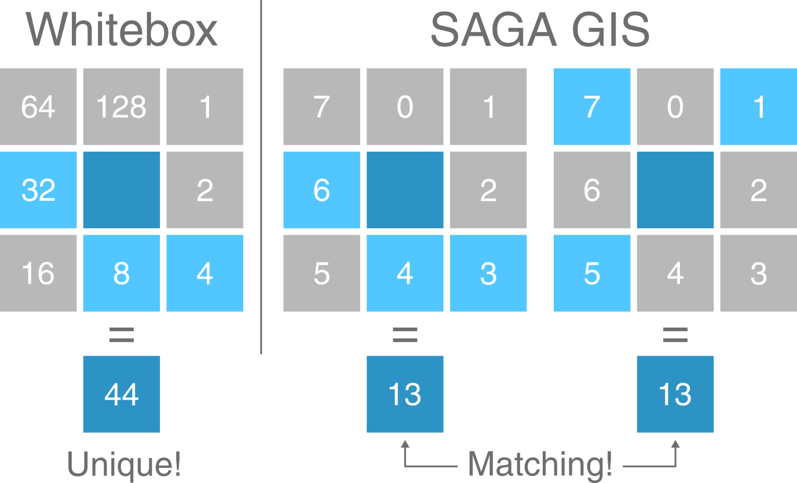

# Mersey III - Hydrology {#mersey_three}

## Task 1: Flow routing

It should be evident from the lecture and the previous practical that DEMs have a great deal of potential for modelling surface water hydrology and related phenomena in drainage basins. Much of this work is based on the assumptions:

- We can trace the path that water will take from any point in an elevation grid to a basin outlet; 
- The discharge of water and sediment from a particular location is directly related to its catchment area. 

However, the first assumption is not met when the flow direction is undefined. This occurs when a single grid cell (pit), or group of grid cells (depression), is lower than all neighbouring cells. When these DEM sinks are encountered, and when there are no downslope neighbours, all water that enters a cell is unable to escape. While these sinks can reflect true features of the landscape, they are often DEM artefacts and can be removed using depression filling or breaching. For more information on DEM sinks and the methods used to remove them, see the previous practical. 

For this practical, we'll be working with a DEM where sinks have already been removed, as indicated by the file name (`mersey_DEM_fill`). While it is not always practical to use file names which include all analytical steps, it is good practice to include the key analytical steps (e.g. `_fill`, `_slope`, `_hillshade`). 

### Creating a D8 pointer 

One key input for drainage network calculations is a **pointer file**, which stores the flow direction of each cell in a raster grid, and thus, the topology of the drainage network. The exact nature of these data depends on the method used to derive the flow directions. One common approach is the D8 algorithm, which sets the flow direction toward the lowest of the eight neighbouring cells, in relation to the centre cell (see **Figure 1**). 

<p align="center">
<a name="Figure_d8"></a>{width=40%}
</p>

**Figure 1: Schematic of the D8 method**. The elevation value of the centre cell is 8 m (dark blue). Under atmospheric pressure, water flows to areas of lower elevation (< 8 m; light blue) and does not flow to areas of higher elevation (>8 m; grey). In this case, the D8 method would route all the water from the centre cell into the bottom left cell, as it has the lowest value (4 m).

<br/> 

We also know from the previous practical that Whitebox stores D8 pointers as binary numbers in base-2 (see **Figure 2**):

<p align="center">
<a name="Figure_pointer"></a>{width=100%}
</p>

**Figure 2: Pointer data format in Whitebox Tools**. Flow directions (NE, E, SE, S, SW, W, NW, N) are stored as binary numbers in base-2 ($2^0, 2^1, 2^2, 2^3, 2^4, 2^5, 2^6, 2^7$)

<br/> 

Initially, this can seem unnecessarily complex, particularly when compared to a simple sequential storage method (e.g. $N = 0, NE = 1, E = 2, ...$). However, the advantage of this approach is only apparent when multi-directional flow algorithms are considered such as **FD8** (@freeman_calculating_1991; @quinn_prediction_1991; @quinn_tan_1995) and **D-infinity** (@tarboton_new_1997). 

While the D8 algorithm assigns all water flow to a single neighbouring cell, multi-directional algorithms split water flow into two or more neighbouring cells. For these methods, a binary base-2 approach enables this information to be stored efficiently as a single number (see **Figure 3**). With eight neighbouring cells, there are a total of 255 possible combinations[^2]. 

<p align="center">
<a name="Figure_binary"></a>{width=100%}
</p>

**Figure 3: Comparison of Whitebox Tools and SAGA GIS flow direction formats**. In WBT, all combinations of multi-directional water flow can be expressed as a unique number using base-2. In this example, the value of the centre cell (dark blue) is equal to 44, which is the sum of flow to its W (32), S (8) and SE neighbours (4). In SAGA GIS, the same flow distribution is equal to 13, which is the sum of W (6), S (4) and SE flow (3). However, this same value (13) can also be obtained with flow to the NE, NW and SW (among others!).

<br/> 

[^2]: The total number of combinations for a set of eight numbers (n = 8) is equal to 255 (ignoring order, no repetition) and is calculated as follows using **factorials**: $\frac{n!}{k!(n-k!)}$, where *k* is the number of selected elements ($k = 1, 2, ... , 8$): see [here](https://www.hackmath.net/en/calculator/combinations-and-permutations?n=8&k=8&order=0&repeat=0) for a interactive version. In WBT, each one of these combinations has a unique value. This is not the case for other formats (e.g. SAGA GIS), where additional programming is required to store and extract that information. 

For this practical, we'll be calculating the pointer file using the simplest D8 algorithm, as shown in Practical 1. 

> Using your experience from Practical 1, run the `wbt_d8_pointer` function, using `mersey_dem_fill.tif` as the input file and saving with an appropriate output name (`mersey_dem_D8_pointer.tif`) and to the correct directory (`output/practical_2`). **Remember**: use the **here** package for accessing file locations.

> Load the raster into R using the **raster** package and plot using **ggplot2** and **ggspatial**. Your output should resemble the following, where each cell value has been reclassified according to the D8 flow. *Note* that the map below is using a continuous scale - a categorical scale would be more appropriate for pointer data, see [last week!]({#Eskdale_flow_algorithms})

```{r, echo = FALSE, eval = FALSE, warning= FALSE, message = FALSE, fig.align = 'center'}

# Sets file path for DEM
dem <- here("data", "practical_2", "mersey_dem_fill.tif")

# Calculates D8 pointer
wbt_d8_pointer(dem, 
               here("output", "practical_2", "mersey_dem_D8_pointer.tif"))

```

```{r, echo = FALSE, eval = TRUE, warning= FALSE, message = FALSE, fig.align = 'center'}

# Loads D8 pointer raster using the raster and here packages
mersey_pointer <- raster(here("output", "practical_2", "mersey_dem_D8_pointer.tif"))

# Plots using ggplot
p <- ggplot() +
  layer_spatial(mersey_pointer, aes(fill = stat(band1))) +
  theme_classic() + 
  labs(fill = "Pointer value", x = "Easting", y = "Northing") +
  scale_fill_continuous(type = "viridis",  na.value = NA)
p 
```

> Save your script before continuing. 

### Catchment area

Using this pointer information, we can calculate the number of grid cells that are connected to each cell in an upslope (catchment area) and downslope (dispersal area) direction. These data describe the spatial pattern of upslope (or downslope) area draining to (or away from) each pixel in a DEM.

For now, we'll be calculating the Specific Contributing Area (SCA), which utilises the Upslope Contributing Area (UCA) and Number of Upslope Elements (NUE) metrics:

- Number of Upslope Elements (**NUE**): the number of cells draining to each grid cell;
- Upslope Contributing Area (**UCA**): the NUE multiplied by the cell area; 
- Specific Contributing Area (**SCA**): the UCA divided by the cell size or grid resolution.

The SCA characterises the amount of flow across a unit length of contour in the catchment and is unaffected by the grid resolution of the DEM.

In Practical 1, we used the filled DEM to calculate the SCA for each raster cell using the `wbt_d8_flow_accumulation` function, but we can also use the D8 pointer raster we just created: 

> Run the `wbt_d8_flow_accumulation` function, using the D8 pointer raster as the input file (`mersey_dem_D8_pointer.tif`). **Important**: because we're working with a pointer raster, rather than a DEM, we need to specify this parameter (`pntr = TRUE`). If we don't set this parameter, WBT will assume the DEM values are actually elevations (ranging from 1 - 128 m) and we will obtain spurious results!

> Make sure to set the output type (`out_type`) as 'specific contributing area' (in quotation marks). As SCA data typically have a very large range of values, we can also log-transform the flow accumulation values (`log = "TRUE"`) to improve plot readability. Save the output file with a logical name (e.g. `mersey_dem_flow_accumulation.tif`) and to the correct sub-directory (`output/practical_2`). Load the raster to R and plot, and your output should resemble the following:

```{r, echo = FALSE, eval = FALSE, warning= FALSE, message = FALSE, fig.align = 'center'}
# Calculates accumulation file
wbt_d8_flow_accumulation(here("output", "practical_2", "mersey_dem_D8_pointer.tif"), 
                         here("output", "practical_2", "mersey_dem_flow_accumulation.tif"), 
                         out_type = "specific contributing area",
                         log = TRUE, 
                         pntr = TRUE)
```

```{r, echo = FALSE, eval = TRUE, warning= FALSE, message = FALSE, fig.align = 'center'}

# Loads D8 pointer raster using the raster and here packages
mersey_accumulation <- raster(here("output", "practical_2", "mersey_dem_flow_accumulation.tif"))

# Plots using ggplot
p <- ggplot() +
  layer_spatial(mersey_accumulation, aes(fill = stat(band1))) +
  theme_classic() + 
  labs(fill = "Log-transformed flow accumulation value", x = "Easting", y = "Northing") +
  scale_fill_continuous(type = "viridis",  na.value = NA) +
  theme(legend.position = "top")
p 
```


## Task 2: Seed points

The UK Environment Agency (EA) collects river water quality data at a series of fixed locations across the Mersey Basin. The location of each of these sites is recorded using a GPS and locations have a unique identification number. Seed points are sometimes referred to as "pour points", and are routinely used to delineate watersheds. 

The locations of the EA monitoring stations are shown below:

```{r, echo = FALSE, fig.align="center", warning = FALSE, message = FALSE}

# Read using sf
mersey_points <- st_read(here("data", "practical_2", "mersey_EA_sites.shp"),
                         quiet = TRUE)

# Transform using sf
mersey_points <- st_transform(mersey_points, 4326)

# Loads shapefiles and transform using rgdal (deprecated)
#mersey_points <- readOGR(here("data", "practical_2", "mersey_EA_sites.shp"), verbose = FALSE)
#mersey_points <- spTransform(mersey_points, CRS("+proj=longlat +datum=WGS84"))

m <- leaflet() %>%
  # Sets view
  setView(lat=53.47722932957252, lng = -2.243114768566372, zoom = 9) %>%
  # Adds default tiles
  addTiles()  %>%
  # Add markers
  addCircleMarkers(data = mersey_points, label = ~as.character(EA_ID), 
                   stroke = FALSE, fillOpacity = 0.5, radius = 5)

m
```

### Seed repositioning

However, before you can delineate the watershed for each of these outlet points, the seed point location must be checked, repositioned if necessary and given its own unique identifier. This is a very important part of any watershed delineation process. 

Below is a figure showing the flow accumulation raster (`mersey_dem_flow_accumulation.tif`) and the EA monitoring stations (`mersey_EA_sites.shp`). Here, we're using the **raster** package to load the raster data, and the `st_read()` function from the `sf` package (**S**imple **F**eatures) to load the vector data. 

To add spatial data to our ggplot map, we are using the `annotation_spatial()` function which is designed for spatial geometries. Helpfully, this works across the main vector types; points, lines, and polygons can all be added using `geom_sf()`. For design reasons, we've modified the [shape type](http://www.sthda.com/english/wiki/ggplot2-point-shapes) as well as the fill, colour and size of the point data.
 
```{r, echo = TRUE, eval = TRUE, warning= FALSE, message = FALSE, fig.align = 'center'}

# Loads flow accumulation raster using the raster and here packages
mersey_accumulation <- raster(here("output", "practical_2", "mersey_dem_flow_accumulation.tif"))

# Loads EA monitoring sites using the st_read function
seed_points <- st_read(here("data", "practical_2", "mersey_EA_sites.shp"))

# Plots using ggplot
p <- ggplot() +
  layer_spatial(mersey_accumulation, aes(fill = stat(band1))) + # Adds raster layer
  annotation_spatial(data = seed_points, shape = 21, fill = "#FFFFFF", colour = "black", size = 3) + # Adds vector layer
  theme_classic() + 
  labs(fill = "Log-transformed flow accumulation value", x = "Easting", y = "Northing") +
  scale_fill_continuous(type = "viridis",  na.value = NA) +
  theme(legend.position = "top")
p 
```

> Inspect the above code and implement it in your R script. 

At this map scale, it is quite difficult to assess the correspondence between the accumulation raster and the monitoring stations. 

> To address this, add the following code **before** your ggplot2 call and update the `layer_spatial()` argument to include this new raster. Here, we are cropping our flow accumulation raster using indexing, extracting rows 632 - 645 and columns 540 - 578. There are, however, more sophisticated approaches to cropping (e.g. using the extent of other spatial layers) but this is reasonably efficient for now. 

```{r, echo = TRUE, eval = FALSE, warning= FALSE, message = FALSE, fig.align = 'center'}
# Crops the accumulation raster based on a defined extent (row and col indexes) 
mersey_accumulation_crop <- crop(mersey_accumulation, extent(mersey_accumulation,  632, 645, 540, 578))
```

As the plot extent is determined by the extent of the feature/layer specified in the `layer_spatial()` argument, your map should now resemble the following:

```{r, echo = FALSE, eval = TRUE, warning= FALSE, message = FALSE, fig.align = 'center'}
# Crops the accumulation raster based on a defined extent (row and col indexes) 
mersey_accumulation_crop <- crop(mersey_accumulation, extent(mersey_accumulation,  632, 645, 540, 578))

# Plots using ggplot
p <- ggplot() +
  layer_spatial(mersey_accumulation_crop, aes(fill = stat(band1))) + # Adds raster layer
  annotation_spatial(data = seed_points, shape = 21, fill = "#FFFFFF", colour = "black", size = 3) + # Adds vector layer
  theme_classic() + 
  labs(fill = "Log-transformed flow accumulation value", x = "Easting", y = "Northing") +
  scale_fill_continuous(type = "viridis",  na.value = NA) +
  theme(legend.position = "top")
p 
```

> Inspect the map. You should notice that while some vector points sit directly on raster cells with high accumulation values, others are located just off, often by only one or two grid cells. 

These errors could be due to imprecise GPS coordinates, the resolution of the DEM, or limitations of the analytical approach (i.e. flow routing), particularly in areas of low lying topography. To ensure accurate watershed creation, the sites that lie off the stream network need to be correctly repositioned.

While it is possible to rectify these errors manually i.e. by checking each point in turn and assigning new coordinates if necessary, this approach would be extremely time consuming with large datasets and could introduce unnecessary bias or human error.

One common approach to reposition individual points is known as pour point snapping, which relocates points to the nearest stream or area of high accumulation, within a specified threshold distance. See @lindsay_mapping_2008 for an overview of snapping approaches. 

Whitebox Tools provides two primary methods for snapping:

- [**Snap Pour Points**](https://rdrr.io/cran/whitebox/man/wbt_snap_pour_points.html), using the `wbt_snap_pour_points` function, which moves each point to the location coincident with the highest flow accumulation value within a specified distance;
- [**Jenson Snap Pour Points**](https://rdrr.io/cran/whitebox/man/wbt_jenson_snap_pour_points.html), using the `wbt_jenson_snap_pour_points` function, which moves each point the nearest stream grid cell within a specified distance following @jenson_applications_1991.

```{r, echo = FALSE, eval = FALSE, warning= FALSE, message = FALSE, fig.align = 'center'}

# Sets file path for DEM
dem <- here("data", "practical_2", "mersey_dem_fill.tif")

# Calculates accumulation file
wbt_d8_flow_accumulation(dem, 
                         here("output", "practical_2", "mersey_dem_D8_flow_accumulation_NUE.tif"), 
                         out_type = "cells",
                         log = FALSE)

# Extracts streams, accumulation threshold of 200
wbt_extract_streams(here("output", "practical_2", "mersey_dem_D8_flow_accumulation_NUE.tif"),
                    here("output", "practical_2", "mersey_dem_streams_act200.tif"), 
                    threshold = 200, 
                    zero_background = TRUE)

```

Of these, the Jenson Snap Pour Points approach (@lindsay_mapping_2008) is more sophisticated and has one clear advantage: when an initial outlet point is located on a stream cell, it will not be moved. For our EA dataset, which contains points of variable accuracy, this is beneficial because correctly placed points will retain their original positions, and only those incorrectly placed will be modified. In contrast, a standard snap pour points approach will often move all the points, even those which were located correctly!

However, the Jenson approach requires additional inputs and utilises a **streams** raster file, rather than an SCA accumulation file. To calculate this, the overall process is as follows:

1. Calculate the Number of Upslope Elements (**NUE**) using the `wbt_d8_flow_accumulation` function. 
2. Define the stream network using the `wbt_extract_streams` function. 
3. Reposition EA seed points using the `wbt_jenson_snap_pour_points` function. 

<br/>

> Save your script before continuing. 


#### Number of Upslope Elements

> Run the `wbt_d8_flow_accumulation` tool, using the original filled DEM as the input file (`pntr = FALSE`) and saving with an appropriate name `mersey_dem_D8_flow_accumulation_NUE.tif` and in the correct location. Set the output type as `cells` (i.e. the number of upslope cells) and **don't** log-transform values.

#### Stream network

Next, we are going to extract the stream network based on the NUE raster created in Step 1. To extract streams, we first need to set the **channelization threshold**. This threshold represents the minimum area required to initiate and maintain a channel. Small threshold values will result in more extensive stream networks, while larger threshold values will extract only the largest streams. Unfortunately, there is no widely accepted rule for determining the channelization threshold, which will be unique for each landscape and dataset, and may vary due to raster resolution. As a result, experimentation is required! 

For our dataset, we want to ensure that each EA measurement site is located on or near a digitised stream, so setting a large channelization threshold and focusing on the largest streams might not be appropriate, as some measurement sites are located on minor streams in small catchments. As such, we need to set the channelization threshold sufficiently low to mitigate against this. Feel free to experiment with this threshold and evaluate its effects on the delineated stream network. For our analysis, a channelization threshold of 200 upslope grid cells would be appropriate.

> Using the output of Step 1, we are going to extract the stream network using `wbt_extract_streams` with a channelization threshold of 200 upslope grid cells (`threshold = 200`). Set the background value to 0 (`zero_background = TRUE`). As usual, save with an appropriate name (e.g. `mersey_dem_streams_act200.tif`) and in the correct location. 

Your output should resemble the following, whether raster cells corresponding to streams are coded as “1” and non-stream regions are coded as “0”:

```{r, echo = FALSE, eval = TRUE, warning= FALSE, message = FALSE, fig.align = 'center'}
# Loads streams raster using the raster and here packages
mersey_streams <- raster(here("output", "practical_2", "mersey_dem_streams_act200.tif"))

# Plot using ggplot
p <- ggplot() +
  layer_spatial(mersey_streams, aes(fill = stat(band1))) + # Adds raster layer
  theme_classic() + 
  labs(fill = "Stream locations (1 = stream, 0 = no stream)", x = "Easting", y = "Northing") +
  scale_fill_continuous(type = "viridis",  na.value = NA) +
  theme(legend.position = "top")
p 
```

#### Snapping

Finally, we are going to reposition the EA seed points to match the stream network. **Remember**, seed points already located on the steam network will not be moved. 

Before we execute the tool, we need to decide on the **Snap Distance**, which is measured in the units of the input data and is the maximum distance that points can be moved to match the stream network. Our raster is measured in **metres** (m) with a grid resolution of 50 m<sup>2</sup>. Most points are incorrectly positioned by one to three grid cells (50 - 150 m). However, to ensure we include all points, we'll set the snap distance to 500 m. 

> Using the output of Step 2 (`mersey_dem_streams_act200.tif`) and the EA monitoring stations shapefile `mersey_EA_sites.shp`, run the `wbt_jenson_snap_pour_points` function, using a snap distance of 500 m (`snap_dist = 500`). Save with an appropriate name `mersey_EA_sites_snapped.shp`. 

> As we're using **two** inputs to a Whitebox function (rather than just one), it can be useful to specify inputs directly in R e.g. `streams = mersey_dem_streams_act200.tif`, `pour_pts = mersey_EA_sites.shp`, `output = ...`. You can check the names of the inputs by reading the [documentation](https://rdrr.io/github/giswqs/whiteboxR/man/wbt_jenson_snap_pour_points.html), by hovering the mouse over the name of the function, or pressing the `tab` button.

```{r, echo = FALSE, eval = FALSE, warning= FALSE, message = FALSE, fig.align = 'center'}
# Snaps pour points to stream network, snap distance in map units. 
wbt_jenson_snap_pour_points(here("data", "practical_2", "mersey_EA_sites.shp"),
                            here("output", "practical_2", "mersey_dem_streams_act200.tif"), 
                            here("output", "practical_2", "mersey_EA_sites_snapped.shp"),
                            snap_dist = 500)
```

> Run the following code to inspect the outputs of Jenson Snap Pour Points. The stream network is a Boolean (logical) raster, where stream cells = 1 (yellow) and non-stream cells = 0 (blue). The original pour points are shown in white, with the snapped points in red. 

```{r, echo = TRUE, eval = TRUE, warning= FALSE, message = FALSE, fig.align = 'center', results='hide'}
# Loads streams raster using the raster and here packages
mersey_streams <- raster(here("output", "practical_2", "mersey_dem_streams_act200.tif"))

# Crops the streams raster based on a defined extent (row and col indexes) 
mersey_streams_crop <- crop(mersey_streams, extent(mersey_streams,  632, 645, 540, 578))

# Loads original and snapped EA monitoring sites using the st_read function
seed_points <- st_read(here("data", "practical_2", "mersey_EA_sites.shp"))
snapped_seed_points <- st_read(here("output", "practical_2", "mersey_EA_sites_snapped.shp"))

# Plots using ggplot
p <- ggplot() +
  layer_spatial(mersey_streams_crop, aes(fill = stat(band1))) + # Adds raster layer
  annotation_spatial(data = seed_points, shape = 21, fill = "#FFFFFF", colour = "black", size = 3) + # Adds seeds layer
  annotation_spatial(data = snapped_seed_points, shape = 21, fill = "#FB5858", colour = "black", size = 3) + # Adds snapped seeds layer
  theme_classic() + 
  labs(fill = "Stream network ID", x = "Easting", y = "Northing") +
  scale_fill_continuous(type = "viridis",  na.value = NA) +
  theme(legend.position = "top")
p 

```

## Task 3: Watershed creation

To finish the Week 10 class (Chapter 9), we are going to combine the previous outputs to create unique (non-overlapping) watersheds for each EA seed point.

> Use the `wbt_watershed` function with the D8 pointer raster (`mersey_dem_D8_pointer.tif`) and the snapped pour points vector (`mersey_EA_sites_snapped.shp`) as inputs. Save in the `output/practical_2` directory as `mersey_watersheds.tif`. Your output should resemble the following:


```{r, echo = FALSE, eval = FALSE, warning= FALSE, message = FALSE, fig.align = 'center'}
# Watershed from pour points
wbt_watershed(here("output", "practical_2", "mersey_dem_D8_pointer.tif"), 
              here("output", "practical_2", "mersey_EA_sites_snapped.shp"), 
              here("output", "practical_2", "mersey_watersheds.tif"))


# Converts watershed to vector format (polygon)
wbt_raster_to_vector_polygons(here("output", "practical_2", "mersey_watersheds.tif"),
                              here("output", "practical_2", "mersey_watersheds.shp"))
```

```{r, echo = TRUE, eval = TRUE, warning= FALSE, message = FALSE, fig.align = 'center'}
# Loads streams raster using the raster and here packages
mersey_watersheds <- raster(here("output", "practical_2", "mersey_watersheds.tif"))

# Plots using ggplot
p <- ggplot() +
  layer_spatial(mersey_watersheds, aes(fill = stat(band1))) + # Adds raster layer
  annotation_spatial(data = snapped_seed_points, shape = 21, fill = "#FB5858", colour = "black", size = 3) + # Adds snapped seeds layer
  theme_classic() + 
  labs(fill = "Stream network", x = "Easting", y = "Northing") +
  scale_fill_continuous(type = "viridis",  na.value = NA) +
  theme(legend.position = "top")
p 

```

The watersheds are currently stored as rasters, but it is often easier to work with vectors, especially when dealing with attributes and spatial relationships (topology).

> Use the following code to convert your watersheds raster (`.tif`) to vector format (`.shp`) 

```{r, echo = TRUE, eval = FALSE, warning= FALSE, message = FALSE, fig.align = 'center'}
# Converts watershed to vector format (polygon)
wbt_raster_to_vector_polygons(here("output", "practical_2", "mersey_watersheds.tif"),
                              here("output", "practical_2", "mersey_watersheds.shp"))

```

These delineated watersheds can now be used for further analysis. However, it is important that we carefully assess them for any errors. This typically requires in-depth knowledge to assess whether the correct watershed(s) has been extracted. In turn, the position of seed points is critical, as placing seeds points above/below stream confluences can have a major impact on the extracted watershed(s), as shown in **Figure 4**: 

<p align="center">
<a name="Figure_watersheds"></a>{width=70%}
</p>

**Figure 4: The impact of seed point location on extracted watersheds**. (A) In this example, rivers A and B are sourced from distinct watersheds but meet at a confluence (white circle). (B) When seeds points are placed above this confluence, each river has its own individual watershed. (C) When a seed point is placed at or below the confluence, these watersheds are combined as all water falling within both will ultimately drain to the confluence. Prior knowledge of the catchment is required to know if the correct watershed has been extracted. 

<br/> 

> To finish, **save your script** and compare your outputs to those shown below. If there are any clear differences in your version, repeat the previous tasks and play close attention to the input settings.

```{r, echo = FALSE, fig.align="center", warning = FALSE, message = FALSE}

# Load shapefiles using sf
mersey_points <- st_read(here("output", "practical_2", "mersey_EA_sites_snapped.shp"),
                         quiet = TRUE)
mersey_watershed_polygons <- st_read(here("output", "practical_2", "mersey_watersheds.shp"),
                                     quiet = TRUE)

# Transform using sf
mersey_points <- st_transform(mersey_points, 4326)
mersey_watershed_polygons <- st_transform(mersey_watershed_polygons, 4326)
 
# Deprecated (rgdal)
#mersey_watershed_polygons <- readOGR(here("output", "practical_2", "mersey_watersheds.shp"), verbose = FALSE)
#mersey_points <- readOGR(here("output", "practical_2", "mersey_EA_sites_snapped.shp"), verbose = FALSE)
#mersey_watershed_polygons <- spTransform(mersey_watershed_polygons, CRS("+proj=longlat +datum=WGS84"))
#mersey_points <- spTransform(mersey_points, CRS("+proj=longlat +datum=WGS84"))

m <- leaflet() %>%
  # Sets view
  setView(lat=53.47722932957252, lng = -2.243114768566372, zoom = 9) %>%
  # Adds default tiles
  addTiles()  %>%
  # Add polygon
  addPolygons(data=mersey_watershed_polygons, color = "#444444", fillColor = "#33b9ff", 
              weight = 1, smoothFactor = 0.5, opacity = 0.9, fillOpacity = 0.2) %>%
  # Add markers
  addCircleMarkers(data = mersey_points, label = ~as.character(EA_ID), 
                   stroke = FALSE, fillOpacity = 0.5, radius = 5)

m
```
