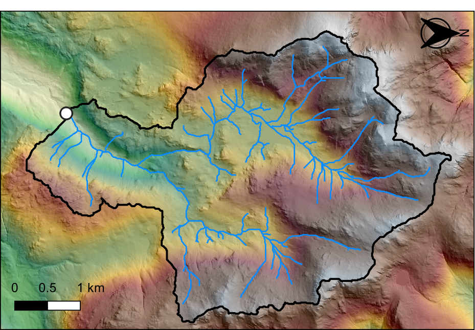

# Introduction

It should be evident from the lectures that digital elevation models (DEMs) have a great deal of potential for modelling surface water hydrology and related phenomena in drainage basins. Much of this work is based on the assumptions that (1) we can trace the path that water will take from any point in an elevation grid to a basin outlet, and (2) the discharge of water from a particular location is directly related to its catchment area. This is a fairly reasonable assumption in most drainage basins. 

## Practical outline

In this set of practicals, we'll be using [*R*](https://www.r-project.org/), [*RStudio*](https://www.rstudio.com/) and [*WhiteboxTools*](https://jblindsay.github.io/wbt_book/intro.html) to perform hydrological analysis. In [Chapters 2](#Installation) and [3](#R), we'll install and get to grips with the required programs. 

In [Practical 1](#FirstPractical), we'll introduce you to some of the key approaches, including DEM pre-processing, calculating flow parameters and comparing flow algorithms. 

In [Practical 2](#SecondPractical), we'll utilise these approaches to investigate the water quality of the Mersey Basin [Chapter 5](#SecondPractical). This forms the basis for your [assessment](#Assessment). 

In this lab exercise, we will use a DEM of the Upper Eskdale watershed to model flow-related phenomena.

In this exercise you will gain experience in the following:

- DEM pre-processing; 
- Calculating flow parameters: Pointers and contributing area;
- Comparing flow algorithms. 
